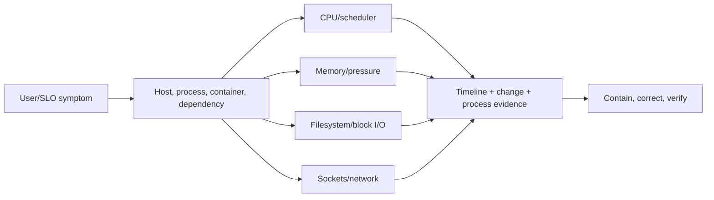

# Linux Production Troubleshooting Path

Production Linux diagnosis connects a user symptom to processes, scheduling, memory,
filesystem and block I/O, network sockets, cgroups, kernel events, and recent change.
Commands are evidence tools; running an expensive command or killing a process without
understanding impact can worsen the incident.

## Complete Route

1. [Processes, CPU, Scheduler, Memory, And OOM](./linux/LINUX-PROCESS-CPU-MEMORY.md)
2. [Filesystems, Disk, Block I/O, And Storage Incidents](./linux/LINUX-FILESYSTEM-STORAGE.md)
3. [systemd, Logs, Networking, Security, Containers, And cgroups](./linux/LINUX-SERVICES-NETWORK-CONTAINERS.md)
4. [Incident Runbooks, Labs, Interview Questions, And Revision](./linux/LINUX-INCIDENT-LABS-REVISION.md)

## Safety Rules

- establish impact and preserve evidence before restarting or deleting;
- use bounded commands and filters on large systems;
- know whether the view is host, namespace, container, cgroup or process;
- distinguish containment from root-cause correction;
- avoid `kill -9`, cache dropping, broad recursive deletion, firewall changes and filesystem
  repair unless the exact target, data risk and recovery path are understood;
- record timestamp, host, command, output context and change timeline.

## Completion Standard

You can diagnose CPU saturation versus throttling, memory leak versus page cache, host OOM
versus cgroup OOM, disk capacity versus inode exhaustion, I/O latency versus throughput,
deleted-open files, systemd startup loops, port/socket exhaustion, container namespace
differences, kernel errors and security denials; then contain safely and prove recovery.

## Official References

- [Linux kernel documentation](https://docs.kernel.org/)
- [systemd manuals](https://www.freedesktop.org/software/systemd/man/latest/)
- [proc filesystem documentation](https://docs.kernel.org/filesystems/proc.html)

## Recommended Next

Begin with [Processes, CPU, Scheduler, Memory, And OOM](./linux/LINUX-PROCESS-CPU-MEMORY.md).

