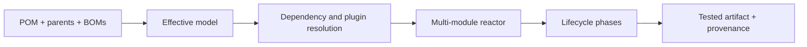

# Maven Engineering Learning Path

Maven is a model-driven build system. The POM describes coordinates, dependencies,
plugins, inheritance, and profiles; Maven computes an effective model and executes
plugin goals bound to lifecycle phases.

## Complete Route

1. [POM, Lifecycle, Plugins, And Effective Model](./maven/MAVEN-POM-LIFECYCLE-PLUGINS.md)
2. [Dependencies, BOMs, Multi-Module Reactors, And Profiles](./maven/MAVEN-DEPENDENCIES-REACTOR.md)
3. [Testing, Repositories, Security, Reproducibility, And CI](./maven/MAVEN-CI-SECURITY-REPRODUCIBILITY.md)
4. [Troubleshooting, Interview Questions, Labs, And Revision](./maven/MAVEN-TROUBLESHOOTING-INTERVIEW-REVISION.md)

## Completion Standard

You should be able to predict which plugin goal runs and why, inspect the effective POM,
explain conflict mediation, distinguish parent inheritance from BOM import, resume and
select reactor builds correctly, separate unit/integration tests, secure repository
credentials, enforce toolchains and dependency policy, and diagnose a build without
deleting the entire local repository as a first response.

## Official References

- [Apache Maven documentation](https://maven.apache.org/guides/)
- [Maven POM reference](https://maven.apache.org/pom.html)
- [Maven lifecycle introduction](https://maven.apache.org/guides/introduction/introduction-to-the-lifecycle.html)

## Recommended Next

Begin with [POM, Lifecycle, Plugins, And Effective Model](./maven/MAVEN-POM-LIFECYCLE-PLUGINS.md).

