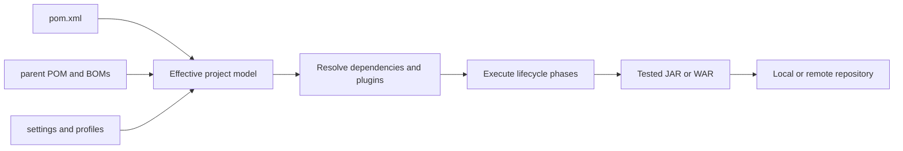

# Maven Overview: POM, Lifecycle, Dependencies, Plugins, And Repositories

Maven is a build and dependency-management tool for JVM projects. A `pom.xml` describes the
project model; Maven combines that file with parents, dependency metadata, settings, and plugin
defaults to calculate an **effective build**, then executes plugin goals through a standard
lifecycle.

## What Problem Does Maven Solve?

Without a build tool, every project invents scripts for compiling source, downloading libraries,
running tests, packaging JARs, and publishing artifacts. Maven standardizes those operations:

- one project model in `pom.xml`;
- a conventional directory structure;
- repeatable lifecycle phases such as `compile`, `test`, `package`, and `verify`;
- dependency resolution from repositories;
- reusable build behavior supplied by plugins;
- multi-module build ordering through the reactor.

Maven makes builds consistent, but reproducibility still requires pinned plugins, controlled
repositories, stable toolchains, and removal of environment-dependent behavior.

## Core Mental Model



| Term | Meaning |
|---|---|
| POM | Project Object Model stored in `pom.xml` |
| coordinates | `groupId:artifactId:version` identity of an artifact |
| dependency | library needed on a project classpath |
| plugin | build extension providing executable goals |
| goal | one plugin task, such as `compiler:compile` |
| phase | named stage in a lifecycle, such as `test` or `package` |
| lifecycle | ordered sequence of phases |
| repository | local or remote storage for Maven artifacts and metadata |
| reactor | Maven's ordered build of related modules in one invocation |

## Standard Project Layout

```text
project/
├── pom.xml
├── src/main/java/          application source
├── src/main/resources/     runtime resources
├── src/test/java/          test source
├── src/test/resources/     test resources
└── target/                 generated build output
```

Convention reduces configuration. Maven can use other directories, but overriding the standard
layout increases surprise and maintenance cost.

## A Minimal POM

```xml
<project xmlns="http://maven.apache.org/POM/4.0.0"
         xmlns:xsi="http://www.w3.org/2001/XMLSchema-instance"
         xsi:schemaLocation="http://maven.apache.org/POM/4.0.0
                             https://maven.apache.org/xsd/maven-4.0.0.xsd">
  <modelVersion>4.0.0</modelVersion>

  <groupId>com.shopverse</groupId>
  <artifactId>order-service</artifactId>
  <version>1.0.0-SNAPSHOT</version>

  <properties>
    <maven.compiler.release>21</maven.compiler.release>
  </properties>

  <dependencies>
    <dependency>
      <groupId>org.junit.jupiter</groupId>
      <artifactId>junit-jupiter</artifactId>
      <version>5.12.2</version>
      <scope>test</scope>
    </dependency>
  </dependencies>
</project>
```

The coordinates identify the artifact. Dependencies describe the classpath. Build plugins and
their configuration belong under `build`, while `dependencyManagement` controls versions without
adding dependencies by itself.

## Lifecycle, Phase, And Goal

The three built-in lifecycles are `default`, `clean`, and `site`. The default lifecycle includes:

```text
validate -> compile -> test -> package -> verify -> install -> deploy
```

Calling a later phase runs the earlier phases in that lifecycle. `mvn verify`, for example,
compiles, tests, packages, and performs verification configured before or at `verify`.

A phase is a position in the lifecycle; a goal is executable plugin work bound to a phase or
called directly. In `mvn dependency:tree`, `dependency:tree` is a plugin goal.

<ExpandableAnswer title="Dry run: mvn clean verify">

1. Maven reads project, parent, settings, profile, and dependency metadata.
2. The `clean` lifecycle removes configured build output.
3. The default lifecycle runs through `validate`, compilation, tests, packaging, integration-test
   preparation/execution/cleanup when configured, and `verify` checks.
4. Plugins perform the actual work bound to each phase.
5. A successful build leaves the packaged artifact and reports under `target`; it does not publish
   the artifact to a remote repository because `deploy` was not requested.

</ExpandableAnswer>

## Dependencies And Repositories

Maven resolves direct and transitive dependencies. A dependency scope controls where an artifact
is available, such as `compile`, `runtime`, `test`, or `provided`. When multiple paths request
different versions, Maven mediation chooses one according to its dependency graph rules; inspect
the result rather than assuming the newest version wins.

The local repository caches downloaded artifacts and stores locally installed builds. Remote
repositories share released or snapshot artifacts. `mvn install` writes to the local repository;
`mvn deploy` publishes through configured distribution management.

Use a BOM import to align a family of dependency versions. Use exclusions only after tracing the
graph and proving why a transitive dependency is inappropriate.

## Essential Commands

```bash
mvn --version
mvn clean verify
mvn test
mvn package
mvn dependency:tree
mvn help:effective-pom
mvn help:active-profiles
mvn -pl order-service -am verify
mvn versions:display-dependency-updates
```

| Command | Purpose |
|---|---|
| `clean verify` | clean and run the full verification lifecycle |
| `dependency:tree` | display the resolved dependency graph |
| `help:effective-pom` | show the merged model Maven actually uses |
| `-pl module` | select one reactor project |
| `-am` | also build required reactor dependencies |
| `-DskipTests` | skip test execution; use deliberately, especially in CI |

## Common Mistakes

- confusing dependencies, which affect project classpaths, with plugins, which perform build work;
- calling `integration-test` directly and skipping later cleanup or verification phases;
- assuming `clean` repairs dependency or configuration problems;
- deleting the entire local repository before inspecting the actual resolution failure;
- declaring versions inconsistently instead of using parent or BOM governance;
- depending on undeclared transitive libraries;
- activating profiles implicitly in ways that make developer and CI builds differ.

## Official References

- [Maven documentation](https://maven.apache.org/guides/)
- [Build lifecycle](https://maven.apache.org/guides/introduction/introduction-to-the-lifecycle.html)
- [POM reference](https://maven.apache.org/pom.html)
- [Dependency mechanism](https://maven.apache.org/guides/introduction/introduction-to-dependency-mechanism.html)
- [Standard directory layout](https://maven.apache.org/guides/introduction/introduction-to-the-standard-directory-layout.html)

## Recommended Next

Continue with the [Maven Engineering Learning Path](./MAVEN-ENGINEERING-PATH.md).

