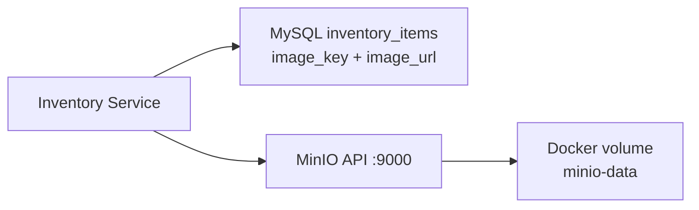
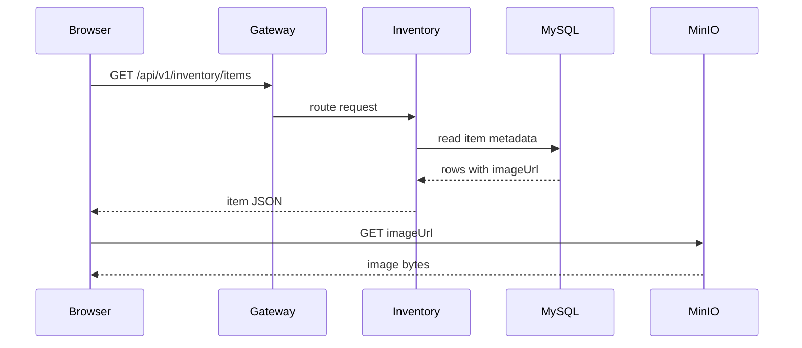
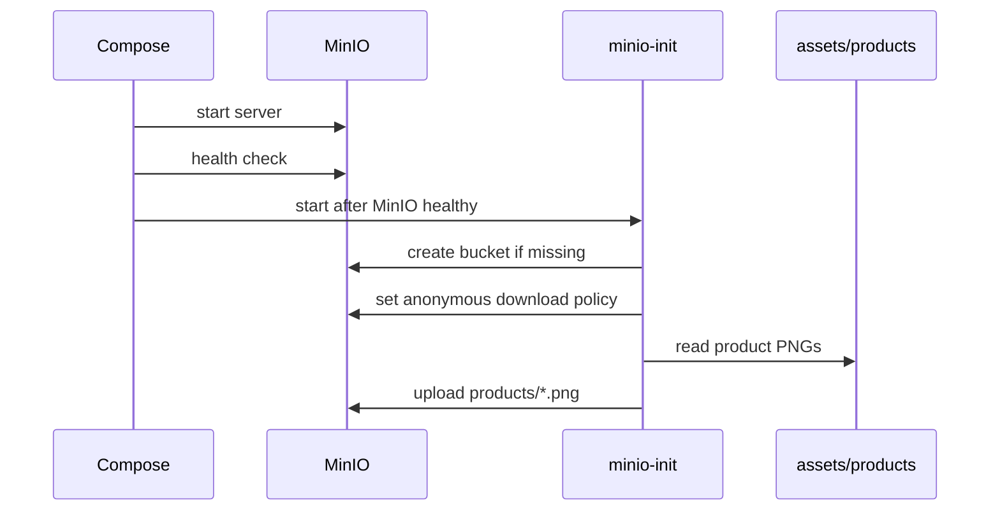
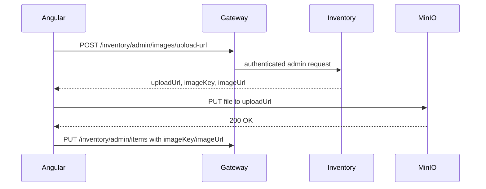

# MinIO Object Storage

MinIO is an S3-compatible object storage server. It stores files as objects in
buckets and exposes S3-style HTTP APIs. It is commonly used in local
development, private cloud, Kubernetes, and testing environments where teams
want S3-compatible behavior without depending directly on AWS.

Shopverse uses MinIO for Inventory product images.

## Why Object Storage Instead Of Database BLOBs?

Product images are binary objects. Storing them directly in MySQL as BLOBs
usually creates operational problems:

- database backups become larger;
- query performance can suffer;
- application servers may stream large payloads through memory;
- CDN integration is harder;
- image lifecycle is tied too tightly to relational data.

The better pattern is:

- store product metadata in MySQL;
- store image bytes in object storage;
- store `imageKey` and `imageUrl` in the database.

```text
MySQL row:
product_id = 101
name       = "Keyboard"
image_key  = "products/101.png"
image_url  = "http://localhost:9000/shopverse-product-images/products/101.png"

MinIO object:
bucket = shopverse-product-images
key    = products/101.png
bytes  = PNG image
```

## Core Concepts

| Concept | Meaning |
|---|---|
| Bucket | top-level container, similar to an S3 bucket |
| Object | file bytes plus metadata |
| Object key | unique path-like identifier inside a bucket |
| Policy | bucket/object access rule |
| Presigned URL | temporary signed URL for upload/download |
| ETag | object version/hash-like identifier returned by object storage |

## How MinIO Stores Data

Internally, MinIO stores objects on disk under its configured data volume.
In Docker Compose, Shopverse maps this to the `minio-data` volume.



MinIO is S3-compatible at the API level. That means code written against S3
concepts such as buckets, keys, object metadata, and presigned URLs can often
work with either MinIO or AWS S3 after configuration changes.

## Shopverse Runtime Flow



The image request does not need to go through the API Gateway in the current
POC because the bucket is configured for public download.

## Public Bucket Versus Private Bucket

| Mode | How it works | Best for |
|---|---|---|
| Public read | browser fetches `imageUrl` directly | public product images, POC catalog |
| Private bucket + presigned GET | backend returns temporary download URL | invoices, private documents |
| Private bucket + CDN | CDN serves objects with controlled policy | production public media |
| Backend streaming | backend reads object and streams response | strict authorization per request |

Shopverse currently uses public-read product images because product catalog
images are not sensitive and this keeps the Angular/frontend flow simple.

## Docker Compose Setup

Shopverse uses two containers:

| Container | Responsibility |
|---|---|
| `minio` | runs object API on `9000` and console on `9001` |
| `minio-init` | creates bucket, applies policy, uploads seed images |

Required local `.env` values:

```env
MINIO_ROOT_USER=shopverse-minio
MINIO_ROOT_PASSWORD=change-me-minio-password
```

Compose resolves environment variables before running any command. If
`MINIO_ROOT_PASSWORD` is missing, even a targeted command such as
`docker compose build order-service` can fail during compose interpolation.

## Seed Image Flow



Useful checks:

```powershell
docker compose ps minio minio-init
docker compose logs minio-init
curl.exe -I http://localhost:9000/shopverse-product-images/products/101.png
```

Expected image response:

```text
HTTP/1.1 200 OK
Content-Type: image/png
```

If the response is `403`, the bucket exists but public download policy was not
applied. Re-run:

```powershell
docker compose up -d --force-recreate minio-init
docker compose logs minio-init
```

## Frontend Product Image Flow

Angular should not call MinIO APIs with root credentials. The normal catalog
flow is:

1. Angular calls Inventory catalog API through Gateway.
2. Inventory returns product data with `imageUrl`.
3. Angular binds `imageUrl` to ``.
4. Browser downloads image directly from MinIO/CDN.

```html

```

## Admin Upload Flow With Presigned URL

For adding inventory items from a frontend, do not expose MinIO root credentials
to the browser. Use presigned upload URLs.



Benefits:

- MinIO credentials stay server-side;
- upload permission is short-lived;
- URL can be limited to one object key;
- frontend can upload directly without streaming file bytes through Inventory.

## Object Key Design

Good object keys are stable and collision-resistant:

```text
products/101/main.png
products/101/gallery/01.webp
products/temp/7f2f7e8d-7ca0-4d01-a252-03b7b0c25d91.png
```

Avoid using only the original filename because two users can upload
`image.png`. Use product ID, UUID, or generated names.

## Security And Production Notes

- Keep root credentials in environment variables or a secret manager.
- Do not commit `.env` with real passwords.
- Use private buckets unless objects are intentionally public.
- Use presigned URLs or CDN signed URLs for protected content.
- Validate MIME type and file extension.
- Enforce upload size limits.
- Scan user-uploaded files if the application accepts arbitrary uploads.
- Add lifecycle cleanup for abandoned temporary uploads.
- Put a CDN in front of public product images in production.

## MinIO Versus AWS S3

| Concern | MinIO | AWS S3 |
|---|---|---|
| hosting | self-hosted/local/private cloud | managed AWS service |
| API style | S3-compatible | native S3 |
| local development | excellent | possible but remote dependency |
| operations | you manage storage/availability | AWS manages service |
| production fit | good for private/self-managed platforms | default choice in AWS deployments |

MinIO is ideal for this POC because it gives realistic object-storage behavior
inside Docker Compose.
