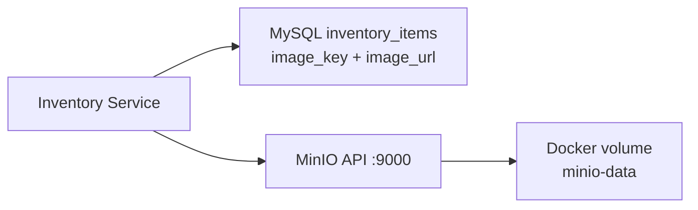
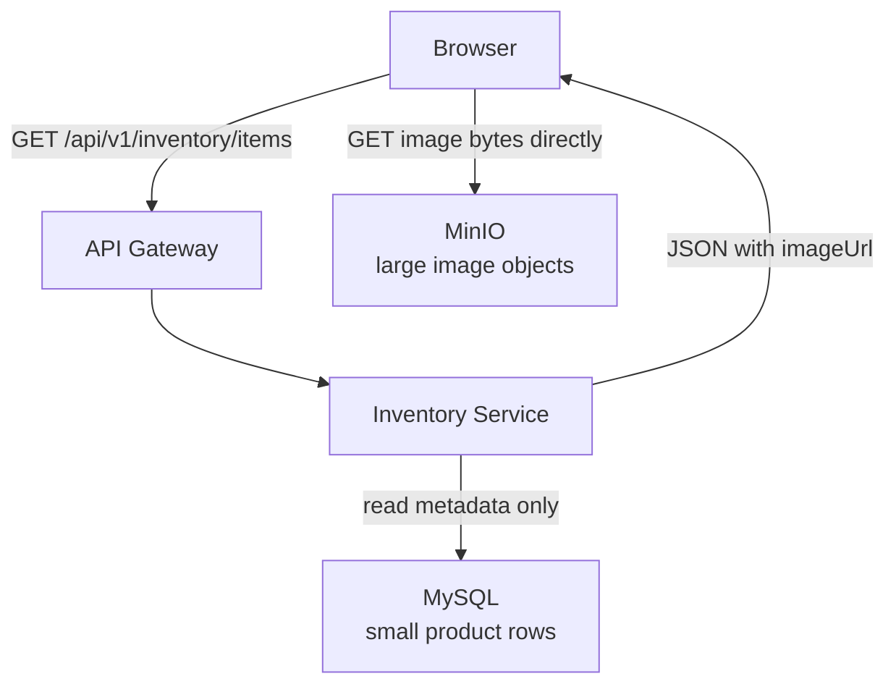
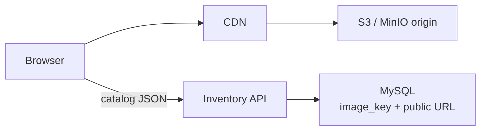
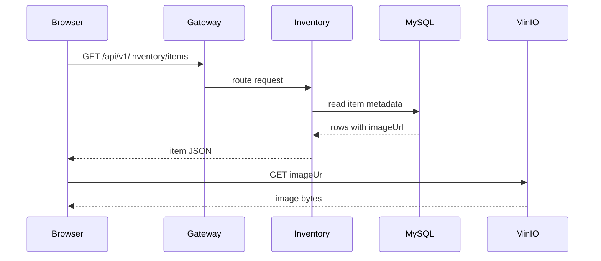
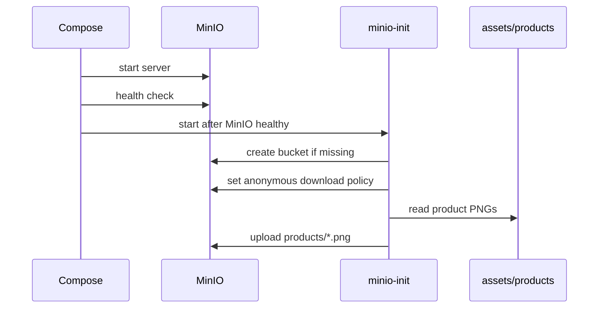
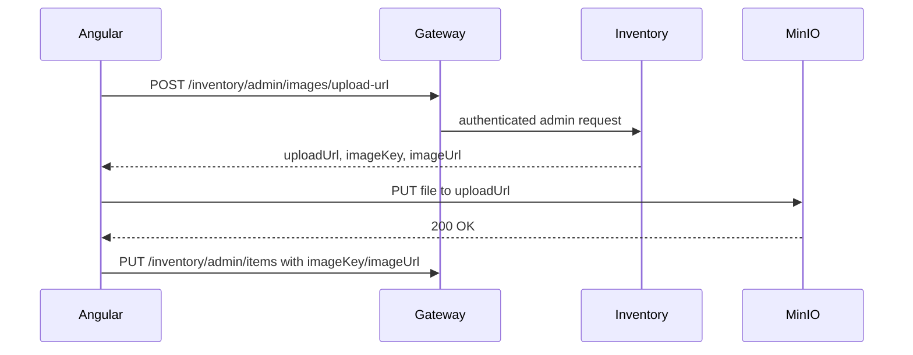

# MinIO Object Storage

MinIO is an S3-compatible object storage server. It stores files as objects in
buckets and exposes S3-style HTTP APIs. It is commonly used in local
development, private cloud, Kubernetes, and testing environments where teams
want S3-compatible behavior without depending directly on AWS.

Shopverse uses MinIO for Inventory product images. In this project, MinIO is
the local replacement for a production object store such as AWS S3, Azure Blob
Storage, or Google Cloud Storage.


## What Problem MinIO Solves In Shopverse

An e-commerce catalog needs product photos, thumbnails, and future media such
as manuals or variant images. Those files are large binary payloads, but the
Inventory Service is mainly responsible for structured product data such as
name, price, stock, category, and SKU.

MinIO separates those responsibilities:

| Problem without object storage | How MinIO solves it |
|---|---|
| Product images would be stored as large database BLOBs | MySQL stores only `image_key` and `image_url`; MinIO stores the image bytes |
| Inventory API would have to stream image bytes | Browser downloads images directly from MinIO using `imageUrl` |
| Database backups would grow with every image | Product rows stay small; object data lives in the `minio-data` volume |
| Moving to production S3 later would require a different programming model | MinIO uses S3-compatible bucket, object, policy, and presigned URL concepts |
| Frontend developers need realistic image URLs locally | Compose starts MinIO on `9000` and seeds the same object-key pattern used by the app |

The result is a cleaner boundary: Inventory owns product metadata, while MinIO
owns product media.

## Where Shopverse Uses It

| Shopverse area | MinIO role |
|---|---|
| `inventory-service` database migration | populates `image_key = products/{productId}.png` and `image_url = http://localhost:9000/shopverse-product-images/products/{productId}.png` |
| Inventory catalog API | returns product JSON with `imageUrl` and `imageKey` |
| Angular catalog page | binds `product.imageUrl` into an `` element |
| Angular product detail page | displays the selected product image and related product images |
| Angular cart and admin screens | reuse the same image URL field for previews |
| `assets/products/products` | source folder for seed PNG files |
| `minio-init` container | creates the bucket, applies the demo read policy, and uploads seed images |

These are real seeded product objects used by the local Shopverse catalog:

| Object key | Preview |
|---|---|
| `products/101.png` |  |
| `products/102.png` |  |
| `products/103.png` |  |

In the running stack the browser loads the same object pattern from:

```text
http://localhost:9000/shopverse-product-images/products/101.png
```

## Why Object Storage Instead Of Database BLOBs?

Product images are binary objects. Storing them directly in MySQL as BLOBs
usually creates operational problems:

- database backups become larger;
- query performance can suffer;
- application servers may stream large payloads through memory;
- CDN integration is harder;
- image lifecycle is tied too tightly to relational data.

The better pattern is:

- store product metadata in MySQL;
- store image bytes in object storage;
- store `imageKey` and `imageUrl` in the database.

```text
MySQL row:
product_id = 101
name       = "Keyboard"
image_key  = "products/101.png"
image_url  = "http://localhost:9000/shopverse-product-images/products/101.png"

MinIO object:
bucket = shopverse-product-images
key    = products/101.png
bytes  = PNG image
```

## Why We Use MinIO Instead Of Only Local Files

The project could store files in a mounted folder and return `/images/101.png`,
but that would hide important production concerns. MinIO is closer to the way
real commerce systems serve media:

| Local folder approach | MinIO approach |
|---|---|
| application-specific file path | S3-compatible bucket and object key |
| usually tied to one server | can later map to S3-compatible infrastructure |
| access control is custom application code | bucket policies and presigned URLs are built-in concepts |
| hard to model direct browser uploads | presigned PUT flow matches production object-storage patterns |
| no object metadata semantics | content type, ETag, object metadata, and lifecycle patterns are available |

For a POC, MinIO gives realistic infrastructure without needing an AWS account
or external network dependency during local development.

## Core Concepts

| Concept | Meaning |
|---|---|
| Bucket | top-level container, similar to an S3 bucket |
| Object | file bytes plus metadata |
| Object key | unique path-like identifier inside a bucket |
| Policy | bucket/object access rule |
| Presigned URL | temporary signed URL for upload/download |
| ETag | object version/hash-like identifier returned by object storage |

## How MinIO Stores Data

Internally, MinIO stores objects on disk under its configured data volume. In
Docker Compose, Shopverse maps this to the named Docker volume `minio-data`:

```yaml title="docker-compose.yml"
minio:
  image: minio/minio:RELEASE.2025-04-22T22-12-26Z
  command: server /data --console-address ":9001"
  volumes:
    - minio-data:/data

volumes:
  minio-data:
```

The application does not depend on MinIO's internal disk layout. It talks to
MinIO through the S3-compatible HTTP API. That matters because the object can
move from local Docker storage to a production object store while the app still
uses the same logical model:

```text
bucket: shopverse-product-images
key:    products/101.png
url:    http://localhost:9000/shopverse-product-images/products/101.png
```



MinIO is S3-compatible at the API level. That means code written against S3
concepts such as buckets, keys, object metadata, and presigned URLs can often
work with either MinIO or AWS S3 after configuration changes.

## Why This Is Efficient

MinIO improves efficiency by keeping heavy media traffic away from services
that should focus on business logic.



Efficiency comes from several design choices:

| Efficiency point | Why it helps |
|---|---|
| database rows stay small | catalog queries read text/numeric fields instead of large binary payloads |
| API Gateway and Inventory do not stream images | fewer CPU, memory, and network hops inside the backend |
| browser downloads media directly | image traffic goes to the storage layer designed for object delivery |
| object keys are stable | frontend can cache image URLs, and production can place a CDN in front |
| seed images are idempotent | `minio-init` can recreate buckets and upload objects without manual console work |
| S3-compatible behavior | the team can test bucket policies and presigned URL flows locally |

In production, the same pattern can become:



The backend still returns product metadata, but public media delivery can be
handled by infrastructure optimized for static bytes.

## Shopverse Runtime Flow



The image request does not need to go through the API Gateway in the current
POC because the bucket is configured for public download.

## Public Bucket Versus Private Bucket

| Mode | How it works | Best for |
|---|---|---|
| Public read | browser fetches `imageUrl` directly | public product images, POC catalog |
| Private bucket + presigned GET | backend returns temporary download URL | invoices, private documents |
| Private bucket + CDN | CDN serves objects with controlled policy | production public media |
| Backend streaming | backend reads object and streams response | strict authorization per request |

Shopverse currently uses public-read product images because product catalog
images are not sensitive and this keeps the Angular/frontend flow simple.

## Docker Compose Setup

Shopverse uses two containers:

| Container | Responsibility |
|---|---|
| `minio` | runs object API on `9000` and console on `9001` |
| `minio-init` | creates bucket, applies policy, uploads seed images |

Required local `.env` values:

```env
MINIO_ROOT_USER=shopverse-minio
MINIO_ROOT_PASSWORD=change-me-minio-password
```

Compose resolves environment variables before running any command. If
`MINIO_ROOT_PASSWORD` is missing, even a targeted command such as
`docker compose build order-service` can fail during compose interpolation.

## Seed Image Flow



Useful checks:

```powershell
docker compose ps minio minio-init
docker compose logs minio-init
curl.exe -I http://localhost:9000/shopverse-product-images/products/101.png
```

Expected image response:

```text
HTTP/1.1 200 OK
Content-Type: image/png
```

If the response is `403`, the bucket exists but public download policy was not
applied. Re-run:

```powershell
docker compose up -d --force-recreate minio-init
docker compose logs minio-init
```

## Frontend Product Image Flow

Angular should not call MinIO APIs with root credentials. The normal catalog
flow is:

1. Angular calls Inventory catalog API through Gateway.
2. Inventory returns product data with `imageUrl`.
3. Angular binds `imageUrl` to ``.
4. Browser downloads image directly from MinIO/CDN.

```html

```

## Admin Upload Flow With Presigned URL

For adding inventory items from a frontend, do not expose MinIO root credentials
to the browser. Use presigned upload URLs.



Benefits:

- MinIO credentials stay server-side;
- upload permission is short-lived;
- URL can be limited to one object key;
- frontend can upload directly without streaming file bytes through Inventory.

## Object Key Design

Good object keys are stable and collision-resistant:

```text
products/101/main.png
products/101/gallery/01.webp
products/temp/7f2f7e8d-7ca0-4d01-a252-03b7b0c25d91.png
```

Avoid using only the original filename because two users can upload
`image.png`. Use product ID, UUID, or generated names.

## Security And Production Notes

- Keep root credentials in environment variables or a secret manager.
- Do not commit `.env` with real passwords.
- Use private buckets unless objects are intentionally public.
- Use presigned URLs or CDN signed URLs for protected content.
- Validate MIME type and file extension.
- Enforce upload size limits.
- Scan user-uploaded files if the application accepts arbitrary uploads.
- Add lifecycle cleanup for abandoned temporary uploads.
- Put a CDN in front of public product images in production.

## MinIO Versus AWS S3

| Concern | MinIO | AWS S3 |
|---|---|---|
| hosting | self-hosted/local/private cloud | managed AWS service |
| API style | S3-compatible | native S3 |
| local development | excellent | possible but remote dependency |
| operations | you manage storage/availability | AWS manages service |
| production fit | good for private/self-managed platforms | default choice in AWS deployments |

MinIO is ideal for this POC because it gives realistic object-storage behavior
inside Docker Compose.
