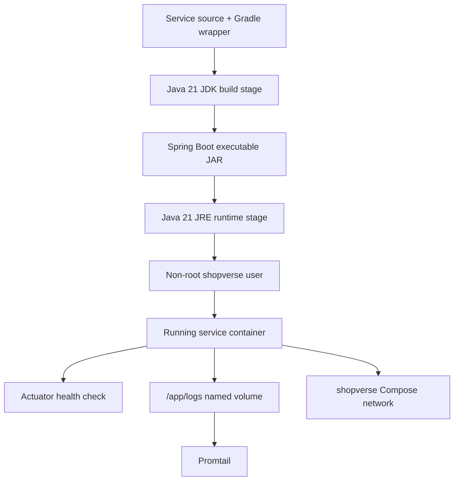
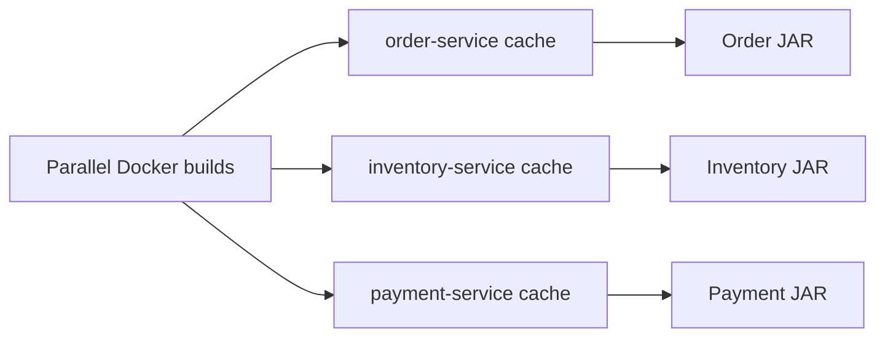
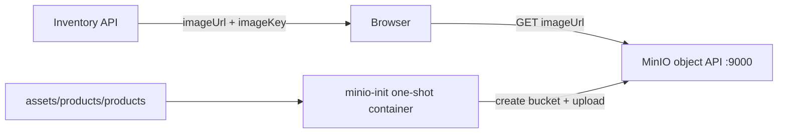

# Shopverse Docker Implementation

This page is the canonical explanation of how Shopverse builds and runs its
containers. For reusable Docker concepts and commands, see
[Docker](DOCKER.md).

## Container Architecture



The final image contains the runtime JRE, `curl`, the application JAR, and a
writable log directory. It does not contain source code, Gradle caches, or the
JDK compiler.

## Service Dockerfile

The following pattern is used by Shopverse Spring Boot services:

```dockerfile title="order-service/Dockerfile"
# syntax=docker/dockerfile:1.7

FROM eclipse-temurin:21-jdk-jammy AS build
WORKDIR /workspace

COPY gradlew gradlew.bat settings.gradle build.gradle ./
COPY gradle ./gradle
RUN chmod +x ./gradlew

COPY src ./src
RUN --mount=type=cache,id=shopverse-order-service-gradle,target=/root/.gradle \
    ./gradlew bootJar --no-daemon --max-workers=2

FROM eclipse-temurin:21-jre-jammy AS runtime

ENV APP_HOME=/app \
    SERVER_PORT=8083 \
    JAVA_OPTS="-XX:MaxRAMPercentage=75 -XX:+UseContainerSupport -XX:+ExitOnOutOfMemoryError"

WORKDIR ${APP_HOME}

RUN apt-get update \
    && apt-get install -y --no-install-recommends curl \
    && rm -rf /var/lib/apt/lists/* \
    && groupadd --system shopverse \
    && useradd --system --gid shopverse \
         --home-dir ${APP_HOME} \
         --shell /usr/sbin/nologin shopverse

COPY --chown=shopverse:shopverse \
    --from=build /workspace/build/libs/*.jar app.jar

RUN mkdir -p ${APP_HOME}/logs \
    && chown shopverse:shopverse ${APP_HOME}/logs

USER shopverse
EXPOSE 8083

HEALTHCHECK --interval=30s --timeout=5s --start-period=90s --retries=5 \
  CMD ["sh", "-c", "curl -fsS http://localhost:${SERVER_PORT}/actuator/health | grep -q UP"]

ENTRYPOINT ["sh", "-c", "java $JAVA_OPTS -jar app.jar"]
```

## Line-By-Line Explanation

| Instruction | Shopverse purpose |
|---|---|
| `# syntax=docker/dockerfile:1.7` | enables BuildKit cache-mount syntax |
| `FROM ... jdk ... AS build` | creates a temporary compilation stage with Java 21 JDK |
| `WORKDIR /workspace` | establishes the build-stage working directory |
| `COPY gradlew ... build.gradle` | copies build metadata before source for reusable layers |
| `COPY gradle ./gradle` | provides the Gradle wrapper runtime |
| `RUN chmod +x ./gradlew` | makes the wrapper executable on Linux |
| `COPY src ./src` | copies application source after build metadata |
| `RUN --mount=type=cache... bootJar` | compiles the JAR while reusing a service-specific Gradle cache |
| `FROM ... jre ... AS runtime` | starts a smaller final runtime stage |
| `ENV` | defines overridable runtime defaults |
| `apt-get install ... curl` | installs only the health-check client |
| `rm -rf /var/lib/apt/lists/*` | removes package-index data from the layer |
| `groupadd` / `useradd` | creates a non-login service identity |
| `COPY --chown` | copies only the JAR and assigns final ownership in the same layer |
| `mkdir ... logs` | creates the writable application-log directory |
| `USER shopverse` | prevents the Java process from running as root |
| `EXPOSE` | documents the internal service port |
| `HEALTHCHECK` | verifies Spring Boot Actuator reports `UP` |
| `ENTRYPOINT` | starts the executable JAR and expands `JAVA_OPTS` |

## Why Every Build Cache Has A Unique ID

Each service uses a cache such as:

```dockerfile
RUN --mount=type=cache,id=shopverse-order-service-gradle,target=/root/.gradle \
    ./gradlew bootJar --no-daemon --max-workers=2
```

Parallel Compose builds previously shared Gradle lock metadata. A unique cache
ID prevents unrelated service builds from contending for one mutable cache:



The cache accelerates repeated builds but is not copied into the final image.

## Non-Root Runtime

The Java application needs to read `app.jar`, listen on an unprivileged port,
write `/app/logs`, and call network dependencies. It does not need root.

```dockerfile
RUN groupadd --system shopverse \
    && useradd --system --gid shopverse \
         --home-dir /app \
         --shell /usr/sbin/nologin shopverse

COPY --chown=shopverse:shopverse --from=build \
    /workspace/build/libs/*.jar app.jar

USER shopverse
```

`COPY --chown` avoids copying the large JAR as root and changing ownership in a
later copy-on-write layer. Only `/app/logs` needs an additional ownership
operation.

Verify a running service:

```powershell
docker exec shopverse-order-service sh -c "id && whoami && ls -ld /app /app/logs"
```

## ENTRYPOINT, CMD, And RUN In Shopverse

| Instruction | Execution time | Shopverse use |
|---|---|---|
| `RUN` | image build | compile JAR, install curl, create user/directories |
| `ENTRYPOINT` | container startup | run Spring Boot |
| `CMD` | container startup | not currently used by service images |

Shopverse uses:

```dockerfile
ENTRYPOINT ["sh", "-c", "java $JAVA_OPTS -jar app.jar"]
```

The shell is used so `${JAVA_OPTS}` expands. A stricter production alternative
is a small tested entrypoint script that ends with `exec java ...`, which makes
signal forwarding explicit.

## `.dockerignore`

Every service build context excludes local/generated files:

```dockerignore title=".dockerignore"
.git
.gitignore
.gradle
build
logs
*.log
.idea
.vscode
*.iml
README.md
```

This reduces context transfer, prevents accidental leakage, and makes cache
behavior more predictable. Files required by the Dockerfile, including
`gradlew`, `gradle/`, `build.gradle`, `settings.gradle`, and `src/`, remain
included.

## Config Server Compose Block

```yaml title="docker-compose.yml"
config-server:
  build:
    context: ./config-server
  image: shopverse/config-server:local
  container_name: shopverse-config-server
  environment:
    SERVER_PORT: 8888
    SPRING_PROFILES_ACTIVE: native
    CONFIG_SEARCH_LOCATIONS: file:/config
    LOG_FILE: /app/logs/config-server.log
  ports:
    - "8888:8888"
  volumes:
    - config-server-logs:/app/logs
    - ./cloud-configs:/config:ro
  healthcheck:
    test: ["CMD-SHELL", "curl -fsS http://localhost:8888/actuator/health | grep -q UP"]
    interval: 15s
    timeout: 5s
    retries: 15
    start_period: 90s
  networks:
    - shopverse
```

| Compose field | Meaning |
|---|---|
| `build.context` | sends `config-server/` as the image build context |
| `image` | gives the built image a stable local name |
| `container_name` | provides a predictable local operational name |
| `SERVER_PORT` | overrides the Spring Boot port |
| `SPRING_PROFILES_ACTIVE=native` | selects the local filesystem Config backend |
| `CONFIG_SEARCH_LOCATIONS` | points Config Server at the mounted configuration directory |
| `LOG_FILE` | sends rolling application logs to the mounted log volume |
| `8888:8888` | publishes Config Server to the host |
| `config-server-logs:/app/logs` | preserves logs across container recreation |
| `./cloud-configs:/config:ro` | mounts centralized YAML read-only |
| `healthcheck` | delays dependent startup until Actuator reports `UP` |
| `shopverse` network | provides Compose DNS such as `http://config-server:8888` |

## MySQL Bootstrap

MySQL initialization scripts run automatically only when the data directory is
first created. Shopverse also has an idempotent `mysql-bootstrap` Compose
service that creates missing service databases and reapplies grants on every
stack startup.

This allows an existing local volume to gain newly introduced service schemas
without forcing `docker compose down -v`.

```powershell
docker compose ps mysql mysql-bootstrap
docker compose logs mysql-bootstrap
```

## MinIO Product Media

MinIO is the local S3-compatible object store for Inventory catalog images.
For generic MinIO concepts, policies, and presigned upload flow, see
[MinIO Object Storage](MINIO.md).
The `inventory_items` table stores stable metadata (`image_key` and
`image_url`), while the bytes remain under the `shopverse-product-images`
bucket. This avoids database backup growth and lets a browser load media
directly from object storage.



`minio-init` runs after the MinIO health check. It creates the bucket if it
does not exist, applies the POC download policy, and uploads the local catalog
assets. It is safe to recreate after an asset change.

```powershell
docker compose config
docker compose up -d minio minio-init
docker compose ps minio minio-init
docker compose logs --tail=100 minio-init
docker compose up -d --force-recreate minio-init
```

The API endpoint is `http://localhost:9000`; the local console is
`http://localhost:9001`. Configure `MINIO_ROOT_USER` and
`MINIO_ROOT_PASSWORD` in the ignored root `.env`. Compose resolves every
required environment variable before it builds any service, so a missing
MinIO password blocks even a targeted command such as `docker compose build
order-service`.

The public bucket policy is deliberately local-POC behavior. A production
deployment should keep buckets private and return short-lived pre-signed URLs
or use a CDN with an origin-access policy.

## Local Secrets

Create local values from the template:

```powershell
Copy-Item .env.example .env
docker compose config
```

`.env` is ignored. `.env.example` contains only placeholders. Production
deployments should use a managed secret store or platform secrets and should
mount signing keys rather than shipping development keys in an image.

## Build And Run Commands

```powershell
# Build all service images.
docker compose build

# Build one changed service.
docker compose build order-service

# Start the complete stack.
docker compose up -d

# Rebuild and recreate one service.
docker compose up -d --build order-service

# Inspect status and logs.
docker compose ps
docker compose logs -f --tail=100 order-service
```

Use `--no-cache` only to investigate stale or corrupted build layers:

```powershell
docker compose build --no-cache order-service
```

## Lightweight Verification Stack

`docker-compose.test.yml` starts the database, Kafka, Config Server, Eureka,
business services, API Gateway, and Zipkin without the complete observability
stack. It uses separate ports, volumes, memory limits, and bounded health
checks.

Run it through the verification script:

```powershell
powershell -NoProfile -ExecutionPolicy Bypass `
  -File .\scripts\Verify-Shopverse.ps1 `
  -Mode Full -TimeoutMinutes 10 -ForceIsolatedStack
```

## Related Guides

- [Generic Docker guide](DOCKER.md)
- [Shopverse problems and solutions](../reliability/PROBLEMS-AND-SOLUTIONS.md)
- [Shopverse testing strategy](../development/TESTING.md)
- [Centralized logging](../observability/STRUCTURED-LOGGING.md)
