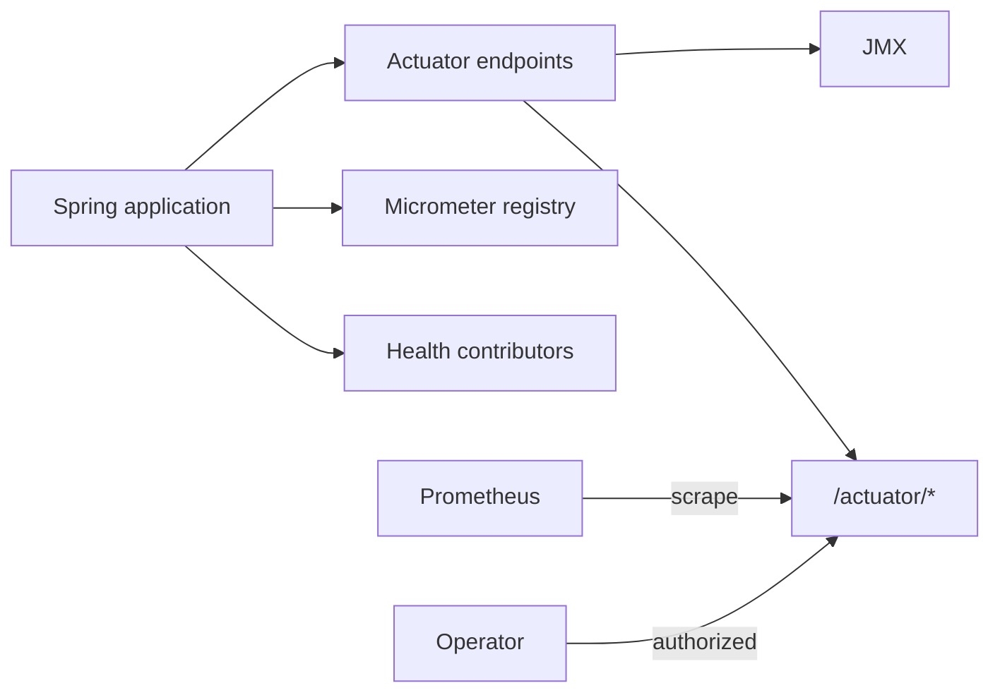

# Spring Boot Actuator

Actuator adds production endpoints and instrumentation for observing and
managing a running Spring Boot application. It helps answer:

- Is the process alive and ready for traffic?
- Which beans, routes, properties, migrations, and auto-configurations exist?
- What are JVM, HTTP, pool, cache, and business metrics doing?
- Which log levels, scheduled tasks, and threads are active?

Actuator instruments the application. Prometheus stores/scrapes metrics,
Grafana visualizes them, and an alerting system notifies responders.

## Dependencies

```groovy
dependencies {
    implementation 'org.springframework.boot:spring-boot-starter-actuator'
    runtimeOnly 'io.micrometer:micrometer-registry-prometheus'
}
```

The registry enables `/actuator/prometheus`; it differs from the diagnostic
`/actuator/metrics` endpoint.



## Important Endpoints

| Endpoint | Purpose | Sensitivity |
|---|---|---|
| `health` | Overall/component health and probe groups | Limit public detail |
| `info` | Curated build/application information | Low if curated |
| `prometheus` | Scrape-format Micrometer samples | Private monitoring path |
| `metrics` | Diagnostic meter names and tagged values | Internal |
| `caches` | Cache managers/caches and administrative eviction | Protect strongly |
| `loggers` | View/change logger levels | Administrative/auditable |
| `mappings` | MVC/WebFlux route mappings | Reveals attack surface |
| `conditions` | Auto-configuration match report | Reveals internals |
| `configprops` | Bound configuration properties | Sensitive despite sanitization |
| `env` | Property sources/environment | Highly sensitive |
| `beans` | Bean graph | Internal architecture |
| `liquibase`/`flyway` | Applied migrations | Database detail |
| `scheduledtasks` | Scheduled work | Internal operation detail |
| `threaddump` | Thread stacks | Sensitive diagnostic data |
| `heapdump` | JVM heap file | Extremely sensitive; may contain secrets/data |
| `startup` | Buffered startup steps | Diagnostic; requires startup recording |
| `httpexchanges` | Recent HTTP exchanges | Requires repository; bound and protect data |
| `shutdown` | Graceful shutdown trigger | Disabled by default; highly privileged |

Do not expose all endpoints publicly. An endpoint must be enabled/permitted and
exposed through HTTP/JMX to be available.

## Safe Baseline

```yaml
management:
  endpoints:
    web:
      exposure:
        include: health,info,prometheus
  endpoint:
    health:
      show-details: when_authorized
      probes:
        enabled: true
  metrics:
    tags:
      application: ${spring.application.name}
```

Use a private network or management port plus authentication and authorization.
A separate port alone is not a security boundary.

## Health, Liveness, And Readiness

| Signal | Question | Dependency rule |
|---|---|---|
| Liveness | Should the process restart? | Do not depend on ordinary remote services |
| Readiness | Should traffic reach this instance? | Include dependencies required to serve safely |
| Overall health | Which component is degraded? | May provide a broader protected view |

```text
/actuator/health/liveness
/actuator/health/readiness
```

Database failure should not normally fail liveness and restart every process.
Readiness should fail if the workload truly cannot serve without the database.
Health checks must be fast, bounded, and low load.

```java
@Component("catalog")
final class CatalogHealthIndicator implements HealthIndicator {
    private final CatalogProbe probe;

    @Override
    public Health health() {
        return probe.canServe()
                ? Health.up().build()
                : Health.down().withDetail("reason", "unavailable").build();
    }
}
```

Never include secrets, customer data, stack traces, or raw dependency responses.

## Metrics And Micrometer

```java
@Service
final class CheckoutMetrics {
    private final Counter successful;

    CheckoutMetrics(MeterRegistry registry) {
        successful = Counter.builder("shopverse.checkout.completed")
                .description("Completed checkouts")
                .register(registry);
    }

    void recordSuccess() { successful.increment(); }
}
```

Tags must be bounded. Use outcome/method/status family—not user ID, order ID,
email, exception message, raw URL, or trace ID.

```text
GET /actuator/metrics
GET /actuator/metrics/http.server.requests
GET /actuator/metrics/http.server.requests?tag=status:500
```

Production dashboards query Prometheus rather than repeatedly polling the
diagnostic endpoint.

## Caches, Info, And Diagnostics

The `caches` endpoint lists managers and caches and may clear entries. Cache
meters may require provider statistics such as Caffeine `recordStats()`; missing
metrics can mean instrumentation is absent, not that misses are zero.

Generate safe build metadata with `springBoot { buildInfo() }`. Useful info is
version, build time, and commit. Do not expose environment dumps or secrets.

Use `conditions` for auto-configuration, `mappings` for routes, `liquibase` for
migrations, `threaddump` for blocked threads, and `loggers` for temporary
diagnostics. Restore logger changes and audit administrative actions.

## Security

```java
@Bean
@Order(1)
SecurityFilterChain actuatorSecurity(HttpSecurity http) throws Exception {
    return http
            .securityMatcher(EndpointRequest.toAnyEndpoint())
            .authorizeHttpRequests(auth -> auth
                    .requestMatchers(EndpointRequest.to("health", "info"))
                    .permitAll()
                    .anyRequest().hasRole("OPS"))
            .httpBasic(Customizer.withDefaults())
            .build();
}
```

Also restrict network paths, use TLS, protect credentials, and test filter-chain
ordering. Heap dumps need strict access and retention because memory can contain
tokens, credentials, and personal data.

## Custom Endpoint

```java
@Component
@Endpoint(id = "release")
final class ReleaseEndpoint {
    @ReadOperation
    Map<String, String> release() {
        return Map.of("version", "2026.07.11");
    }
}
```

Prefer normal secured APIs for business operations. Custom management endpoints
must be bounded, sanitized, authorized, and auditable.

## Shopverse Mapping

Shopverse services already include Actuator. Docker uses health endpoints and
Prometheus scrapes `/actuator/prometheus`. Review every public matcher and network
path before internet exposure.

- [Observability Implementation Guide](../observability/OBSERVABILITY-IMPLEMENTATION-GUIDE.md)
- [Micrometer Metrics](../observability/MICROMETER-METRICS.md)
- [Spring Boot Admin](./SPRING-BOOT-ADMIN.md)
- [Debugging](../development/DEBUGGING.md)

## Production Checklist

- Expose only required endpoints; restrict by network and identity.
- Keep unauthenticated health detail minimal.
- Define probes from restart/traffic semantics.
- Keep contributors fast and bounded.
- Prevent sensitive data in info, health, env, logs, and metric tags.
- Protect/audit logger changes, cache eviction, and shutdown.
- Test endpoints through deployed gateway/network policy.

## Official References

- [Actuator Endpoints](https://docs.spring.io/spring-boot/reference/actuator/endpoints.html)
- [Actuator Metrics](https://docs.spring.io/spring-boot/reference/actuator/metrics.html)
- [Monitoring Over HTTP](https://docs.spring.io/spring-boot/reference/actuator/monitoring.html)
