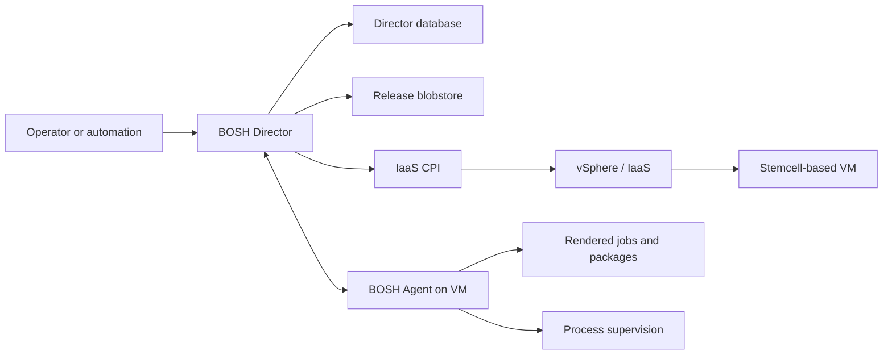

# Containers, Virtual Machines, Kubernetes, And BOSH

“VM versus Kubernetes” compares different layers. A virtual machine is an isolation
and compute unit. Kubernetes is a distributed control plane that schedules and
reconciles Pods, commonly onto nodes that are themselves virtual machines.

```text
Physical host
  -> hypervisor
    -> node VM with guest kernel
      -> container runtime
        -> Pod sandbox
          -> one or more containers
            -> application processes
```

## Layer Comparison

| Layer | Provides | Owns Lifecycle | Typical Failure |
|---|---|---|---|
| process | executing program and address space | OS/service manager/runtime | crash, deadlock, resource exhaustion |
| container | packaged root filesystem plus isolated process configuration | container runtime | image/start/config/cgroup failure |
| Pod | co-scheduled container group with shared network identity and volumes | kubelet and workload controller | Pending, sandbox, probe, eviction failure |
| node VM | guest kernel, CPU/memory devices, network and disks | IaaS/vSphere plus VM lifecycle manager | power, host, guest OS, disk, network failure |
| Kubernetes | API and reconciliation of workloads/cluster resources | cluster/platform team | API, etcd, scheduler, controller, add-on failure |
| BOSH | release engineering and lifecycle management of VMs and software jobs | BOSH Director and operators | CPI, agent, release, manifest or convergence failure |

## Virtual Machines

A VM virtualizes hardware and runs its own guest kernel. It offers a strong OS
boundary and can run arbitrary services, container runtimes, or Kubernetes nodes.
The hypervisor schedules vCPU and memory and connects virtual disks and NICs.

Advantages:

- independent guest kernel and OS-level configuration;
- mature infrastructure isolation, snapshots, networking, and tooling;
- natural unit for a Kubernetes node or legacy service;
- failure and maintenance boundary separate from other guest VMs.

Costs:

- larger image and boot footprint than a container process;
- guest OS patching and configuration ownership;
- slower provisioning and lower density in many workloads;
- application deployment remains a separate concern unless another manager exists.

## Containers

A Linux container is not a lightweight VM. Container processes share the host
kernel and use namespaces, cgroups, capabilities, seccomp, filesystems, and runtime
configuration for isolation and resource control. The image supplies userspace and
application dependencies, not a separate kernel.

Advantages include fast startup, immutable packaging, reproducible dependencies,
and high density. Risks include shared-kernel exposure, image supply chain, weak
defaults, writable-layer loss, and resource contention. Containers still require
a host OS, runtime, networking, storage, and lifecycle owner.

## Pods And Containers

A Pod is Kubernetes' smallest scheduling unit. Containers in one Pod:

- are assigned to the same node;
- share one Pod IP and network namespace by default;
- can communicate over `localhost`;
- can share declared volumes;
- normally scale, restart, and terminate as one lifecycle unit.

Use multiple containers in a Pod only when their placement and lifecycle are
inseparable, such as an application plus a tightly coupled proxy or adapter. Do
not place unrelated microservices into one Pod merely to reduce manifest count.

### Container Restart Versus Pod Replacement

The kubelet may restart a failed container inside the existing Pod according to
restart policy. A Deployment controller replaces a deleted/unavailable Pod with a
new Pod that has a new UID and usually a new IP. Applications must not treat Pod
identity or writable layers as durable state.

## Kubernetes On Virtual Machines

In many enterprise platforms, control-plane and worker nodes are VMs:

```text
vSphere / IaaS
  -> Kubernetes control-plane VMs
  -> Kubernetes worker VMs
       -> kubelet + container runtime
       -> Pods and containers
```

Kubernetes does not replace the hypervisor. It consumes node capacity provided by
physical or virtual machines. The IaaS controls VM placement, virtual hardware,
networks, and disks; Kubernetes controls Pod placement and application resources.

### Two Scheduling Layers

The Kubernetes scheduler selects a node for a Pod. The hypervisor scheduler places
and runs the node VM on physical infrastructure. Good Pod anti-affinity is not
enough if all node VMs share one host, rack, datastore, or failure domain. Platform
design must align both layers.

## What BOSH Adds

BOSH is a release-engineering, deployment, and lifecycle-management system for
distributed software on VMs. It can create VMs through an IaaS-specific Cloud
Provider Interface (CPI), install versioned software, monitor agents/processes,
recreate unhealthy VMs, and perform controlled updates.



## BOSH Building Blocks

### Stemcell

A stemcell is a versioned VM template containing an operating system and BOSH
Agent. It is specific to a cloud/IaaS family. BOSH clones it when creating managed
VMs, then applies networks, disks, VM type, and jobs.

### Release

A release is a versioned, self-contained collection of software source/artifacts,
configuration templates, startup/lifecycle scripts, jobs, and packages. A release
describes software; it does not by itself choose how many VMs or where they run.

### BOSH Package

A package contains source or precompiled software plus a packaging script and
compile-time dependency list. Compiled content is installed under:

```text
/var/vcap/packages/<package-name>
```

“BOSH package” and “Go package” are different concepts. A BOSH package may contain
and compile a Go module/application, often using a vendored Go runtime package, but
it may equally package Java, Ruby, C, CLIs, or precompiled binaries.

### BOSH Job

A job describes a runnable role: configuration properties, rendered templates,
process definitions, lifecycle hooks, and runtime package dependencies. It appears
under:

```text
/var/vcap/jobs/<job-name>
/var/vcap/sys/log/<job-name>
/var/vcap/sys/run/<job-name>
```

Jobs may use Monit or BPM to supervise processes, depending on release/version.

### Deployment Manifest

A deployment manifest assigns jobs to instance groups and declares instances,
networks, availability zones, VM types, disks, stemcells, releases, update policy,
and properties. It is desired state for one BOSH deployment.

### Cloud Config And CPI

Cloud config separates IaaS-specific networks, AZs, VM types, disk types, and VM
extensions from application deployment manifests. The CPI translates Director
requests into vSphere or another IaaS API operations.

### Director And Agent

The Director stores desired/deployed state and orchestrates tasks. An Agent runs on
each managed VM, applies settings/jobs and reports state. Depending on generation,
Director/Agent communication includes NATS-based messaging. The Health Monitor can
detect missing VMs and request resurrection when configured.

## BOSH VM Lifecycle

```text
manifest desired state
 -> Director calculates diff
 -> CPI creates VM/disk/network from stemcell
 -> Agent configures VM and installs compiled packages
 -> job templates rendered and lifecycle hooks executed
 -> processes started and monitored
 -> Director records convergence
```

During an update, canaries and `max_in_flight` bound disruption. BOSH can recreate
a VM from desired state, but application data still needs replication, backup, and
correct recovery semantics.

## BOSH Command Orientation

```bash
bosh environments
bosh -e <environment> env
bosh -e <environment> deployments
bosh -e <environment> configs
bosh -e <environment> cloud-config
bosh -e <environment> stemcells
bosh -e <environment> releases
bosh -e <environment> tasks --recent=30

bosh -e <environment> -d <deployment> vms
bosh -e <environment> -d <deployment> instances
bosh -e <environment> -d <deployment> manifest
bosh -e <environment> -d <deployment> logs <instance-group>/<index>
bosh -e <environment> -d <deployment> ssh <instance-group>/<index>
bosh -e <environment> -d <deployment> run-errand <errand>
bosh -e <environment> -d <deployment> cck
```

`bosh cck` is an interactive cloud consistency repair tool. Its options can recreate,
delete, or forget infrastructure state; capture evidence and understand every
choice before proceeding.

## Kubernetes Versus BOSH Reconciliation

| Concern | Kubernetes | BOSH |
|---|---|---|
| primary API object | Pod/workload/resource | deployment manifest, releases, configs |
| scheduling unit | Pod | VM instance group instance |
| infrastructure action | usually delegated to node/cloud integrations | Director invokes CPI directly |
| software artifact | container image | stemcell plus compiled BOSH releases/packages |
| node/VM recreation | node manager/provider/platform | native BOSH desired-state operation |
| application rollout | workload controller | VM/job update strategy |
| health loop | probes, kubelet and controllers | Agent, process supervision, Health Monitor |

In TKGI, both operate together: BOSH manages Kubernetes node VMs and their Kubernetes
software; Kubernetes manages Pods inside those nodes.

## Failure-Layer Diagnosis

| Symptom | Start At |
|---|---|
| Pod pending or restarting | Kubernetes object, scheduler, kubelet, runtime |
| worker VM missing/unresponsive | BOSH deployment, Agent, CPI, vSphere/IaaS |
| all cluster API calls fail | control-plane VMs, load balancer/DNS, certificates, etcd |
| BOSH task fails creating VM | Director task, CPI, IaaS quota/network/datastore |
| process absent on BOSH VM | job logs, Monit/BPM, rendered config/package |
| Pod placement resilient but zone still fails | verify node-VM placement and physical failure domains |

## Interview Questions

**Is a container a small VM?** No. It normally shares the host kernel and isolates
processes using Linux mechanisms. A VM includes a separate guest kernel on virtual hardware.

**Is a Pod a container?** No. It is a Kubernetes scheduling/lifecycle envelope for
one or more co-located containers with shared network identity and declared volumes.

**Does Kubernetes replace vSphere or VMs?** No. Kubernetes commonly runs on VMs and
orchestrates workloads inside nodes; the hypervisor still owns virtual infrastructure.

**Why BOSH when Kubernetes exists?** In a TKGI-style architecture, BOSH manages the
VM-based Kubernetes clusters themselves: node VM creation, versioned Kubernetes software,
updates, repair, and IaaS integration. Kubernetes then manages application workloads.

## Official References

- [Kubernetes containers](https://kubernetes.io/docs/concepts/containers/)
- [Kubernetes Pods](https://kubernetes.io/docs/concepts/workloads/pods/)
- [BOSH components](https://bosh.io/docs/bosh-components/)
- [Understanding BOSH](https://bosh.cloudfoundry.org/docs/understanding-bosh/)
- [BOSH releases, jobs, and packages](https://bosh.io/docs/release/)
- [BOSH CLI v2 commands](https://bosh.io/docs/cli-v2/)

## Recommended Next

Continue with the [TKGI Beginner-To-Architect Overview](./TKGI-OVERVIEW-PATH.md), then
use the focused API, UAA, database, BOSH, Harbor and Management Console pages before
the end-to-end architecture guide.
