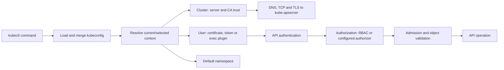

# Kubernetes Kubeconfig, Contexts, Authentication, And Cluster Access

A kubeconfig is a client configuration document. It tells `kubectl` and other
`client-go` applications which API server to contact, how to establish TLS trust, which
client identity mechanism to use and which namespace to select by default.

It is not a Kubernetes API object stored in the cluster. It is local client-side data,
and it may contain or invoke highly privileged credentials.

## Request Path



## Kubeconfig Anatomy

```yaml
apiVersion: v1
kind: Config

clusters:
  - name: orders-prod-cluster
    cluster:
      server: https://api.orders-prod.example.com:6443
      certificate-authority: ./certificates/orders-prod-ca.pem

users:
  - name: ahmed-prod
    user:
      exec:
        apiVersion: client.authentication.k8s.io/v1
        command: company-kubernetes-login
        args: ["token", "--environment", "prod"]
        interactiveMode: IfAvailable

contexts:
  - name: orders-prod
    context:
      cluster: orders-prod-cluster
      user: ahmed-prod
      namespace: orders

current-context: orders-prod
```

### Cluster Entry

The cluster entry normally contains:

- `server`: Kubernetes API HTTPS endpoint;
- `certificate-authority` or `certificate-authority-data`: CA used to authenticate
  the API server;
- optional `tls-server-name` when the TLS name differs from the connection address;
- optional proxy configuration supported by the client.

Avoid `insecure-skip-tls-verify: true`. It disables server identity verification and
turns network interception into credential and control-plane compromise risk.

### User Entry

The user entry describes a client authentication mechanism. Common forms are:

- X.509 client certificate and private key;
- bearer token;
- an `exec` credential plugin that returns short-lived credentials;
- identity-provider integration such as OIDC through a supported plugin/workflow.

The name under `users` is only a local kubeconfig key. It is not necessarily the
username recognized by the API server. The authenticator derives the Kubernetes user
and groups from the certificate, token claims, webhook response or proxy headers.

### Context Entry

A context joins three references:

```text
context = cluster + user + optional default namespace
```

Changing context can change both target cluster and identity. Changing only the
namespace does not create an isolation boundary; it changes the default request scope.

## How kubectl Selects Configuration

Conceptually, selection is:

1. `--kubeconfig <file>` when explicitly supplied;
2. files listed in `KUBECONFIG` when the environment variable is set;
3. the default per-user kubeconfig location otherwise.

`KUBECONFIG` is a platform-specific path list: commonly `:` separated on Linux/macOS
and `;` separated on Windows. Multiple files are merged into an effective configuration.
Duplicate names and ambient environment state can make automation surprising, so CI
should pass an explicit, dedicated file and context.

Inspect configuration without printing raw credential material:

```bash
kubectl config view
kubectl config get-clusters
kubectl config get-users
kubectl config get-contexts
kubectl config current-context
kubectl config view --minify
```

`kubectl config view --raw` and flattened output can reveal embedded certificates,
tokens or private keys. Treat their output as secret material.

## Context And Namespace Commands

```bash
kubectl config use-context orders-prod
kubectl config set-context --current --namespace=orders
kubectl --context orders-prod --namespace orders get deployment
```

For scripts and production writes, prefer explicit flags:

```bash
kubectl --kubeconfig ./ci-prod.config \
  --context orders-prod \
  --namespace orders \
  diff --server-side -f deployment.yaml
```

Do not rely on the operator remembering which context was last selected in another
terminal. Prompts that display cluster/namespace are helpful guardrails, not authorization.

## Building Entries With kubectl

The commands below show structure; use your platform's supported credential workflow:

```bash
kubectl config --kubeconfig ./orders.config set-cluster orders-prod-cluster \
  --server=https://api.orders-prod.example.com:6443 \
  --certificate-authority=./orders-prod-ca.pem

kubectl config --kubeconfig ./orders.config set-context orders-prod \
  --cluster=orders-prod-cluster \
  --user=ahmed-prod \
  --namespace=orders

kubectl config --kubeconfig ./orders.config use-context orders-prod
```

Avoid placing long-lived tokens or private-key values directly on a command line because
shell history and process inspection can expose them.

## Multiple Files, Merge And Portability

Useful views include:

```bash
kubectl config view --merge
kubectl config view --minify
kubectl config view --flatten
```

`--minify` keeps information used by the current context. `--flatten` can make referenced
certificate/key files self-contained by embedding data, which improves portability but
also concentrates secrets. Write the result only to a protected destination and inspect
it before distribution.

Recommended multi-cluster practice:

- give clusters, users and contexts unique, meaningful names;
- include environment and region in production context names;
- keep personal, CI and break-glass credentials separate;
- avoid merging an untrusted file with privileged configuration;
- maintain restrictive filesystem permissions;
- inventory and expire old contexts and credentials;
- use explicit configuration in automation.

## Exec Credential Plugins

An exec plugin is a local executable invoked by `client-go`. It returns an
`ExecCredential` containing a token or client certificate/key, ideally with an expiry.

```yaml
users:
  - name: platform-sso
    user:
      exec:
        apiVersion: client.authentication.k8s.io/v1
        command: company-kubernetes-login
        args: ["token", "--cluster", "orders-prod"]
        interactiveMode: IfAvailable
        provideClusterInfo: false
```

Security consequences:

- loading a malicious kubeconfig can execute an attacker-selected command;
- the plugin binary and update channel become supply-chain dependencies;
- interactive plugins can fail in headless CI;
- cached refresh tokens must be protected and revoked when devices are lost;
- plugin stdout must contain only the credential response, not debug logging.

Only use kubeconfig files and credential plugins from trusted sources. Inspect an
untrusted file like executable code before allowing any client to load it.

## Client Certificates

A certificate-based user entry can reference files:

```yaml
users:
  - name: legacy-operator
    user:
      client-certificate: ./certificates/operator.crt
      client-key: ./certificates/operator.key
```

or embed base64-encoded data. The API server authenticates a valid client certificate
signed by a configured client CA. Identity commonly derives from certificate subject
information; actual authorization still depends on configured authorizers such as RBAC.

Certificates require inventory, expiry monitoring, secure private-key storage, revocation
or compensating controls and a rotation procedure. Avoid distributing one administrative
certificate to a whole team.

## Tokens, OIDC And Short-Lived Access

Prefer centrally managed human identity and short-lived tokens over static bearer tokens.
An OIDC or exec flow can map signed claims to a Kubernetes username and groups. RBAC then
binds those groups to permitted actions.

Validate:

- issuer and API server trust;
- token audience;
- expiry, not-before and clock synchronization;
- username/group claim mapping;
- refresh and revocation behavior;
- plugin behavior in interactive and CI environments.

A decoded token is not proof that the API accepts it. Signature, issuer, audience,
expiry and authenticator configuration must all match.

## Service Accounts And In-Cluster Configuration

A Pod normally uses an in-cluster client configuration rather than a human kubeconfig:

```text
API host/port injected into the Pod environment
service-account token projected into the Pod
cluster CA bundle mounted for TLS trust
namespace file mounted with the service-account data
```

Use a purpose-specific ServiceAccount and least-privilege RBAC. Disable automatic token
mounting when the workload does not call the Kubernetes API. Modern projected tokens are
short-lived and audience-bound; avoid old manually created long-lived token Secrets.

## Authentication, Authorization And Admission

A successful TLS connection is not authentication. Successful authentication is not
authorization. Successful authorization does not bypass admission.

```bash
kubectl auth whoami
kubectl auth can-i get pods -n orders
kubectl auth can-i create deployments.apps -n orders
kubectl auth can-i --list -n orders
```

Test another identity only when you have explicit impersonation permission:

```bash
kubectl auth can-i get pods -n orders \
  --as=ahmed@example.com \
  --as-group=orders-readers
```

Impersonation is powerful and must be granted narrowly and audited. `kubectl auth can-i`
answers an authorization question; admission policy can still reject the final object.

## TKGI Credential Flow

```bash
tkgi login -a api.tkgi.example.com
tkgi get-credentials orders-prod
kubectl config current-context
kubectl auth whoami
kubectl get --raw='/readyz?verbose'
```

The first two commands cross the TKGI/UAA management boundary and produce/configure
cluster access. Subsequent commands target the provisioned Kubernetes API. A working
TKGI login does not prove Kubernetes endpoint reachability, and a working cached
kubeconfig does not prove the TKGI management API is healthy.

Before running `get-credentials`, preserve or explicitly select the intended kubeconfig
destination. Verify exactly which context was added or changed, especially on a workstation
with multiple production clusters.

## Security Controls

- never commit kubeconfig files to Git;
- never attach raw kubeconfig to tickets or chat;
- do not use shared cluster-admin configuration for daily work;
- encrypt and access-control backups containing client configuration;
- prefer short-lived, identity-provider-backed credentials;
- restrict local file permissions and workstation access;
- monitor API audit logs for privileged identities and impersonation;
- use separate break-glass credentials with tested, audited access;
- remove stale users, contexts and RBAC bindings during offboarding;
- rotate certificates, tokens and plugin credentials before expiry.

## Troubleshooting Decision Tree

### Wrong Cluster Or Namespace

```bash
kubectl config current-context
kubectl config view --minify
kubectl cluster-info
kubectl auth whoami
```

### DNS, TCP Or TLS Failure

Inspect the selected cluster server and CA reference. Then test name resolution, route,
port reachability, certificate chain, SAN and clock. Do not “fix” an x509 problem by
permanently disabling TLS verification.

### Credential Plugin Failure

Confirm the executable exists, is trusted, supports the declared `ExecCredential` API
version, has suitable `interactiveMode`, can reach the identity provider and returns no
extra stdout. CI must not depend on an interactive prompt.

### Unauthorized Versus Forbidden

```text
Unauthorized / 401: identity was absent, invalid, expired or rejected.
Forbidden / 403: identity was recognized but lacks authorization.
```

Confirm with `kubectl auth whoami` and `kubectl auth can-i`, then inspect API audit and
authenticator/authorizer evidence.

### Certificate Expired

Inspect both API server certificate and client certificate. They have different purposes
and rotation procedures. With an exec/OIDC flow, refresh the supported credential source
instead of manually editing generated tokens.

## Interview Questions

**What is a kubeconfig context?** A named client-side tuple selecting a cluster entry,
user entry and optional default namespace.

**Does kubeconfig grant permission?** It supplies connection and authentication inputs.
The API server authenticates the presented identity; RBAC or another authorizer grants
permissions; admission can still reject the request.

**Why is an untrusted kubeconfig dangerous?** It can reference local credential files,
redirect a client to a hostile API endpoint and configure an exec credential plugin that
runs a local command.

**What is the difference between `certificate-authority-data` and
`client-certificate-data`?** The first authenticates the API server to the client. The
second presents client identity to the API server and must be paired with its private key.

**How do you make multi-cluster automation safe?** Use a dedicated explicit kubeconfig,
an explicit context and namespace, short-lived least-privilege identity, preflight identity
checks, server-side dry run/diff, controlled secrets and auditable change gates.

## Official References

- [Organizing cluster access with kubeconfig](https://kubernetes.io/docs/concepts/configuration/organize-cluster-access-kubeconfig/)
- [Configure access to multiple clusters](https://kubernetes.io/docs/tasks/access-application-cluster/configure-access-multiple-clusters/)
- [Kubernetes authentication and exec credential plugins](https://kubernetes.io/docs/reference/access-authn-authz/authentication/)
- [Kubernetes authorization](https://kubernetes.io/docs/reference/access-authn-authz/authorization/)
- [User impersonation](https://kubernetes.io/docs/reference/access-authn-authz/user-impersonation/)

## Recommended Next

Continue with [API Machinery And Control-Plane Internals](./KUBERNETES-CONTROL-PLANE-INTERNALS.md)
to follow the authenticated request through authorization, admission, persistence and
controller reconciliation.

