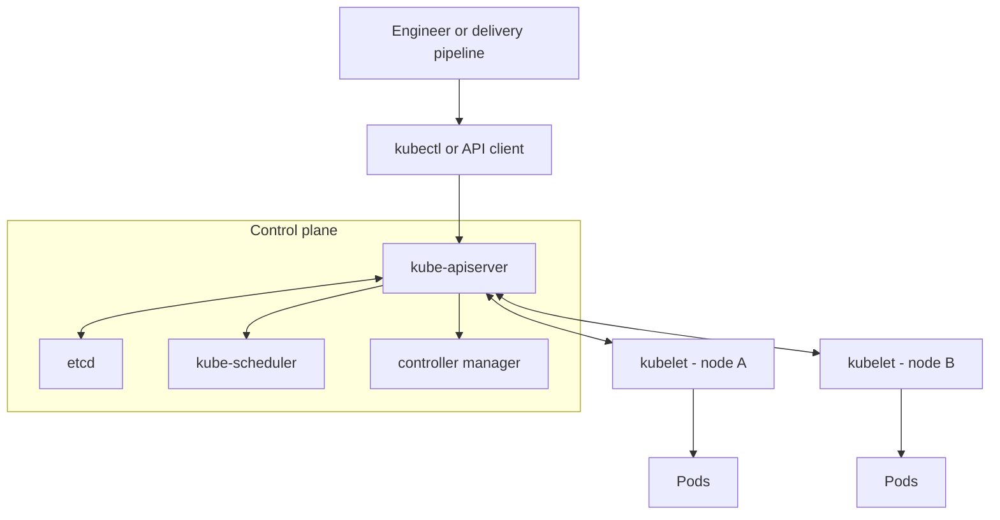
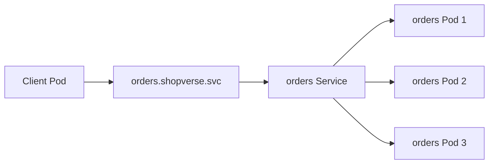

# Kubernetes Overview: Clusters, Nodes, Pods, And Core Concepts

Kubernetes is a platform for running and coordinating containerized applications across a
group of machines. You declare the state you want—for example, “keep three copies of the
orders application running”—and Kubernetes continuously works to make the cluster match that
state.

Kubernetes is commonly abbreviated as **K8s** because eight letters appear between `K` and `s`.

<DocCallout type="tip" title="The central idea">

Kubernetes is not primarily a collection of commands. It is an API-driven **desired-state and
reconciliation system**. You submit objects describing the desired state; controllers compare
that state with reality and repeatedly correct differences.

</DocCallout>

## What Problem Does Kubernetes Solve?

A container packages an application and its runtime dependencies, but production operation
requires more than starting one container. Teams must decide:

- which machine should run each application instance;
- how failed instances are detected and replaced;
- how applications find one another when instance addresses change;
- how releases move from one version to another without avoidable downtime;
- how CPU, memory, configuration, secrets, and storage are assigned;
- how replicas spread across machines and failure zones;
- how access and resource consumption are controlled.

Kubernetes supplies APIs and controllers for these concerns. It does **not** fix application
bugs, design database replication, guarantee correct scaling metrics, or make every workload a
good fit for distributed infrastructure.

## The Basic Mental Model

```text
Cluster
├── Control plane: stores desired state and makes cluster-wide decisions
└── Worker nodes: provide CPU and memory for application Pods
    └── Pod: smallest deployable Kubernetes unit
        └── Container: packaged application process and dependencies
```

| Term | Meaning | Example |
|---|---|---|
| container image | immutable package used to start a container | `shopverse/orders:1.4.0` |
| container | running process created from an image | one running orders application process |
| Pod | one scheduling and lifecycle unit containing one or more containers | orders container plus a tightly coupled sidecar |
| node | physical or virtual machine that runs Pods | a VM with kubelet and a container runtime |
| cluster | control plane, worker nodes, networking, storage integrations, and add-ons | production Kubernetes environment |
| namespace | logical scope for names, permissions, and policies inside a cluster | `shopverse-prod` |
| Kubernetes object | API record describing desired state or configuration | Deployment, Service, ConfigMap |

## Cluster Architecture

<InteractiveTopicTree
  title="Kubernetes learning tree"
  items={[
    {title: 'Foundations', description: 'Understand the API-driven cluster model', children: [
      {title: 'kubectl and manifests', href: '/operations/kubernetes/KUBERNETES-KUBECTL-MANIFESTS-COMMANDS', description: 'Inspect and change API objects safely'},
      {title: 'Kubeconfig and access', href: '/operations/kubernetes/KUBERNETES-KUBECONFIG-ACCESS', description: 'Contexts, identity, clusters, and namespaces'},
      {title: 'Control plane', href: '/operations/kubernetes/KUBERNETES-CONTROL-PLANE-INTERNALS', description: 'API server, etcd, scheduler, controllers, and kubelet'},
    ]},
    {title: 'Workloads and data plane', children: [
      {title: 'Pods, workloads, and scheduling', href: '/operations/kubernetes/KUBERNETES-WORKLOADS-SCHEDULING'},
      {title: 'Networking and Services', href: '/operations/kubernetes/KUBERNETES-NETWORKING-SERVICES'},
      {title: 'Storage and stateful workloads', href: '/operations/kubernetes/KUBERNETES-STORAGE-STATEFUL'},
    ]},
    {title: 'Production operations', children: [
      {title: 'Security and multi-tenancy', href: '/operations/kubernetes/KUBERNETES-SECURITY-MULTITENANCY'},
      {title: 'Cluster operations and recovery', href: '/operations/kubernetes/KUBERNETES-CLUSTER-OPERATIONS'},
      {title: 'Troubleshooting and interviews', href: '/operations/kubernetes/KUBERNETES-TROUBLESHOOTING-INTERVIEW-REVISION'},
    ]},
  ]}
/>



### Control Plane

The control plane manages the cluster rather than serving normal application traffic.

| Component | Basic responsibility |
|---|---|
| `kube-apiserver` | exposes the Kubernetes API and validates requests |
| `etcd` | stores cluster state consistently |
| `kube-scheduler` | selects a suitable node for each unscheduled Pod |
| `kube-controller-manager` | runs controllers that reconcile resources such as Deployments, nodes, and Jobs |
| cloud controller manager | integrates nodes, routes, load balancers, and volumes with a cloud provider when used |

### Worker Node

A worker node contributes compute capacity to the cluster.

| Component | Basic responsibility |
|---|---|
| `kubelet` | ensures the Pods assigned to its node are running as specified |
| container runtime | pulls images and starts/stops containers through the CRI |
| network implementation | gives Pods connectivity and may implement network policy |
| service data plane | routes Service traffic; commonly kube-proxy or functionality integrated into the network implementation |

The control plane decides and coordinates; nodes perform the application work.

## What Is A Pod?

A Pod is the smallest deployable unit in Kubernetes. It contains one or more containers that
must share placement and lifecycle. Containers in the same Pod share the Pod network identity,
can communicate over `localhost`, and can mount shared volumes.

Most application Pods contain one main container. Add another container only when it is tightly
coupled to the application—for example, a sidecar that must start, stop, and scale with it.

Pods are intentionally replaceable:

- a recreated Pod normally receives a new identity and IP address;
- changing a Deployment commonly creates new Pods instead of editing old ones in place;
- data written only to a container's writable layer disappears with that container;
- clients should use a Service rather than depend on individual Pod addresses.

<ExpandableAnswer title="Pod versus container">

A container is a running isolated process. A Pod is Kubernetes' wrapper around one or more
containers. Kubernetes schedules, addresses, probes, restarts, and terminates the Pod as a unit.
Two containers belong in one Pod only when they need the same node, network namespace, storage,
and lifecycle. Otherwise, deploy them as separate workloads and connect them through Services.

</ExpandableAnswer>

## Core Kubernetes Objects

| Object | What it solves | Typical use |
|---|---|---|
| Pod | runs one application unit | debugging or controller-created runtime unit |
| Deployment | maintains replaceable replicas and rolling updates | stateless HTTP service |
| ReplicaSet | maintains a replica count; normally owned by a Deployment | implementation detail of Deployment rollout |
| StatefulSet | gives Pods stable ordinal identity and volume association | clustered database or broker when Kubernetes operation is appropriate |
| DaemonSet | runs a Pod on every eligible node | log, metrics, network, or security agent |
| Job | runs work to completion | migration or batch calculation |
| CronJob | creates Jobs on a schedule | periodic cleanup or report |
| Service | provides a stable endpoint for changing backends | connect frontend Pods to backend Pods |
| ConfigMap | stores non-confidential configuration | feature settings or configuration files |
| Secret | stores sensitive values for controlled delivery | password, token, or certificate material |
| PersistentVolumeClaim | requests persistent storage | application data that must outlive a Pod |
| Namespace | scopes names and supports policy boundaries | separate teams or environments within a cluster |
| ServiceAccount | gives a workload an API identity | allow a controller to read selected resources |

## Kubernetes Terminology Glossary

Use these terms as a map of the platform. The definitions are intentionally short; each later
page explains the mechanisms and trade-offs in depth.

### Cluster And Control Plane

| Term | Meaning |
|---|---|
| cluster | the control plane and worker nodes managed as one Kubernetes system |
| control plane | components that expose the API, store state, schedule Pods and reconcile objects |
| worker node | a machine that supplies CPU, memory, networking and storage to Pods |
| data plane | workload traffic and execution across nodes, runtimes and network components |
| API server | the validated, authenticated front door to Kubernetes state and operations |
| `etcd` | the strongly consistent key-value store holding Kubernetes API state |
| scheduler | selects a suitable node for each unscheduled Pod |
| controller | a reconciliation loop that moves actual state toward desired state |
| reconciliation | repeated observe, compare and act work performed by controllers |
| admission controller | validates or mutates an API request after authentication and authorization |
| kubelet | the node agent that makes declared Pods run and reports their status |
| container runtime / CRI | software and interface used by kubelet to run containers |
| CNI | plugin interface used to configure Pod networking |
| CSI | plugin interface used to provision and attach storage |

### Workloads And Scheduling

| Term | Meaning |
|---|---|
| Pod | the smallest schedulable unit; one or more containers sharing network and volumes |
| init container | a container that completes before normal application containers start |
| sidecar | a supporting container that shares a Pod lifecycle with the application |
| Deployment / ReplicaSet | rollout controller and its replica-maintenance implementation for replaceable Pods |
| StatefulSet | controller for Pods needing stable identity, ordered lifecycle or stable volume claims |
| DaemonSet | controller that places a Pod on each eligible node |
| Job / CronJob | controllers for run-to-completion work once or on a schedule |
| request / limit | scheduling reservation and enforced resource ceiling for a container |
| QoS class | eviction priority derived from container requests and limits |
| readiness probe | decides whether a Pod should receive Service traffic |
| liveness / startup probe | detects a stuck container / protects slow startup before liveness begins |
| affinity / anti-affinity | preferences or requirements to place Pods together or apart |
| taint / toleration | node repulsion and the Pod permission to tolerate it |
| topology spread | rules that distribute replicas across zones, nodes or other domains |
| PDB | PodDisruptionBudget limiting voluntary simultaneous disruption |
| HPA | HorizontalPodAutoscaler that changes workload replica count from metrics |

### Networking, Configuration And Storage

| Term | Meaning |
|---|---|
| Service / ClusterIP | stable discovery name and virtual in-cluster address for selected Pods |
| EndpointSlice | scalable record of the ready backend addresses behind a Service |
| Ingress | HTTP(S) routing API that requires an ingress controller implementation |
| Gateway API | role-oriented APIs for advanced service and external traffic routing |
| CoreDNS | the common cluster DNS implementation used for Service discovery |
| NetworkPolicy | allowed ingress or egress rules enforced by a capable network plugin |
| ConfigMap / Secret | non-sensitive / sensitive configuration API objects; Secrets still require protection |
| volume | storage mounted into one or more containers in a Pod |
| PV / PVC | cluster storage resource and a workload's claim for storage |
| StorageClass | provisioning and policy profile used to create persistent storage |

### Object Model, Scope And Access

| Term | Meaning |
|---|---|
| manifest | YAML or JSON document describing a Kubernetes API object |
| `spec` / `status` | desired state supplied by users / observed state reported by the system |
| label / selector | indexed identity metadata / query that chooses matching objects |
| annotation | non-identifying metadata used by tools and integrations |
| namespace | logical naming, access and policy scope inside a cluster |
| owner reference | relationship that lets garbage collection follow object ownership |
| finalizer | deletion guard requiring a controller to finish cleanup first |
| CRD / operator | custom API type / controller that automates its domain knowledge |
| ServiceAccount | workload identity used by Pods when calling the Kubernetes API |
| RBAC | authorization using Roles, ClusterRoles and their bindings |
| kubeconfig / context | client access configuration / selected cluster, identity and namespace tuple |

### Workload Controllers

You usually create a **Deployment**, StatefulSet, DaemonSet, Job, or CronJob instead of creating
standalone Pods. A controller then creates and replaces Pods to maintain the declared state.

```text
Deployment -> ReplicaSet -> Pods -> Containers
```

If one of three Deployment Pods fails, the Deployment's ReplicaSet creates a replacement. It
restores the requested replica count; it does not repair the failed Pod.

## Services And Networking

Pod IP addresses can change as Pods are replaced. A Service provides a stable name and virtual
endpoint for a logical group of backends, usually selected by labels.



Common Service types:

- `ClusterIP`: internal cluster endpoint and the default;
- `NodePort`: exposes a port through every node, usually as a lower-level building block;
- `LoadBalancer`: requests an external load balancer from a supported integration;
- `ExternalName`: provides a DNS alias rather than proxying traffic.

Ingress or Gateway API resources describe external HTTP routing. A compatible controller must
be installed; creating an Ingress or Gateway object alone does not create a working data plane.

## Labels, Selectors, And Namespaces

**Labels** are key/value identifiers attached to objects. **Selectors** find objects by those
labels. Deployments use selectors to associate Pods, and Services usually use selectors to find
their backends.

```yaml
metadata:
  labels:
    app: orders
    tier: backend
```

A selector such as `app: orders` must match the Pod template labels. A wrong selector can send
traffic to the wrong Pods or leave a Service with no endpoints.

Namespaces divide namespaced resources into logical scopes. They help organize objects and
apply RBAC, quotas, and policies, but they are not automatically complete security isolation.
Cluster-scoped resources such as nodes and PersistentVolumes do not belong to one namespace.

## Configuration, Secrets, And Storage

- Use ConfigMaps to separate non-sensitive environment configuration from container images.
- Use Secrets for sensitive values, but also configure encryption, RBAC, rotation, and careful
  delivery; encoding a Secret value is not encryption.
- Use volumes for files shared within a Pod or supplied by the platform.
- Use PersistentVolumeClaims when data must survive Pod replacement. A StorageClass commonly
  describes how storage should be provisioned.

Kubernetes can attach storage. It does not automatically design database replication, backup,
restore, quorum, corruption recovery, or disaster recovery.

## Desired State, Actual State, And Reconciliation

Suppose a Deployment declares three replicas:

```text
Desired state: 3 ready Pods
Actual state:  2 ready Pods
Difference:    1 missing Pod
Controller:    creates a replacement
```

Controllers perform this comparison continuously. This is why directly editing a controller-
managed Pod is usually the wrong mental model: the controller owns the durable intent.

Kubernetes objects commonly contain:

| Field | Purpose |
|---|---|
| `apiVersion` | API group and version used for the object |
| `kind` | resource type, such as Deployment or Service |
| `metadata` | name, namespace, labels, annotations, and identity |
| `spec` | desired state supplied by the user or another controller |
| `status` | observed state reported by the system |

## First Deployment And Service

This example requests two web Pods and gives them a stable internal endpoint:

```yaml
apiVersion: apps/v1
kind: Deployment
metadata:
  name: web
spec:
  replicas: 2
  selector:
    matchLabels:
      app: web
  template:
    metadata:
      labels:
        app: web
    spec:
      containers:
        - name: web
          image: nginx:1.27
          ports:
            - containerPort: 80
          resources:
            requests:
              cpu: 100m
              memory: 64Mi
            limits:
              memory: 128Mi
---
apiVersion: v1
kind: Service
metadata:
  name: web
spec:
  selector:
    app: web
  ports:
    - port: 80
      targetPort: 80
```

The example is intentionally introductory. A production workload also needs deliberate image
provenance, health probes, security context, graceful shutdown, availability rules, resource
measurement, configuration, observability, and rollout policy.

<ExpandableAnswer title="Dry run: what happens after kubectl apply">

1. `kubectl` sends the Deployment and Service objects to the API server.
2. The API server authenticates and authorizes the request, validates the objects, and stores
   accepted state in etcd.
3. The Deployment controller creates a ReplicaSet; the ReplicaSet creates two Pod objects.
4. The scheduler selects a node for each unscheduled Pod.
5. Each selected node's kubelet asks its runtime to pull the image and start the container.
6. The network implementation connects the Pods. Their labels match the Service selector.
7. EndpointSlice data records the ready Service backends, and cluster DNS lets clients find the
   Service by name.
8. If a Pod disappears, reconciliation creates a replacement and the Service backend set changes.

</ExpandableAnswer>

## Essential Beginner Commands

```bash
kubectl get nodes
kubectl get namespaces
kubectl get pods -n <namespace>
kubectl get deployments,services -n <namespace>
kubectl describe pod <pod-name> -n <namespace>
kubectl logs <pod-name> -n <namespace>
kubectl apply -f application.yaml
kubectl rollout status deployment/web -n <namespace>
kubectl delete -f application.yaml
```

`get` shows summaries, `describe` combines object details with events, and `logs` reads container
output. Always confirm the current kubeconfig context and namespace before a mutating command.

## What Kubernetes Does Not Automatically Provide

- application correctness, idempotency, or transaction consistency;
- a CI pipeline or container-image build system;
- a container registry;
- useful monitoring dashboards and alert rules without an observability stack;
- database backup, restore, quorum, or schema compatibility;
- secure defaults for every workload and environment;
- unlimited capacity or instantaneous autoscaling;
- an implementation for every optional API, such as Ingress, Gateway, storage, or policy.

## Common Beginner Misconceptions

| Misconception | Correct model |
|---|---|
| a Pod is a lightweight VM | a Pod is a shared execution boundary around containers, not a full machine |
| a Deployment is an application process | a Deployment is a controller object that manages ReplicaSets and Pods |
| restarting a Pod preserves local data | ephemeral container data normally disappears; use suitable persistent storage |
| a Service keeps Pods alive | a workload controller maintains Pods; a Service supplies discovery and traffic routing |
| a namespace is a separate cluster | it is a logical scope inside one cluster |
| more replicas always improve reliability | replicas can amplify downstream load and still share a failure domain |
| Kubernetes replaces application architecture | it operates workloads; it does not design their data and failure semantics |

## Learning Order

1. Learn the object model and basic `kubectl` inspection on this page.
2. Study manifests, kubeconfig, API machinery, and reconciliation.
3. Learn Pods, Deployments, probes, resources, scheduling, and rollouts.
4. Add Services, DNS, ingress, storage, security, and cluster operations.
5. Practise diagnosis by following evidence from API status, events, logs, metrics, and nodes.

## Interview Questions

<ExpandableAnswer title="What problem does Kubernetes solve?">

It maintains declared application state across a pool of machines. Its controllers continuously
replace failed replicas, perform rollouts, connect discovery and configuration, and expose status.
It does not make an application correct or automatically supply CI, backups, observability or
unlimited capacity.

</ExpandableAnswer>

<ExpandableAnswer title="How are a container, Pod and node different?">

A container is an isolated process. A Pod is the smallest Kubernetes scheduling unit and may hold
one or more tightly coupled containers sharing network and volumes. A node is the machine on which
many Pods can run.

</ExpandableAnswer>

<ExpandableAnswer title="Why use a Service when Pods already have IP addresses?">

Pod identities and addresses are replaceable. A Service provides a stable DNS name and virtual
address and continually routes to the ready Pods selected by its labels.

</ExpandableAnswer>

<ExpandableAnswer title="What does reconciliation mean?">

A controller repeatedly compares an object's desired `spec` with observed `status`, takes an
idempotent action when they differ, and checks again. This is why an accepted API request is not
the same as a successfully running application.

</ExpandableAnswer>

<ExpandableAnswer title="When would you choose a Deployment or StatefulSet?">

Choose a Deployment for interchangeable, replaceable replicas. Choose a StatefulSet when Pods
need stable names, ordered lifecycle or stable per-replica volume claims. A StatefulSet does not
provide database replication, consistency or backups by itself.

</ExpandableAnswer>

## Official References

- [Kubernetes concepts](https://kubernetes.io/docs/concepts/)
- [Kubernetes glossary](https://kubernetes.io/docs/reference/glossary/)
- [Kubernetes components](https://kubernetes.io/docs/concepts/overview/components/)
- [Pods](https://kubernetes.io/docs/concepts/workloads/pods/)
- [Workloads](https://kubernetes.io/docs/concepts/workloads/)
- [Services](https://kubernetes.io/docs/concepts/services-networking/service/)
- [Namespaces](https://kubernetes.io/docs/concepts/overview/working-with-objects/namespaces/)
- [ConfigMaps](https://kubernetes.io/docs/concepts/configuration/configmap/)
- [Secrets good practices](https://kubernetes.io/docs/concepts/security/secrets-good-practices/)

## Recommended Next

Continue with the [Kubernetes Workload Engineering Primer](../KUBERNETES-WORKLOAD-ENGINEERING.md),
then follow the complete [Kubernetes Beginner-To-Architect Path](../KUBERNETES-ARCHITECT-PATH.md).
