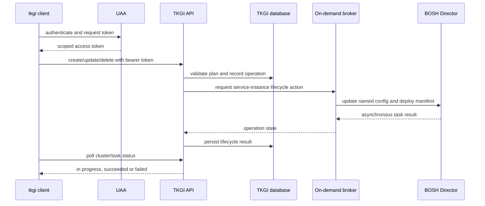

# TKGI API Server And Cluster Lifecycle

Begin with [TKGI Control Plane Architecture And Component Interactions](./TKGI-CONTROL-PLANE-ARCHITECTURE.md)
for the canonical API VM group, database VM cluster, Broker, BOSH and NSX interaction model.

The TKGI API Server is the platform-facing control point for on-demand Kubernetes
clusters. It accepts desired lifecycle operations; it does not directly schedule Pods
or create hypervisor VMs. Those responsibilities belong to Kubernetes and BOSH/IaaS.

## API Boundary



### TKGI API Versus Kubernetes API

| TKGI API | Kubernetes API |
|---|---|
| manages whole clusters | manages objects within one cluster |
| understands plans and cluster profiles | understands Pods, Deployments, Services and CRDs |
| delegates infrastructure reconciliation to BOSH | delegates object reconciliation to Kubernetes controllers |
| uses TKGI/UAA operator authorization | uses cluster authentication, RBAC and admission |
| lifecycle status is a platform operation | object status is Kubernetes observed state |

## Plans And Request Inputs

A plan defines supported resource and feature choices such as control-plane/worker
sizing, worker count constraints, availability placement, networking, storage and
Kubernetes options. Network and compute profiles may refine a request depending on
the installed version and configuration.

Never treat a plan name as a cosmetic label. The cluster record retains an association
with a plan. Deleting or deactivating a referenced plan without a supported migration
can make later listing or lifecycle operations fail.

## Lifecycle Operations

### Create

```bash
tkgi create-cluster orders-prod \
  --plan production \
  --external-hostname orders-prod-api.example.com \
  --num-nodes 6

tkgi cluster orders-prod
```

Creation typically records the request, creates a brokered service instance, generates
cluster-specific BOSH configuration, deploys control-plane and worker VMs, runs add-on
errands and records the final result.

### Scale Or Update

```bash
tkgi update-cluster orders-prod --num-nodes 9
tkgi cluster orders-prod
```

An update is a reconciliation request, not a direct edit to one VM. TKGI regenerates
the supported desired configuration, and BOSH computes and applies the deployment diff.

### Credentials

```bash
tkgi get-credentials orders-prod
kubectl config current-context
kubectl get nodes
```

This crosses two trust boundaries: the user first authenticates to TKGI, then receives
or configures credentials for a particular Kubernetes API. Success at the first layer
does not prove the second API is reachable or authorized.

### Delete

Deletion removes a managed service instance and instructs BOSH/IaaS to remove its
deployment resources. Before deletion, classify persistent data, external load
balancers, volumes, backups, DNS records and compliance evidence. Cluster deletion is
not a substitute for an application-data retention policy.

## Status Is A Projection

API status is a management-plane view derived from stored operation state and downstream
results. Diagnose a mismatch by comparing:

```bash
tkgi clusters
tkgi cluster <cluster-name>
bosh deployments
bosh tasks --recent=30
bosh task <task-id> --debug
```

Then inspect the cluster itself if its API is available:

```bash
kubectl get --raw='/readyz?verbose'
kubectl get nodes -o wide
kubectl get pods -A
```

## Correlation Identifiers

Capture every identifier shown by a failed lifecycle request:

- cluster name and cluster UUID;
- service-instance GUID;
- broker request ID;
- TKGI operation/task ID;
- BOSH deployment name such as `service-instance_<guid>`;
- BOSH task ID;
- time window and initiating identity.

These identifiers turn a vague “cluster update failed” report into a trace across API,
database, broker, BOSH and infrastructure logs.

## Common Failure Classes

| Failure | Evidence | Likely boundary |
|---|---|---|
| 401/403 | token claims, scopes, UAA/API logs | identity or authorization |
| TLS error before login | DNS, certificate SAN/chain, clock | endpoint or trust |
| validation/plan error | request and plan definition | TKGI policy/state |
| operation stuck | broker request and BOSH recent tasks | orchestration |
| CPI VM/disk/network error | BOSH debug task and IaaS events | infrastructure |
| `apply-addons` failure | BOSH errand/job logs, Kubernetes API | bootstrap/add-ons |
| credentials work but Pods fail | Kubernetes events/logs | workload plane |

## Safe Diagnostic Flow

1. Record request, timestamp, identity and returned IDs.
2. Prove DNS/TCP/TLS to the TKGI endpoint.
3. Prove UAA token issuance and intended scopes without exposing the token.
4. Inspect TKGI cluster and operation state.
5. Map the cluster UUID to its BOSH deployment.
6. Read the exact BOSH task with `--debug`.
7. Classify the first failing boundary: config, CPI, VM job, errand or Kubernetes.
8. Correct the supported source of desired state and retry/reconcile.

Do not start with manual BOSH manifest or database edits. They can make TKGI's source
of desired state disagree with BOSH. Use them only in a vendor-supported recovery
procedure with backups and an explicit resynchronization step.

## Interview Questions

**Why are TKGI operations asynchronous?** Provisioning and updating distributed VM
deployments can take minutes and include retriable infrastructure tasks. The API records
an operation and exposes progress instead of holding one HTTP request for the duration.

**Why can increasing worker count fail even when capacity exists?** Plan constraints,
named/global cloud-config mismatch, AZ placement, quotas, IP exhaustion, CPI errors,
storage or a later add-on errand can fail independently of raw CPU capacity.

**Why can `kubectl` work while `tkgi clusters` fails?** Existing Kubernetes clusters
have their own API and credentials. The TKGI management API/UAA/database can be
unavailable without immediately stopping every independent workload cluster.

## References

- [Broadcom TKGI 1.25 control-plane documentation](https://techdocs.broadcom.com/us/en/vmware-tanzu/standalone-components/tanzu-kubernetes-grid-integrated-edition/1-25/tkgi/control-plane.html)
- [Broadcom: cluster update and BOSH configuration hierarchy](https://knowledge.broadcom.com/external/article/437404/tkgi-cluster-update-and-bosh-tile-apply.html)
- [TKGI Overview](./TKGI-OVERVIEW-PATH.md)
