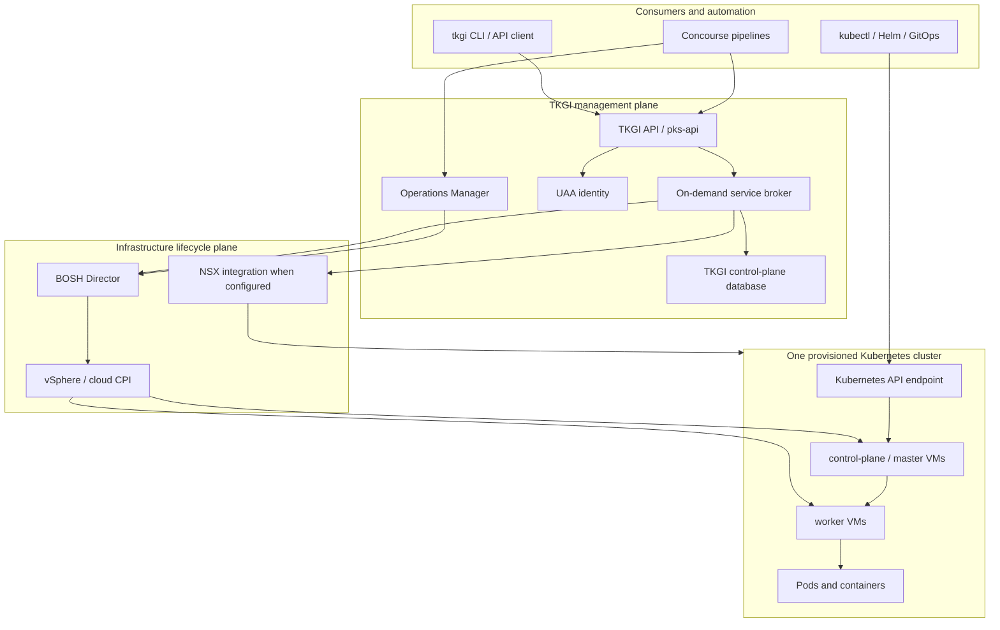
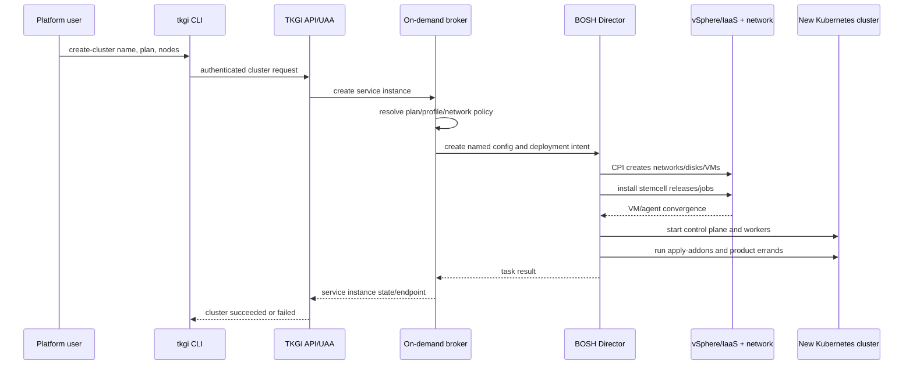
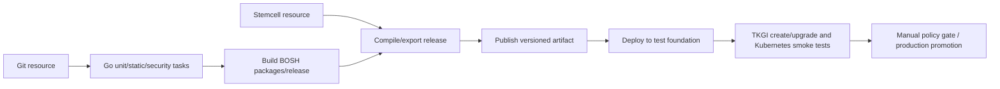

# TKGI Architecture, Services, BOSH, Concourse, And Operations

This is the end-to-end deep dive in the
[TKGI Beginner-To-Architect track](./TKGI-OVERVIEW-PATH.md). Read the focused component
pages first when you need API, UAA, database, BOSH, Harbor or Management Console depth.
The [TKGI Control Plane Architecture](./TKGI-CONTROL-PLANE-ARCHITECTURE.md) page is the
canonical TKGI 1.25 source-aligned explanation of the two VM groups and request paths.

VMware Tanzu Kubernetes Grid Integrated Edition (TKGI), formerly Enterprise PKS
and Pivotal Container Service, provides on-demand, conformant Kubernetes clusters.
Its defining architecture is that **BOSH manages the lifecycle of the Kubernetes
cluster VMs and software**, while each provisioned Kubernetes cluster manages Pods
and application resources inside those VMs.

Internal deployment, service, directory, and log names often retain the historical
`pks` and `pivotal-container-service` names. Exact jobs and processes vary by TKGI
version, IaaS, network mode, enabled features, and topology; always confirm with the
installed tile/release manifest and supported-version documentation.

## The Four Planes



### Consumer Plane

Platform users use the `tkgi` CLI/API to request and manage clusters. After obtaining
credentials, cluster users use normal Kubernetes tools such as `kubectl`, Helm, and
GitOps controllers. These are different APIs and authorization boundaries.

### TKGI Management Plane

The TKGI API authenticates requests, exposes plans and cluster lifecycle operations,
stores management state, and delegates provisioning/update/delete work through its
on-demand broker to BOSH and infrastructure integrations.

### BOSH Lifecycle Plane

BOSH Director owns versioned VM deployments. It creates/recreates VMs through the
CPI, installs Kubernetes/TKGI release jobs, applies configuration, runs errands,
and records task state. Every Kubernetes cluster is normally a separate BOSH
deployment, providing a clear lifecycle boundary.

### Kubernetes Workload Plane

Inside each provisioned cluster, standard Kubernetes control-plane components and
node services reconcile Kubernetes objects. BOSH should not be used to deploy normal
application Pods; Kubernetes/Helm/GitOps owns that layer.

## Core Deployments And Naming

| Layer | Typical Name | Purpose |
|---|---|---|
| BOSH Director | environment configured by Ops Manager | IaaS lifecycle, releases, deployments, tasks, health |
| TKGI management deployment | `pivotal-container-service-<guid>` | TKGI API, broker, identity, data and integrations |
| workload cluster deployment | `service-instance_<guid>` | master/control-plane VMs, workers and cluster errands |
| named cloud config | commonly `pivotal-container-service-<guid>` or `pks-<guid>` patterns | cluster/product-specific mapping onto global infrastructure config |
| broker service identifier | historical names such as `p.pks` appear in task errors | on-demand service instance lifecycle |

Treat names as evidence from an installed system, not a universal API contract.
Use `bosh deployments`, `bosh configs`, and the TKGI cluster UUID to map layers.

## TKGI Management-Plane Services

Depending on version and features, the `pivotal-container-service` VM or HA instance
group can include processes such as:

| Process / job name commonly seen | Responsibility |
|---|---|
| `pks-api` | TKGI REST API and cluster lifecycle requests |
| `broker` | on-demand service broker interaction with BOSH service instances |
| `uaa` | OAuth2/OIDC identity and token issuance for TKGI API access |
| MariaDB/Galera processes such as `mariadb_ctrl` and `galera-healthcheck` | persistent TKGI management state in applicable versions |
| `pks-nsx-t-osb-proxy` | NSX-T on-demand broker/proxy integration when NSX networking is enabled |
| `telemetry` / telemetry-related jobs | product telemetry workflow when enabled |
| `event-emitter` | platform event emission in applicable releases |
| `cluster_health_logger` | cluster health logging in applicable releases |
| `bosh-dns` jobs | DNS support for BOSH-managed instances |
| backup/restore jobs | BBR participation when configured |

Older/newer versions may move, rename, remove, or containerize functions. Inspect:

```bash
bosh -d pivotal-container-service-<guid> manifest
bosh -d pivotal-container-service-<guid> instances
bosh -d pivotal-container-service-<guid> ssh pivotal-container-service/0
sudo monit summary
ls /var/vcap/jobs
ls /var/vcap/sys/log
```

Never restart a process merely because its name appears in a generic runbook. First
confirm the deployment, instance, active supervisor, version, HA impact, and owner.

## Provisioned Cluster Services

A workload-cluster deployment commonly contains instance groups resembling:

- `master` or control-plane VMs;
- `worker` VMs or node pools;
- an `apply-addons` errand/instance group;
- telemetry or other product errands in applicable versions.

The cluster itself includes normal Kubernetes components:

| Location | Kubernetes/TKGI responsibility |
|---|---|
| control-plane VMs | API server, etcd, scheduler, controller manager and supporting components |
| worker VMs | kubelet, container runtime, node networking and storage components |
| `kube-system` | DNS, proxy/network, CSI/CNI and platform add-ons depending on configuration |
| historical `pks-system` | TKGI system agents in versions/features that use it |

`apply-addons` installs or upgrades system manifests. A failure there can leave the
BOSH deployment task failed even when VMs and some Kubernetes services are running.

## How Cluster Creation Works



### Important Boundaries

1. CLI acceptance does not mean the cluster exists.
2. The TKGI API/broker can be healthy while a BOSH task or CPI operation fails.
3. VMs can be running while Kubernetes or an add-on is unhealthy.
4. Kubernetes can be healthy while credentials, DNS, load balancer, or user routing fails.
5. The TKGI database, BOSH database, named cloud config, deployment manifest, IaaS
   resources, and Kubernetes API each hold different parts of the operational truth.

## Plans, Profiles, And Infrastructure Mapping

A TKGI plan typically constrains or defaults Kubernetes version/capabilities,
control-plane topology, worker count and sizing, AZ placement, networks, quotas,
and add-ons. Depending on version, network profiles and compute profiles can provide
additional per-cluster choices.

The BOSH dependency hierarchy is:

```text
global cloud config
  -> AZs, networks, VM types, disks, extensions
named cloud config for TKGI/cluster
  -> scoped mapping/overrides for the service deployment
cluster deployment manifest
  -> instance groups, counts, jobs, stemcell, releases, errands
actual IaaS resources
  -> VMs, NICs, disks, load balancers/network constructs
```

Removing an AZ or network from global config before every dependent named config
and deployment is migrated can break both cluster update and product Apply Changes.

## Networking Variants

TKGI architecture differs significantly by selected networking:

- with NSX-T, TKGI integrates cluster provisioning with NSX networking, routing,
  load balancing, security, and NCP-related components;
- without NSX-T, another supported CNI/load-balancer design supplies Pod and Service networking;
- vSphere, public-cloud, and product versions have different supported combinations.

Diagnose separately:

```text
TKGI API endpoint
Kubernetes API endpoint
node/VM management network
Pod network
Service network
ingress/load-balancer network
DNS and certificate trust
```

A proxy or `no_proxy` error can break internal TKGI-to-BOSH or NSX calls even while
ordinary operator HTTP access works.

## TKGI CLI Orientation

Verify commands and flags with the installed `tkgi help`; capabilities vary by version.

```bash
tkgi login -a <tkgi-api-fqdn> -u <user>
tkgi plans
tkgi clusters
tkgi cluster <cluster-name>
tkgi create-cluster <cluster-name> --plan <plan> --external-hostname <fqdn> --num-nodes 3
tkgi get-credentials <cluster-name>
tkgi update-cluster <cluster-name> --num-nodes 5
tkgi delete-cluster <cluster-name>
tkgi tasks
```

Version-dependent commands can include cluster upgrades, network profiles, compute
profiles, and node-pool controls. Treat `tkgi cluster` action state and task IDs as
the starting correlation keys for BOSH investigation.

## Mapping A TKGI Cluster To BOSH

```bash
tkgi cluster <cluster-name>
bosh deployments
bosh configs
bosh tasks --recent=50
bosh -d service-instance_<cluster-guid> instances
bosh -d service-instance_<cluster-guid> manifest
bosh -d service-instance_<cluster-guid> tasks --recent=30
```

Then inspect the failing instance/job:

```bash
bosh -d service-instance_<cluster-guid> logs worker/0
bosh -d service-instance_<cluster-guid> ssh worker/0
bosh -d service-instance_<cluster-guid> run-errand apply-addons --keep-alive
```

Use supported procedures and preserve evidence. Directly editing a broker-managed
manifest can desynchronize TKGI management state, named configs, and BOSH desired
state. Manual repair belongs in an approved vendor-supported runbook followed by a
TKGI reconciliation operation.

## Getting Kubernetes Access

The normal path is:

```bash
tkgi get-credentials <cluster-name>
kubectl config current-context
kubectl cluster-info
kubectl get nodes
```

Credential acquisition can depend on UAA, the TKGI API, broker, BOSH deployment
lookup, cluster API endpoint, certificates, and DNS/network reachability. Therefore,
`get-credentials` failure does not by itself prove the Kubernetes cluster is down.

Emergency kubeconfig recovery from a control-plane VM is version- and configuration-
specific and should use a vendor-approved procedure, strong auditing, and immediate
credential review. It is not the normal access path.

## BOSH, Go Packages, And TKGI

TKGI's delivered software is represented through BOSH releases. Keep three meanings
separate:

| Term | Meaning |
|---|---|
| Go package/module | Go source-code namespace and dependency/build unit |
| BOSH package | source/precompiled artifacts plus a packaging script inside a BOSH release |
| OS package | distribution-managed software such as an RPM or DEB |

A BOSH package can build a Go service:

```bash
source /var/vcap/packages/golang-1.x-linux/bosh/compile.env
go build -trimpath -o "${BOSH_INSTALL_TARGET}/bin/service" ./cmd/service
```

The BOSH job then renders configuration and starts the produced binary. A typical
release source tree looks like:

```text
release/
  jobs/pks-api/
    spec
    monit
    templates/
  packages/pks-api/
    spec
    packaging
  src/
  blobs/
  releases/
```

The installed proprietary release layout may differ; this example explains the
model, not TKGI source-code ownership.

## Where Concourse Fits

Concourse is a CI/CD system around product or platform delivery, not a required
runtime component inside each TKGI Kubernetes cluster. A Concourse pipeline can:

- detect source, dependency, stemcell, release, or tile versions;
- run Go tests, static analysis, vulnerability and license checks;
- build Go binaries and BOSH packages/releases;
- create or consume compiled BOSH releases;
- validate job templates and deployment manifests;
- publish signed/versioned artifacts;
- promote tile/release configuration across foundations;
- run smoke, upgrade, backup/restore, and conformance tests;
- invoke reviewed Ops Manager, BOSH, TKGI, and Kubernetes automation.



### Concourse Concepts

- **Resource:** versioned external state such as Git, registry image, release, or time.
- **Job:** a build plan connecting `get`, `task`, and `put` steps.
- **Task:** the smallest execution unit, run in an isolated container with declared inputs/outputs.
- **Pipeline:** declarative YAML connecting jobs and resources.

Example skeleton:

```yaml
resources:
  - name: source
    type: git
    source:
      uri: ((source-uri))
      branch: main

jobs:
  - name: test-and-build-release
    plan:
      - get: source
        trigger: true
      - task: test-go
        file: source/ci/tasks/test-go.yml
      - task: build-bosh-release
        file: source/ci/tasks/build-bosh-release.yml
```

Store credentials in an approved variable source, pin and scan task images, make
promotion auditable, serialize foundation-changing operations, and preserve BOSH/
TKGI task evidence. A green pipeline does not prove production convergence unless
it waits for and tests the resulting control planes.

## Upgrade Flow

TKGI upgrades cross several layers:

```text
Ops Manager/product configuration
 -> BOSH Director/product deployment update
 -> TKGI management plane release/config update
 -> upgrade-all-service-instances or controlled cluster updates
 -> per-cluster BOSH VM/job update
 -> apply-addons/product errands
 -> Kubernetes/API/add-on/workload validation
```

Plan version compatibility for Ops Manager, BOSH, stemcells, TKGI, Kubernetes,
vSphere/IaaS, NSX/CNI, CSI, load balancers, observability, and user workloads. Verify
backup/restore, canary capacity, PDBs, deprecated Kubernetes APIs, certificates,
and workload compatibility before production rollout.

## Failure Diagnosis By Plane

| Symptom | Likely Plane | First Evidence |
|---|---|---|
| `tkgi login` fails | DNS/TLS/UAA/TKGI API | client TLS output, UAA/API process and logs |
| cluster action remains `in progress` or fails | broker/BOSH/CPI/errand | TKGI task ID, BOSH task debug output |
| BOSH cannot create a worker | CPI/vSphere/network/storage/quota | Director task, CPI error, IaaS event |
| VM is running but node is NotReady | kubelet/runtime/CNI/cert/network | BOSH VM state, node condition, kubelet/runtime logs |
| `apply-addons` fails | Kubernetes system resource/admission/network | errand logs and `kube-system` rollout/events |
| `get-credentials` fails but workloads still serve | UAA/API/broker/BOSH lookup path | API and BOSH connectivity versus cluster endpoint |
| Service has no external path | NSX/LB/CNI/Service selector | Service/EndpointSlice, controller/NSX state |
| cluster delete fails | broker, BOSH consistency, unresponsive VM, NSX cleanup | task chain, `bosh cck`, remaining IaaS/network state |

## Evidence Collection

```bash
tkgi cluster <cluster-name>
tkgi tasks
bosh tasks --recent=50
bosh task <task-id> --debug
bosh -d <deployment> instances
bosh -d <deployment> manifest
bosh -d <deployment> logs <instance>
kubectl get nodes -o wide
kubectl get pods -A -o wide
kubectl get events -A --sort-by=.metadata.creationTimestamp
kubectl get --raw='/readyz?verbose'
```

Also capture DNS resolution, certificate chains/expiry, load-balancer state,
vSphere events, NSX objects/logs when applicable, datastore capacity, time sync,
and the exact configuration/app version. Redact credentials and private material.

## Production Runbook Scenarios

### BOSH Director Is Unavailable

Existing Kubernetes clusters may continue running, but cluster lifecycle operations
and some credential/broker flows can fail because the broker depends on Director
deployment state. Restore the Director through the supported HA/backup procedure;
do not assume Kubernetes availability proves management-plane availability.

### Worker VM Is Missing

Correlate Kubernetes node identity with the BOSH worker instance and IaaS VM. Decide
whether BOSH resurrection/recreate is safe given local data, Pod disruption, capacity,
and workload quorum. Verify the replacement rejoins and system Pods converge.

### Add-On Errand Fails

Inspect errand output, retain the errand VM when supported, and examine target
objects in `kube-system`/product namespaces. Common causes include immutable fields,
admission/policy, image access, DNS/networking, unavailable nodes, or version skew.

### AZ Or Network Configuration Changes

Inventory global and named cloud configs plus every cluster manifest before removing
an AZ/network. Migrate dependent deployments first and trigger a TKGI-supported
update so broker state and BOSH desired state remain synchronized.

### Certificate Rotation

Map trust relationships separately: Ops Manager, BOSH Director API/UAA, TKGI API/UAA,
NSX/vCenter, Kubernetes control planes, ingress/workloads, and clients. Use overlap
where supported, rotate in vendor-defined order, and validate every dependent path.

## Security Boundaries

- limit Ops Manager, BOSH Director, TKGI admin, and Kubernetes cluster-admin separately;
- isolate management networks and use audited jump hosts;
- protect BOSH/TKGI databases, blobstores, manifests, credentials, and backups;
- rotate certificates and service credentials using supported workflows;
- restrict Concourse teams, variable sources, workers, task images, and build logs;
- use Kubernetes RBAC, admission, Pod security, network policy, and secret controls;
- audit cluster create/update/delete and emergency BOSH/VM access;
- do not expose internal management endpoints through application networks.

## Interview Questions

**How does TKGI offer Kubernetes as a service?** It exposes an authenticated cluster
lifecycle API and plans. The on-demand broker translates a request into a BOSH-managed
service-instance deployment. BOSH creates and configures control-plane and worker VMs
through the CPI, then errands install system add-ons. Users receive a normal Kubernetes
API endpoint and operate workloads with Kubernetes-native tools.

**What does BOSH manage versus Kubernetes?** BOSH manages the VM, stemcell, release,
job, and cluster-software lifecycle. Kubernetes manages Pods and Kubernetes resources
inside the provisioned cluster. Their reconciliation loops are stacked.

**Why can a cluster serve traffic while `tkgi get-credentials` fails?** Existing
Kubernetes components and workloads can remain healthy while UAA, TKGI API, broker,
BOSH deployment lookup, DNS, or certificate paths needed for credential retrieval fail.

**Is Concourse part of TKGI runtime?** Not inherently. It is delivery automation used
to build, test, package, promote, and operate TKGI/BOSH artifacts or workloads.

**Are Go packages the same as BOSH packages?** No. A BOSH package is a release artifact
and build recipe. It may compile Go source/modules into a binary, but the terms describe
different layers.

**Why do internal names still say PKS?** TKGI was renamed from Enterprise PKS/Pivotal
Container Service, and internal compatibility names, deployment paths, jobs, and service
IDs often retain historical identifiers.

## Official And Primary References

- [Broadcom TKGI 1.25 control-plane documentation](https://techdocs.broadcom.com/us/en/vmware-tanzu/standalone-components/tanzu-kubernetes-grid-integrated-edition/1-25/tkgi/control-plane.html)
- [Broadcom TKGI 1.25 Management Console cluster operations](https://techdocs.broadcom.com/us/en/vmware-tanzu/standalone-components/tanzu-kubernetes-grid-integrated-edition/1-25/tkgi/console-monitor-manage-clusters.html)
- [TKGI product overview](https://www.vmware.com/products/app-platform/tanzu-kubernetes-grid)
- [Broadcom: TKGI cluster update and BOSH configuration hierarchy](https://knowledge.broadcom.com/external/article/437404/tkgi-cluster-update-and-bosh-tile-apply.html)
- [Broadcom: TKGI API process and BOSH job evidence](https://knowledge.broadcom.com/external/article/377371/bosh-task-errors-out-on-precheck-job-pks.html)
- [Broadcom: TKGI management-plane process example](https://knowledge.broadcom.com/external/article/298517/pksnsxtosbproxy-fails-to-start-with-erro.html)
- [Broadcom: cluster errands and system namespaces](https://knowledge.broadcom.com/external/article/298590)
- [BOSH components](https://bosh.io/docs/bosh-components/)
- [BOSH releases and packages](https://bosh.io/docs/release/)
- [Concourse pipelines](https://concourse-ci.org/docs/pipelines/)
- [Concourse tasks](https://concourse-ci.org/docs/tasks/)

## Recommended Next

Use [Kubernetes Troubleshooting And Interview Revision](./KUBERNETES-TROUBLESHOOTING-INTERVIEW-REVISION.md)
to practise the same failure-first reasoning at workload and cluster layers.
