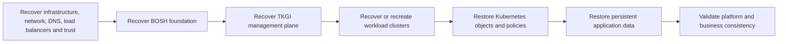

# TKGI Backup Restore And Disaster Recovery

There is no single “TKGI backup” that protects every layer. A reliable strategy begins
with state ownership and restores dependencies in an order that produces a consistent,
supported platform.

## State And Protection Map

| Layer | Important state | Typical supported protection concern |
|---|---|---|
| infrastructure | vCenter/NSX configuration, networks, certificates, DNS/LB dependencies | platform-specific backup and vendor restore procedure |
| BOSH foundation | Director database, credentials, blobstore and deployment intent | BOSH Backup and Restore (BBR) where supported |
| TKGI management plane | API/UAA/database product state and cluster metadata | product-supported BBR procedure |
| workload cluster | Kubernetes control-plane/etcd and cluster lifecycle state | TKGI cluster recovery procedure for the installed version |
| Kubernetes objects | namespaces, controllers, RBAC, Secrets and CRDs | GitOps/source control plus Velero or supported Kubernetes backup |
| persistent application data | volume/database state and consistency points | CSI snapshots, filesystem backup or database-native tooling |
| external dependencies | DNS, certificates, registry, secrets, IdP and integrations | owner-specific backup and rebuild automation |

Backing up only Kubernetes YAML does not preserve database contents. Backing up only
volumes does not preserve the controllers and policies needed to mount them. Backing up
only the TKGI database does not reconstruct the IaaS or each cluster's etcd.

## Broadcom TKGI 1.25 Recovery Categories

The official documentation separates protection into:

- Kubernetes workloads, including Velero and storage-specific examples;
- Kubernetes clusters;
- TKGI management components using BBR;
- infrastructure dependencies such as NSX Manager and vCenter.

That separation is an architectural warning: choose a recovery unit first, then use the
supported tool and sequence for that unit.

## RPO And RTO

**Recovery Point Objective (RPO)** is the maximum acceptable data loss measured in time.
**Recovery Time Objective (RTO)** is the maximum acceptable time to restore service.

Example:

```text
orders database: RPO 5 minutes, RTO 30 minutes
TKGI management API: RPO 24 hours, RTO 4 hours
stateless analytics namespace: rebuild from Git, RTO 2 hours
```

Different components may have different objectives. Convert them into backup frequency,
retention, replication, staffing, automation and restore-test requirements.

## Consistency Matters

A storage snapshot is crash-consistent only if the application and storage system make
that guarantee. Stateful workloads may require quiescing, database-native snapshots,
write-ahead-log capture or coordinated CSI snapshot capabilities. “Snapshot completed”
does not prove that the application can start and pass integrity checks.

For event-driven services also define how restored offsets, deduplication tables, Kafka
retention and database state align. Restoring a database to an earlier point while the
consumer group remains ahead can skip reconstruction; rewinding offsets without an
idempotent consumer can repeat side effects.

## Recovery Sequence

The exact supported order is release- and failure-specific, but reason from dependencies:



Do not manually mutate TKGI, BOSH and IaaS databases to make records “match.” Use the
supported recovery workflow and engage vendor support when authoritative states diverge.

## Velero Design Questions

Before adopting a Velero workflow, answer:

- Are resources selected by namespace, label or explicit include/exclude rules?
- Are CRDs and cluster-scoped dependencies protected?
- Is volume data captured by CSI snapshots, filesystem backup or a storage plug-in?
- Are snapshot locations in an independent failure domain?
- How are encryption keys, credentials and object-storage lifecycle protected?
- How are static IPs, load balancers and external DNS reconstructed?
- Are hooks required to quiesce databases?
- Does restore target the same cluster, a replacement cluster or another site?
- Which resources must be transformed because storage classes or endpoints differ?

## Management-Plane BBR Discipline

Use the version-specific BBR procedure. Operationally, protect:

1. compatible BBR tooling and credentials;
2. the backup artifact and metadata in secure independent storage;
3. encryption keys and certificates required to interpret or restore it;
4. the exact product/version prerequisites for restore;
5. a tested runbook that identifies expected downtime and validation.

A backup command exit code proves creation, not recoverability. Restore tests are the
evidence of recoverability.

## Disaster-Recovery Exercise

Run at least these scenarios in a representative non-production environment:

1. delete and restore a namespace with persistent data;
2. lose one Kubernetes control-plane or worker VM and observe normal reconciliation;
3. recover a failed TKGI management component using the supported procedure;
4. restore a workload into a replacement cluster;
5. simulate loss of a network/site dependency and execute DNS/LB failover;
6. prove credentials, registry access, monitoring and alerting after recovery;
7. compare actual recovery time and data point against RTO/RPO.

Record every hidden dependency discovered. A DR exercise that bypasses DNS, identity,
certificates or external secrets does not represent production recovery.

## Acceptance Checklist

- TKGI, BOSH and Kubernetes report consistent, healthy objects;
- restored applications pass business-level integrity checks;
- storage attachments and database recovery checks succeed;
- ingress, egress, DNS, identity, registry and certificates work;
- metrics, logs and alerts are present after recovery;
- duplicate or missing event risks are reconciled;
- actual RPO/RTO and manual steps are documented;
- backups and restore credentials remain protected and auditable.

## Interview Questions

**Can Velero alone back up all of TKGI?** No. Velero protects Kubernetes resources and,
with suitable integrations, workload volume data. TKGI management state, BOSH foundation
and infrastructure dependencies require their own supported protection.

**What is the most important backup metric?** Backup success rate matters, but verified
restore success and achieved RPO/RTO are stronger evidence.

**Why can restoring Kafka consumers be dangerous?** Database state, offsets and external
side effects may represent different points in time. Recovery needs idempotency and an
explicit offset/reconciliation plan.

## Official Reference

- [Broadcom TKGI 1.25 backup and restore](https://techdocs.broadcom.com/us/en/vmware-tanzu/standalone-components/tanzu-kubernetes-grid-integrated-edition/1-25/tkgi/backup-and-restore.html)

