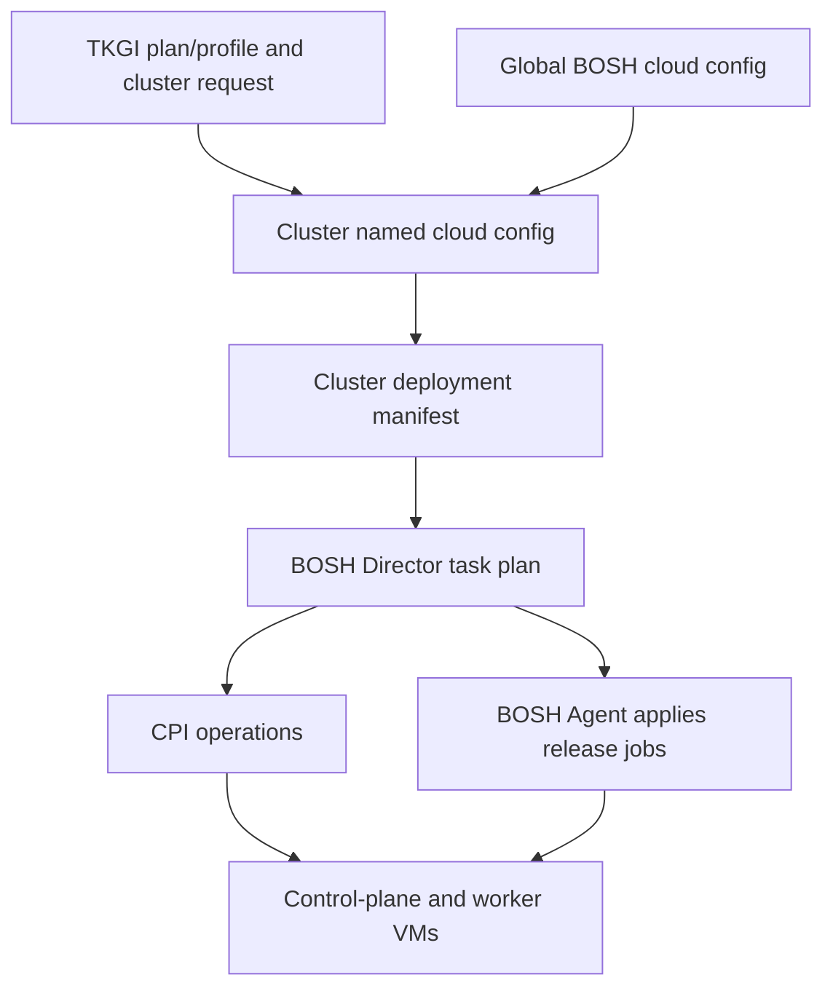

# TKGI BOSH Provisioning, Healing And Upgrades

BOSH is the infrastructure and distributed-software lifecycle engine beneath TKGI.
TKGI decides what kind of Kubernetes cluster is requested; BOSH turns the generated
desired state into VMs, disks, networks and running release jobs.

## Core BOSH Components In TKGI

| Component | Role |
|---|---|
| Director | stores desired deployment state, plans tasks and orchestrates changes |
| CPI | translates BOSH VM/disk/network operations to vSphere or another IaaS |
| Agent | runs on each BOSH VM and applies jobs, packages and configuration |
| stemcell | versioned base operating-system image plus BOSH agent |
| release | versioned jobs, package specifications, templates and source blobs |
| deployment manifest | instance groups, jobs, networks, VM types, disks and properties |
| global cloud config | shared AZ, network, VM and disk mappings |
| named cloud config | TKGI/cluster-specific mapping layered on global infrastructure |
| health monitor | observes VM/job health and can trigger repair behavior |

## Cluster Deployment Shape

```text
TKGI management deployment: pivotal-container-service-<guid>
  API, UAA, broker, database and integrations

One workload cluster deployment: service-instance_<cluster-guid>
  control-plane/master instance group
  worker instance group(s)
  apply-addons and version-dependent errands
```

## Desired-State Layers



All layers must remain valid. Removing an AZ from global cloud config while cluster
named configs/manifests still reference it can block both cluster updates and Director
validation.

## Provisioning Internals

For a new cluster, BOSH typically:

1. validates deployment and cloud configuration;
2. selects stemcell, VM type, AZ and network placement;
3. asks the CPI to create VMs, disks and attachments;
4. waits for each BOSH Agent to register;
5. compiles or downloads release packages as applicable;
6. renders job templates and distributes configuration;
7. starts jobs under the VM's process supervisor;
8. runs cluster/bootstrap/add-on errands;
9. records task results and the deployed manifest.

## Healing Boundary

BOSH can recreate a missing/unresponsive worker VM so it matches the deployment.
Kubernetes separately reschedules Pods when a node is unavailable.

```text
Kubernetes reconciliation: Pod and API-object desired state
BOSH reconciliation: VM and installed-job desired state
vSphere HA: hypervisor/host VM restart behavior
```

These mechanisms complement one another, but simultaneous automation can complicate
incidents. Establish which controller acted before manually recreating resources.

## Scaling

Use TKGI's supported update workflow rather than directly scaling the BOSH instance
group. Direct BOSH changes can be overwritten on the next TKGI reconciliation.

```bash
tkgi update-cluster <cluster> --num-nodes <count>
tkgi cluster <cluster>
bosh tasks --recent=20
```

Capacity checks include VM quota, datastore, IP addresses, load balancer capacity,
network segments, AZ/host placement and Kubernetes workload constraints.

## Rolling Upgrade

A platform upgrade can cross:

```text
Ops Manager compatibility
 -> BOSH Director/CPI and stemcell compatibility
 -> TKGI management release and database migrations
 -> generated cluster releases/manifests
 -> control-plane VM rollout
 -> worker VM rollout
 -> add-on reconciliation
 -> Kubernetes workload availability
```

Before an upgrade:

- read the exact supported upgrade path and known issues;
- back up all required management components;
- verify BOSH and cluster health;
- confirm Pod disruption budgets and spare capacity;
- test application compatibility with the target Kubernetes version;
- define abort/rollback limits because database/schema migrations may not be reversible;
- canary a representative non-production cluster.

## BOSH Command Orientation

```bash
bosh environments
bosh -e <env> deployments
bosh -e <env> configs
bosh -e <env> tasks --recent=30
bosh -e <env> task <task-id> --debug
bosh -e <env> -d service-instance_<guid> instances
bosh -e <env> -d service-instance_<guid> vms --vitals
bosh -e <env> -d service-instance_<guid> manifest
bosh -e <env> -d service-instance_<guid> logs
```

Commands that deploy, recreate, restart, delete or mutate configuration require an
approved, version-specific runbook and impact review.

## Failure Localization

| Task evidence | Likely issue |
|---|---|
| cloud-config validation error | invalid AZ/network/VM mapping |
| CPI create VM failure | vCenter permissions, quota, datastore, host or network |
| agent never responds | network, boot, stemcell, DNS/time or agent issue |
| package/job start failure | release config, certificate, dependency or disk issue |
| control-plane job unhealthy | etcd/API/certificate or resource failure |
| `apply-addons` errand fails | Kubernetes reachability or system add-on manifest |
| update repeatedly recreates a VM | unresolved job/health condition, not merely “bad VM” |

## Interview Questions

**Why does TKGI need BOSH when Kubernetes already self-heals?** Kubernetes heals
workloads and cluster API objects. BOSH manages the VM and installed-software layer on
which Kubernetes itself runs, including node recreation and controlled upgrades.

**What happens when a worker VM fails?** Kubernetes detects the node condition and may
reschedule eligible Pods. BOSH observes the managed VM/job failure and can recreate the
worker according to deployment state. Availability depends on spare capacity, storage,
disruption rules and failure timing.

**Why should operators avoid direct manifest edits?** TKGI generates and owns cluster
desired state. A direct BOSH edit can desynchronize TKGI database/config state and later
be overwritten. It is appropriate only inside a supported recovery with resynchronization.

## References

- [BOSH components](https://bosh.io/docs/bosh-components/)
- [BOSH releases](https://bosh.io/docs/release/)
- [BOSH packages](https://bosh.io/docs/packages/)
- [Broadcom: TKGI cluster update configuration hierarchy](https://knowledge.broadcom.com/external/article/437404/tkgi-cluster-update-and-bosh-tile-apply.html)
- [Containers, VMs, Kubernetes And BOSH](./KUBERNETES-CONTAINERS-VMS-BOSH.md)

