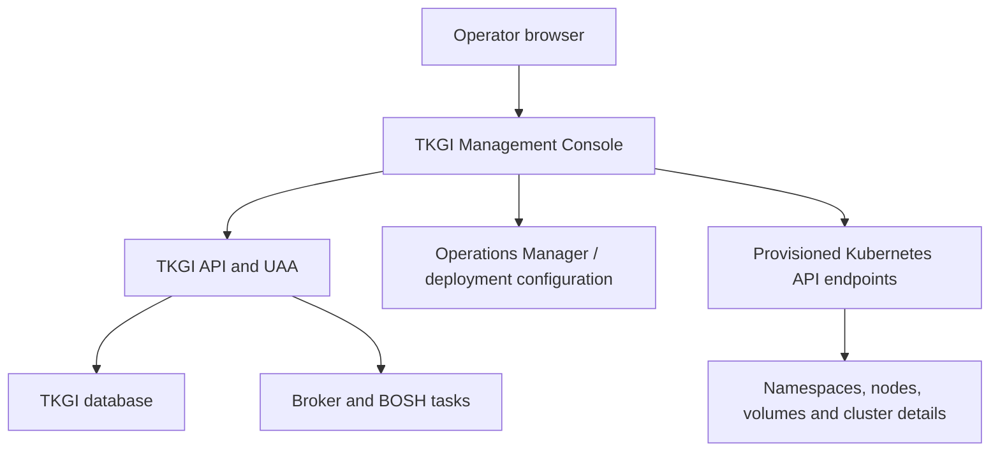

# TKGI Management Console, Monitoring And Operations

The TKGI Management Console provides a graphical experience for product deployment,
configuration and cluster monitoring/management. A console view is an aggregation of
several downstream calls; a failed panel does not necessarily mean the workload cluster
is down, and a green panel does not prove application correctness.

## Console Data Paths



This explains partial failures. The console may list a cluster from TKGI management
state but fail to retrieve its namespaces because token refresh, API reachability or
client compatibility failed on the Kubernetes data path.

## What The Console Can Represent

Exact features vary by release, but operational views can include:

- platform deployment/configuration status;
- TKGI plans and cluster inventory;
- cluster lifecycle state and Kubernetes version;
- nodes, namespaces, volumes and network-related information;
- configuration validation and apply progress;
- links or workflows for cluster management.

Always correlate UI status with CLI/API and lower-layer evidence before remediation.

## Health Is Layered

| Layer | Useful evidence | Example failure |
|---|---|---|
| console application | console container/process logs, browser/network errors | UI backend crash or client incompatibility |
| TKGI API/UAA | login, cluster listing, API/UAA logs | expired certificate or invalid token |
| Ops Manager/BOSH | apply status, BOSH tasks and VM vitals | failed deployment/CPI operation |
| Kubernetes control plane | `/readyz`, nodes and system Pods | API/etcd/add-on issue |
| workloads | availability, latency, errors and saturation | application or dependency failure |
| infrastructure | vCenter, NSX, LB, storage and DNS | placement or network outage |

## Operational Command Set

```bash
# TKGI management view
tkgi clusters
tkgi cluster <cluster-name>

# BOSH lifecycle view
bosh deployments
bosh tasks --recent=30
bosh -d service-instance_<guid> instances
bosh -d service-instance_<guid> vms --vitals

# Kubernetes view
tkgi get-credentials <cluster-name>
kubectl get --raw='/readyz?verbose'
kubectl get nodes -o wide
kubectl get pods -A
kubectl get events -A --sort-by=.metadata.creationTimestamp
```

Commands prove different facts. `tkgi clusters` proves management API visibility;
`bosh instances` proves deployment/VM state; `/readyz` proves API readiness; application
SLIs prove whether users receive acceptable service.

## Monitoring Model

Monitor symptoms and causes:

### Platform/API

- TKGI/UAA endpoint availability and certificate expiry;
- authentication failure and privileged-operation rates;
- cluster lifecycle duration, failure and stuck-operation age;
- management database quorum, disk and latency;
- BOSH task failure, Director health and CPI error rate.

### Cluster

- Kubernetes API availability and latency;
- etcd health/capacity and control-plane resources;
- node Ready condition, pressure and certificate expiry;
- system add-on health, DNS and network dataplane;
- volume attach/mount and storage capacity;
- pending Pods and workload resource saturation.

### Registry And Supply Chain

- Harbor availability, storage headroom and GC/replication status;
- pull error rate and certificate expiry;
- vulnerability/policy exception age.

Alert on user or operator impact, not every transient reconciliation event. Include a
runbook, owner, severity, evidence query and escalation boundary with every alert.

## Common Console Failures

### Cluster List Works, Detail Panels Fail

The console can retrieve TKGI inventory but fail calls to the cluster Kubernetes API.
Check console backend logs, token refresh/signature validation, cluster endpoint TLS,
network reachability and Kubernetes client/server compatibility.

### Certificate Expired

Symptoms can mention failure to obtain OAuth tokens from the TKGI API endpoint. Rotate
the certificate through the supported TKGI/Ops Manager configuration, synchronize the
Management Console's configured certificate material and validate both CLI and UI.

### Ops Manager Marked Down

The console can report an Ops Manager deployment/configuration step as failed due to
IaaS placement, datastore, host-group, SSH key, DNS or NTP validation. Check the exact
failed phase rather than restarting an otherwise healthy Ops Manager VM.

### Stale Or Missing Plan

Cluster listing can fail when a cluster record references a plan that was removed or
made inactive. This is management-state integrity, not a Kubernetes workload failure.
Follow a supported plan restoration/migration procedure.

## Incident Workflow

1. Capture screenshot/message, timestamp, user and affected clusters.
2. Test whether the failure affects one browser/user or the console backend.
3. Compare console output with `tkgi` CLI/API.
4. Test UAA/TLS and inspect console backend logs.
5. If only details fail, test the exact Kubernetes API path from the console network.
6. Map lifecycle failures to BOSH task IDs and read debug output.
7. Inspect vSphere/NSX/storage only after evidence points to infrastructure.
8. Correct the supported configuration source and apply/reconcile.
9. Validate UI, CLI, BOSH, Kubernetes and application SLIs.
10. Record timeline, root cause, detection gap and preventive action.

## Production Evidence

A healthy production claim should include:

- successful synthetic login and non-destructive cluster-list request;
- certificate-expiry monitoring for every management and cluster endpoint;
- lifecycle operation SLO and failed/stuck task alerting;
- BOSH deployment/task and VM vitality monitoring;
- Kubernetes API, node, system Pod and workload SLIs;
- tested management-plane and cluster recovery procedures;
- registry pull and storage monitoring;
- audit evidence for privileged changes.

## Interview Questions

**The console is red but workloads are serving. How is that possible?** The console,
TKGI management plane and each workload cluster are separate failure domains. A console
backend, token or management API problem can prevent visibility without immediately
stopping an existing Kubernetes control plane or running Pods.

**What should be the first response to a failed console panel?** Identify which API the
panel depends on, reproduce through the corresponding CLI/API, inspect the first failed
network/authentication/downstream boundary and avoid changing workloads based only on UI.

**What metrics prove TKGI is healthy?** No single metric. Combine management endpoint
and lifecycle SLOs, UAA/database/BOSH evidence, Kubernetes control-plane/node/system
health, registry health and application user-facing SLIs.

## References

- [Broadcom TKGI 1.25 Management Console cluster operations](https://techdocs.broadcom.com/us/en/vmware-tanzu/standalone-components/tanzu-kubernetes-grid-integrated-edition/1-25/tkgi/console-monitor-manage-clusters.html)
- [Broadcom: Management Console cannot display cluster details](https://knowledge.broadcom.com/external/article/388430/tkgi-management-console-does-not-display.html)
- [Broadcom: Management Console and API certificate rotation](https://knowledge.broadcom.com/external/article/327473)
- [Broadcom: Management Console token errors](https://knowledge.broadcom.com/external/article/394632)
- [Broadcom: Ops Manager placement shown as down in console](https://knowledge.broadcom.com/external/article/418622)

