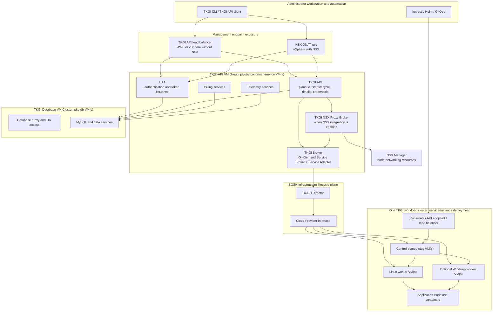
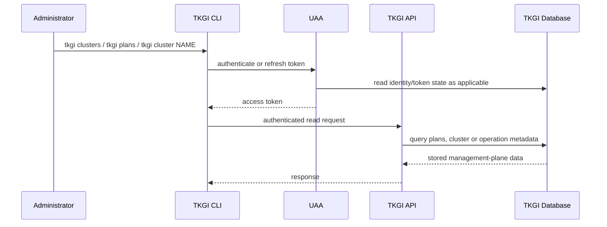
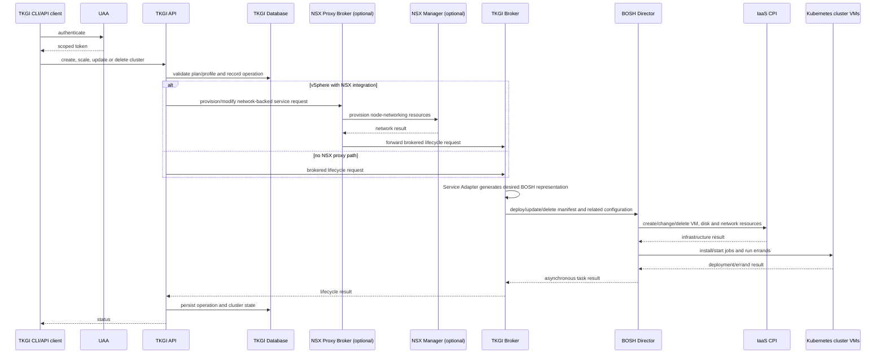
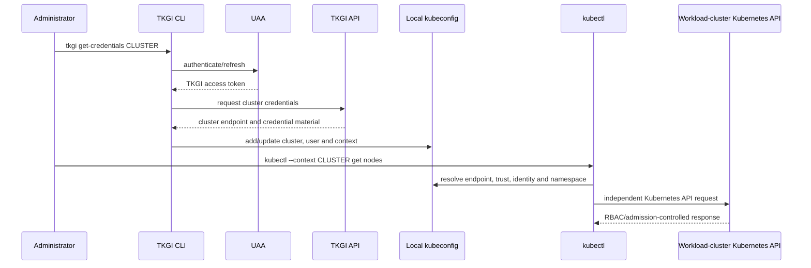
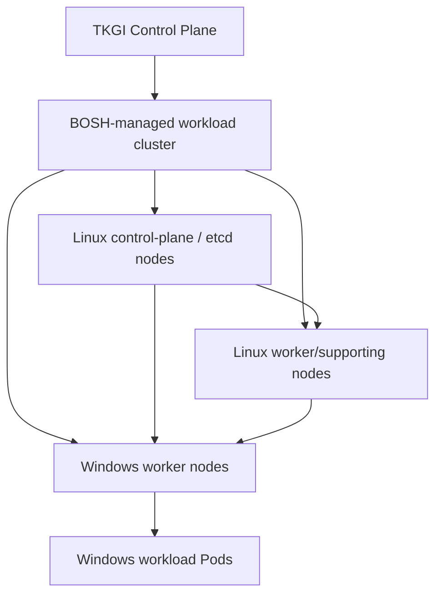

# TKGI Control Plane Architecture And Component Interactions

This page is the canonical explanation of the Tanzu Kubernetes Grid Integrated Edition
(TKGI) 1.25 control plane. It is based on Broadcom's TKGI 1.25 architecture model and
adds execution flows, ownership boundaries, failure analysis and operational evidence.

Do not confuse these two control planes:

```text
TKGI Control Plane
  creates, scales, upgrades, describes and deletes whole Kubernetes clusters

Kubernetes control plane inside each workload cluster
  manages Kubernetes API objects, nodes, Pods, Services and application workloads
```

An installed TKGI environment consists of one TKGI Control Plane and one or more
independently provisioned workload clusters.

## Complete Architecture



The lines represent logical interactions, not a promise that every enabled process is
co-located exactly the same way in every patch release. Confirm an installed system
using its TKGI tile configuration, BOSH deployment manifest, instance groups and jobs.

## Control-Plane VM Groups

Broadcom divides the TKGI control plane into two main VM groups.

| VM group | Common BOSH instance-group/VM name | Responsibility |
|---|---|---|
| TKGI API VM Group | `pivotal-container-service` | hosts UAA, TKGI API, TKGI Broker, billing and telemetry services |
| TKGI Database VM Cluster | `pks-db` | hosts MySQL, proxy and other data services that persist control-plane data |

This separation gives compute/service processes and persistent data services different
scaling, availability, storage and recovery concerns.

## Component Responsibility Map

### TKGI CLI

The TKGI CLI is the administrator-facing client. It talks to UAA for login/logout and
the TKGI API for plans, cluster lifecycle, cluster information and credentials.

It does not talk directly to BOSH for ordinary platform-user operations. BOSH access is
an operator-level troubleshooting and lifecycle boundary.

### UAA

UAA authenticates users and clients and issues tokens used with the TKGI API. The API
permits authenticated and appropriately authorized identities to manage clusters.

UAA is not the Kubernetes scheduler, Kubernetes RBAC database or the identity mechanism
for every application Pod. After credentials are obtained, the workload cluster's
Kubernetes API performs a separate authentication and authorization process.

### TKGI API

The TKGI API is the management-plane front door. According to the TKGI 1.25 architecture,
it supports:

- viewing cluster plans;
- creating clusters;
- viewing cluster information;
- obtaining credentials for workload deployment;
- scaling clusters;
- deleting clusters;
- creating and managing VMware NSX network profiles;
- initiating supported cluster-management workflows.

The API can write cluster credentials to a local kubeconfig file, after which `kubectl`
talks to that cluster's Kubernetes API endpoint—not to the TKGI API.

### TKGI Broker

The TKGI Broker handles requests that modify cluster infrastructure. The architecture
describes it as:

```text
TKGI Broker
  ├── On-Demand Service Broker
  └── Service Adapter
```

It translates a service-instance lifecycle request into cluster-specific BOSH desired
state, generates a BOSH deployment manifest and instructs the BOSH Director to deploy,
update or delete the Kubernetes cluster.

### On-Demand Service Broker

The On-Demand Service Broker coordinates creation, update and deletion of brokered
service instances. In TKGI, a Kubernetes cluster is represented through that brokered
lifecycle and commonly maps to a BOSH deployment such as `service-instance_<guid>`.

### Service Adapter

The Service Adapter contains service-specific logic used by the broker to generate and
manage the Kubernetes cluster deployment representation. Conceptually it bridges generic
on-demand service lifecycle operations and TKGI-specific BOSH manifests/configuration.

### TKGI NSX Proxy Broker

When vSphere with NSX integration is enabled, mutation flow includes an additional TKGI
NSX Proxy Broker. The TKGI API communicates with the proxy broker; it communicates with
NSX Manager to provision required node-networking resources; it then forwards the request
to the On-Demand Service Broker for cluster deployment.

This creates an important partial-failure boundary:

```text
NSX resources may be created
  -> later BOSH cluster deployment fails
  -> operation requires supported reconciliation/cleanup across both systems
```

### BOSH Director

BOSH receives generated desired state and manages infrastructure/software lifecycle. It
validates deployment and cloud configuration, calls the CPI, creates VMs/disks/network
attachments, applies stemcells and release jobs, runs errands, monitors VM/job health and
performs rolling updates or repair according to desired state.

BOSH manages the machines that form Kubernetes. Kubernetes manages workloads running on
those machines.

### CPI

The Cloud Provider Interface translates BOSH operations into IaaS-specific actions such
as creating or deleting a vSphere VM, attaching storage and configuring network placement.
An API/broker request can therefore be valid but fail later because of vCenter permissions,
capacity, datastore, network, IP or placement constraints.

### TKGI Database Services

The TKGI Database VM Cluster hosts MySQL, proxy and supporting data services. Broadcom's
architecture identifies persistent control-plane data for:

- TKGI API;
- UAA;
- billing;
- telemetry.

This database is not Kubernetes etcd and not the BOSH Director database. Each stores a
different desired-state or operational domain.

### Billing And Telemetry

Billing and telemetry services run in the API VM group and persist applicable data through
the TKGI database services. Their exact enablement and behavior depend on configuration.
They must not be mistaken for the services that provision cluster VMs.

## Read-Only Request Flow

The TKGI 1.25 architecture explicitly states that the TKGI API sends cluster-management
requests to the Broker **except read-only requests**.



The broker and BOSH do not need to run a deployment task for an ordinary read. However,
the freshness and meaning of returned status still depend on product reconciliation and
the stored management view.

## Create Or Mutate Cluster Flow



### Why The Flow Is Asynchronous

VM creation, package/job installation, Kubernetes bootstrap, networking and errands can
take minutes. The request crosses systems with different retry and failure semantics.
TKGI records operation state and allows status polling instead of holding one connection
as the sole source of truth.

## Obtain Credentials And Use kubectl



This is why the following can all be true simultaneously:

- cached kubeconfig works while the TKGI API is unavailable;
- `tkgi login` works while the cluster Kubernetes endpoint is unreachable;
- credential retrieval succeeds but Kubernetes RBAC returns `403 Forbidden`;
- a console can list a cluster but fail to retrieve its Kubernetes namespaces.

## API Endpoint Exposure

Broadcom distinguishes the management endpoint path by deployment topology:

| Deployment topology | TKGI CLI reaches API through |
|---|---|
| AWS | TKGI API load balancer |
| vSphere without NSX integration | TKGI API load balancer |
| vSphere with NSX integration | API host exposed using a DNAT rule |

For diagnosis, test DNS, routing, TCP, load-balancer/DNAT behavior and TLS separately.
Do not assume an authentication error when the packet never reaches UAA/API.

## Upgrade-All-Clusters Flow

The TKGI Control Plane can upgrade existing clusters using the **Upgrade all clusters**
BOSH errand in the supported product workflow.

Conceptually:

```text
target TKGI/Kubernetes release and product configuration
  -> management-plane apply/upgrade workflow
  -> Upgrade all clusters errand
  -> each brokered cluster deployment reconciled through BOSH
  -> control-plane and worker VM rolling changes
  -> add-ons and health validation
```

This is not the same as changing an application Deployment with `kubectl`. Plan for
Kubernetes version compatibility, VM disruption, PodDisruptionBudgets, spare capacity,
storage, add-ons, CNI/CSI, admission webhooks and rollback limitations.

## Standard And High-Availability Modes

### Standard Mode

According to the TKGI 1.25 architecture:

- TKGI API services are hosted on one `pivotal-container-service` VM;
- TKGI database services are hosted on one `pks-db` VM.

This reduces infrastructure cost but makes each VM group a smaller failure domain and
can increase lifecycle-management downtime during failure or maintenance.

### High-Availability Mode

- TKGI API services run on multiple `pivotal-container-service` VMs;
- TKGI database services run on three `pks-db` VMs.

The TKGI tile resource-configuration phase controls these instance counts. In the 1.25
documentation, the API group can be increased from one to two or three instances, and
the database group from one to three. Once HA is enabled by increasing beyond one, the
documentation states that the count cannot be decreased.

Treat that as a version-specific product constraint and validate it before capacity or
cost decisions on another release.

### HA Does Not Mean Every Failure Is Survived

HA still depends on:

- load-balancer or DNAT availability;
- UAA signing and trust consistency across instances;
- database quorum and proxy behavior;
- BOSH Director and IaaS availability;
- failure-domain placement and anti-affinity;
- DNS, NTP and certificate health;
- operator procedures that preserve quorum.

## Workload-Cluster High Availability

Workload-cluster HA is separate from TKGI Control Plane HA. A highly available management
plane can create a single-control-plane workload cluster, and HA workload clusters can
continue serving during a management API outage.

For a typical HA workload cluster, design includes multiple control-plane/etcd nodes and
enough workers/failure-domain distribution for application availability. Plan settings
determine supported topology.

## Windows Worker-Based Cluster Topology

The TKGI 1.25 architecture distinguishes Linux management nodes from Windows workers:

- standard mode uses a single control-plane/etcd node and one Linux worker to manage the
  cluster's Windows Kubernetes VMs;
- HA mode uses multiple control-plane/etcd and Linux worker nodes to manage the Windows
  Kubernetes VMs;
- plan fields include enabling HA Linux workers plus control-plane/etcd and worker counts.



Windows worker support introduces OS-specific image, networking, scheduling, patching and
application compatibility concerns. Do not infer Windows-worker health only from Linux
control-plane availability.

## Data Ownership Matrix

| System | Authoritative for | Example evidence |
|---|---|---|
| UAA/database | TKGI identities, clients and token-related persistent state | UAA health/logs and supported identity tooling |
| TKGI API/database | plan/cluster association and management operation state | `tkgi clusters`, API logs, operation IDs |
| TKGI Broker | brokered service-instance orchestration | broker request and service-instance IDs |
| BOSH Director/database | deployments, manifests, configs, tasks, VM/job desired state | `bosh deployments`, `bosh tasks`, deployment manifest |
| NSX Manager | NSX networking objects and realization | NSX object/realization state and proxy logs |
| vSphere/IaaS | actual VM, disk, host and network infrastructure | vCenter tasks/events and CPI errors |
| Kubernetes etcd | Kubernetes API objects inside one cluster | `kubectl get`, API audit and etcd health |

No single database contains the complete truth of an in-flight cross-system operation.

## Failure-Domain Matrix

| Symptom | First boundary to test | Downstream evidence |
|---|---|---|
| TKGI endpoint unreachable | API LB/DNAT, DNS, TCP and TLS | listener and API VM health |
| login fails | UAA endpoint, certificate, time and client state | UAA logs and database health |
| plans/clusters read fails | TKGI API and DB query path | API/DB logs and plan integrity |
| mutation fails before BOSH task | API, NSX Proxy Broker or TKGI Broker | request IDs and broker/proxy logs |
| NSX object created but cluster failed | NSX-to-broker hand-off and BOSH task | NSX realization plus BOSH debug task |
| BOSH task fails creating VM | CPI/IaaS | vCenter permissions, quota, network and datastore |
| VMs exist but task fails late | BOSH jobs or errands | `/var/vcap/sys/log`, `apply-addons`, Kubernetes API |
| credentials written but kubectl fails | kubeconfig and workload API endpoint | context, TLS, authentication and RBAC |
| existing apps work but TKGI is down | management-plane-only incident | independent Kubernetes/app SLIs |
| one API VM fails in HA | LB routing and remaining instances | per-instance health and shared DB |
| DB member fails in HA | quorum/proxy and disk/network health | database cluster evidence |

## Operational Evidence And Commands

### Client And TKGI Layer

```bash
tkgi login -a api.tkgi.example.com
tkgi plans
tkgi clusters
tkgi cluster <cluster-name>
tkgi get-credentials <cluster-name>
kubectl config current-context
```

### Map TKGI To BOSH

```bash
bosh deployments
bosh configs
bosh tasks --recent=30
bosh task <task-id> --debug
bosh -d pivotal-container-service-<guid> instances
bosh -d pivotal-container-service-<guid> vms --vitals
bosh -d service-instance_<cluster-guid> instances
bosh -d service-instance_<cluster-guid> manifest
```

### Inspect A BOSH-Managed Management VM

After confirming the correct deployment, instance, HA impact and change authorization:

```bash
sudo monit summary
ls /var/vcap/jobs
ls /var/vcap/sys/log
```

Historical internal names such as `pks-api`, `pks-db` and
`pivotal-container-service` remain common because TKGI was previously Enterprise PKS.
Use installed manifests as evidence rather than assuming every generic process name.

### Workload-Cluster Layer

```bash
kubectl get --raw='/readyz?verbose'
kubectl get nodes -o wide
kubectl get pods -A
kubectl get events -A --sort-by=.metadata.creationTimestamp
```

## Safe Diagnosis Sequence

1. Record user, request, time, cluster UUID and returned operation/request IDs.
2. Identify whether the failing client is `tkgi`, Management Console or `kubectl`.
3. Prove the intended endpoint path: load balancer or NSX DNAT.
4. Separate connectivity/TLS from UAA authentication and API authorization.
5. Decide whether the operation is read-only or mutating.
6. For a mutation, locate NSX proxy/broker and BOSH task evidence.
7. Classify the first failed downstream boundary: NSX, BOSH validation, CPI, Agent/job,
   Kubernetes bootstrap or errand.
8. Correct the supported source of desired state rather than editing generated artifacts.
9. Reconcile through TKGI and validate management, BOSH, Kubernetes and application views.
10. Preserve evidence and update alerts/runbooks for the missed detection signal.

## Architecture Trade-Offs

### Why A Broker Between API And BOSH?

The API expresses platform intent; the broker and Service Adapter translate generic
service-instance lifecycle into TKGI-specific BOSH desired state. This keeps API concerns
separate from deployment generation and asynchronous infrastructure orchestration.

### Why Separate API And Database VM Groups?

Stateless/service processes and persistent clustered data have different scaling,
storage, quorum, backup and failure characteristics. Separate groups allow appropriate
resource and HA topology for each.

### Why Is NSX A Separate Proxy Path?

NSX-backed cluster networking requires lifecycle coordination with NSX Manager before
or alongside BOSH deployment. The proxy broker isolates that integration but introduces
an additional distributed-operation and partial-failure boundary.

### Why Can Workloads Survive A TKGI Outage?

After provisioning, the workload cluster has its own Kubernetes control plane. Normal
Pod reconciliation does not synchronously call the TKGI API. Management operations,
credential retrieval or cluster upgrades can fail while already-running applications
continue.

## Top Interview Questions

**What are the two main TKGI Control Plane VM groups?** The TKGI API VM Group hosts
UAA, TKGI API, Broker, billing and telemetry. The TKGI Database VM Cluster hosts MySQL,
proxy and data services that persist control-plane state.

**Which requests reach the TKGI Broker?** Cluster-management mutations do. Broadcom's
architecture explicitly excludes read-only requests from that broker forwarding path.

**What exactly is the TKGI Broker?** It consists of an On-Demand Service Broker and a
Service Adapter. It generates the BOSH representation and instructs BOSH to deploy,
update or delete a cluster.

**How does the NSX flow differ?** The TKGI API sends the mutation through the TKGI NSX
Proxy Broker. That broker coordinates node-network resources with NSX Manager, then
forwards the request to the On-Demand Service Broker.

**What is stored in the TKGI database cluster?** Persistent control-plane data used by
TKGI API, UAA, billing and telemetry. Kubernetes objects live in each cluster's etcd;
BOSH deployment/task state lives in the BOSH Director's persistence layer.

**How does `tkgi get-credentials` relate to kubeconfig?** TKGI authenticates the user,
returns cluster access information and writes/updates a local kubeconfig. `kubectl` then
uses its selected context to connect directly to that workload cluster's Kubernetes API.

**What changes between standard and HA mode?** Standard mode uses one API VM and one DB
VM. TKGI 1.25 HA supports multiple API VMs and three DB VMs; the documented resource
configuration does not permit decreasing counts after enabling HA beyond one instance.

**Is TKGI Control Plane HA the same as workload-cluster HA?** No. One protects TKGI
management services; the other protects a provisioned Kubernetes cluster's control plane
and workers. They are separately selected and validated.

## One-Page Revision

```text
TKGI CLI
  -> API LB (AWS/vSphere no NSX) or NSX DNAT (vSphere with NSX)
  -> UAA authenticates
  -> TKGI API handles plans, reads, credentials and lifecycle intent

Read request
  -> TKGI API -> TKGI DB -> response

Mutation without NSX proxy
  -> TKGI API -> TKGI Broker (ODSB + Service Adapter)
  -> generated BOSH desired state -> BOSH Director -> CPI -> cluster VMs

Mutation with NSX
  -> TKGI API -> NSX Proxy Broker -> NSX Manager
  -> On-Demand Service Broker -> BOSH -> cluster VMs

Credential request
  -> TKGI API -> local kubeconfig
  -> kubectl -> workload-cluster Kubernetes API

API VM group
  -> UAA + TKGI API + Broker + billing + telemetry

DB VM cluster
  -> MySQL + proxy + persistent data services

Standard: 1 API VM + 1 DB VM
HA: 2/3 API VMs + 3 DB VMs in TKGI 1.25 supported configuration
```

## Official Reference

- [Broadcom TKGI 1.25: Overview of TKGI architecture](https://techdocs.broadcom.com/us/en/vmware-tanzu/standalone-components/tanzu-kubernetes-grid-integrated-edition/1-25/tkgi/control-plane.html)
- [Broadcom TKGI 1.25: API authentication](https://techdocs.broadcom.com/us/en/vmware-tanzu/standalone-components/tanzu-kubernetes-grid-integrated-edition/1-25/tkgi/api-auth.html)
- [Broadcom TKGI 1.25: Load balancers](https://techdocs.broadcom.com/us/en/vmware-tanzu/standalone-components/tanzu-kubernetes-grid-integrated-edition/1-25/tkgi/about-lb.html)
- [BOSH components](https://bosh.io/docs/bosh-components/)

## Recommended Next

Continue with [TKGI API Server And Cluster Lifecycle](./TKGI-API-SERVER-LIFECYCLE.md),
then the focused UAA, database, BOSH, Harbor and Management Console pages in the
[TKGI Beginner-To-Architect Overview](./TKGI-OVERVIEW-PATH.md).

