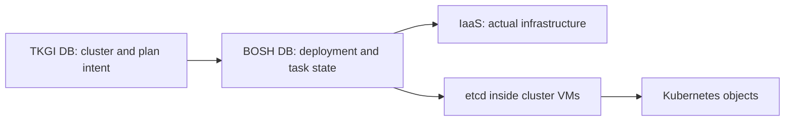

# TKGI Database, State And Consistency

The TKGI management database stores durable product metadata used to manage clusters,
plans and lifecycle operations. Exact schemas and database topology are implementation
details that vary by release. Operate the database through supported product procedures,
not application-style manual edits.

## Four Different State Stores

| Store | Owns | Does not own |
|---|---|---|
| TKGI database | cluster identity, plan association, desired lifecycle metadata and operation records | Kubernetes objects |
| BOSH Director database | deployments, VM/job state, tasks, configs and infrastructure reconciliation records | TKGI business policy |
| Kubernetes etcd | Kubernetes API desired/observed object state for one cluster | TKGI plans or BOSH VMs |
| IaaS control plane | actual VMs, networks, load balancers, disks and infrastructure events | authoritative TKGI intent |

These stores are related but not interchangeable.



## Consistency Is Reconciled, Not One Transaction

A cluster creation crosses multiple systems and cannot be one ordinary relational
transaction. A failure can leave:

- a TKGI record with a failed/in-progress operation;
- a partially created BOSH deployment;
- IaaS resources created before a later step failed;
- a working Kubernetes control plane before an add-on errand failed;
- database state referencing a deleted or inactive plan;
- named cloud configuration that no longer matches global cloud configuration.

The correct recovery starts by identifying the authoritative supported workflow and
the first failed boundary. Blindly changing one database can hide evidence and create
more drift.

## Plan And Cluster Referential Integrity

A cluster commonly retains the identifier of its selected plan. Operational controls
should prevent deletion or incompatible mutation of a plan still referenced by clusters.

Before changing a plan:

1. inventory all clusters using it;
2. determine supported migration/update behavior;
3. confirm capacity and placement for the replacement;
4. update/reconcile clusters through TKGI;
5. verify BOSH deployments and Kubernetes health;
6. retire the old plan only when no valid references remain.

## Availability And Failure Modes

Depending on the TKGI version/topology, database services can involve MariaDB/Galera
processes. Quorum, replication and split-brain protection matter more than whether one
process responds locally.

Watch for:

- loss of database quorum or unhealthy members;
- disk-full and inode exhaustion;
- latency causing API timeouts;
- certificate/credential failures;
- schema migration problems during upgrade;
- backup jobs that completed without a restorable artifact;
- divergent time or DNS affecting clustered members.

## Evidence Collection

From the supported management deployment context:

```bash
bosh -d pivotal-container-service-<guid> instances
bosh -d pivotal-container-service-<guid> vms --vitals
bosh -d pivotal-container-service-<guid> logs pivotal-container-service/0
bosh tasks --recent=30
```

After a scoped SSH session:

```bash
sudo monit summary
df -h
df -i
ls /var/vcap/sys/log
```

Use product runbooks to inspect database health and logs. Never include credentials or
row contents containing secrets in diagnostic output shared outside the incident team.

## Backup And Recovery

A reliable recovery design defines:

- which TKGI, BOSH, Ops Manager and Harbor data is backed up;
- whether BBR or another supported mechanism coordinates component backups;
- encryption and access control for backup artifacts;
- RPO and RTO for management-plane loss;
- dependency order during restore;
- DNS, certificates, IaaS and external service prerequisites;
- an isolated restore test and documented evidence.

Database backup alone may not recreate a consistent platform if BOSH state, blobstore,
credentials, product configuration and infrastructure have different recovery points.

## Safe Recovery Principles

1. Freeze unrelated lifecycle changes during diagnosis.
2. Preserve logs, task IDs and backups before mutation.
3. Compare TKGI cluster identity with BOSH deployment and IaaS resources.
4. Restore availability/quorum before attempting logical repair.
5. Follow a version-specific Broadcom procedure for schema or row changes.
6. Trigger a supported TKGI reconciliation after any approved low-level repair.
7. Validate both cluster lifecycle and Kubernetes workload behavior.

## Interview Questions

**Is the TKGI database the source of truth for running Pods?** No. Kubernetes etcd is
the state store for Kubernetes API objects. The TKGI database stores platform-level
cluster lifecycle metadata.

**Why is a manual database fix risky?** It can violate schema invariants and leave the
TKGI API/broker view inconsistent with BOSH named configs, deployment manifests and
actual IaaS resources. A vendor-supported fix must include reconciliation and validation.

**What proves a backup works?** A successful scheduled job is insufficient. Evidence is
an isolated, version-compatible restore that meets RPO/RTO and passes management API,
BOSH, cluster credential and Kubernetes workload checks.

## References

- [Broadcom: plan metadata inconsistency affecting cluster listing](https://knowledge.broadcom.com/external/article/313133)
- [Broadcom: layered TKGI and BOSH configuration consistency](https://knowledge.broadcom.com/external/article/437404/tkgi-cluster-update-and-bosh-tile-apply.html)
- [TKGI Overview](./TKGI-OVERVIEW-PATH.md)

