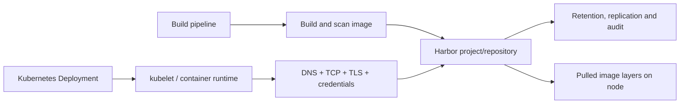

# TKGI And Harbor Registry

Harbor is an optional private OCI registry commonly paired with TKGI. It stores image
manifests and layers and adds project access control, vulnerability scanning, retention,
replication and audit capabilities. It is not the TKGI API database and is not a required
process inside every Kubernetes cluster.

## Image Supply Path



## Core Harbor Concepts

| Concept | Purpose |
|---|---|
| project | tenancy and policy boundary containing repositories |
| repository | named collection of image artifacts/tags |
| artifact digest | immutable content identity such as `sha256:...` |
| robot/service account | non-human automation identity |
| vulnerability scan | identifies known package vulnerabilities; policy still decides action |
| retention policy | selects which artifacts remain referenced |
| replication | copies artifacts between registry instances/endpoints |
| garbage collection | reclaims unreferenced blob storage after deletion/retention |
| audit log | evidence of registry operations and identities |

## Production Pull Configuration

Use a namespaced Kubernetes Secret or approved workload identity mechanism:

```bash
kubectl -n orders create secret docker-registry harbor-pull \
  --docker-server=harbor.example.com \
  --docker-username='<robot-account>' \
  --docker-password='<secret>' \
  --dry-run=client -o yaml
```

Reference it in the workload or ServiceAccount:

```yaml
apiVersion: v1
kind: ServiceAccount
metadata:
  name: orders-runtime
imagePullSecrets:
  - name: harbor-pull
---
apiVersion: apps/v1
kind: Deployment
metadata:
  name: orders
spec:
  template:
    spec:
      serviceAccountName: orders-runtime
      containers:
        - name: orders
          image: harbor.example.com/production/orders@sha256:REPLACE_ME
```

Do not commit the generated Secret containing credentials. Use secret delivery and
rotation appropriate for the environment.

## Tags Versus Digests

Tags are movable labels; digests identify content. Production promotion should make
the exact approved artifact auditable. A common model is:

1. build once;
2. scan and attach evidence;
3. promote/replicate the same digest;
4. deploy by digest or enforce immutable release tags;
5. record source commit, build and attestation.

## TLS Trust

Registry trust must exist at the component making the TLS connection. For image pulls,
that is normally the node container runtime, not the application Pod. An `imagePullSecret`
provides credentials but does not fix an untrusted CA.

Validate from the relevant network:

```bash
getent hosts harbor.example.com
openssl s_client -connect harbor.example.com:443 \
  -servername harbor.example.com -showcerts
```

Update node trust through supported TKGI configuration and node rollout mechanisms.
Manual changes on BOSH-managed nodes can disappear when BOSH recreates them.

## Scanning And Admission

A vulnerability scanner reports findings; it does not automatically prove an image is
safe. Define policy for severity, exploitability, fix availability, exception owner and
expiry. Admission policy can enforce approved registries, signatures/attestations and
digest pinning, but emergency processes must remain controlled and auditable.

## Retention, Deletion And Garbage Collection

Deleting a tag or artifact reference does not necessarily reclaim blob storage
immediately. Garbage collection reclaims unreferenced content. It can impose read-only
or other operational constraints depending on Harbor version/mode, so schedule and test
it. Monitor filesystem capacity before it becomes an outage.

## Availability And Disaster Recovery

Design for:

- registry endpoint/load-balancer availability;
- database and object/blob storage durability;
- backup consistency and restore tests;
- replication lag and conflict policy across sites;
- certificate and robot-account rotation;
- image availability during a region or registry outage;
- sufficient storage headroom for uploads, retention and GC.

Existing running containers do not continuously pull their image. New nodes, evicted
Pods and rollouts may fail during a Harbor outage even while current Pods look healthy.

## Pull Failure Runbook

```bash
kubectl -n <ns> describe pod <pod>
kubectl -n <ns> get events --sort-by=.metadata.creationTimestamp
kubectl -n <ns> get pod <pod> -o jsonpath='{.spec.imagePullSecrets}'
kubectl -n <ns> get serviceaccount <sa> -o yaml
```

Classify the exact event:

| Error | Likely cause |
|---|---|
| `not found` | repository, tag or digest incorrect |
| `unauthorized`/`denied` | credentials or Harbor project permission |
| `x509` | node runtime CA trust, expiry or hostname |
| timeout | DNS, routing, firewall, proxy or registry availability |
| `manifest unknown` | tag/digest/platform mismatch |
| `no space left` | node image filesystem or registry storage, depending on location |

## Interview Questions

**Is Harbor required for TKGI?** No. It is an optional companion registry. TKGI
clusters can pull from another reachable, trusted and authorized OCI registry.

**Why does adding an image-pull Secret not fix an x509 error?** Authentication and TLS
trust are independent. The node runtime must trust the registry's certificate chain.

**What happens if Harbor is down?** Existing containers can continue. Pulls required by
new Pods, new nodes, rescheduling or rollouts fail unless the needed layers are already
cached; cached layers are not a reliable availability strategy.

## References

- [Harbor documentation](https://goharbor.io/docs/)
- [Broadcom: Harbor garbage collection and disk reclamation](https://knowledge.broadcom.com/external/article/379792)
- [TKGI Overview](./TKGI-OVERVIEW-PATH.md)

