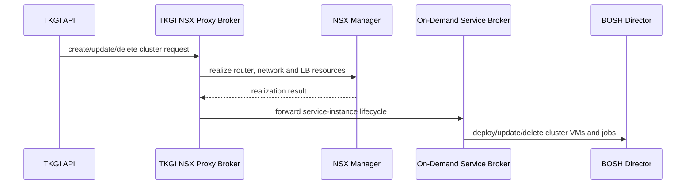

# TKGI Networking, NSX, Antrea And Load Balancers

TKGI has several independent network paths. “The load balancer is healthy” is meaningless
until the operator identifies which endpoint, virtual server and backend pool is involved.

## Network Domains

```text
management network: Ops Manager, BOSH, TKGI API/database and integrations
node network:       workload-cluster VM interfaces and kubelet/control-plane traffic
Pod network:        routable/overlay addresses managed by CNI/NSX design
Service network:    virtual ClusterIP allocation
ingress/LB network: external VIPs, DNAT/SNAT and edge capacity
storage network:    CSI/datastore traffic where separated
```

Prevent overlap between these CIDRs and enterprise routes. Include VPN, proxy and future
cluster allocations in the overlap review.

## Three Load-Balancer Purposes

Broadcom identifies distinct load-balancer use cases for AWS or vSphere without NSX:

| Load balancer | Client | Backend/purpose |
|---|---|---|
| TKGI API LB | `tkgi` CLI/automation | TKGI API/UAA management endpoint |
| Kubernetes cluster LB | `kubectl` and controllers | one workload cluster's control-plane/API nodes |
| workload LB/Ingress | application clients | Services/Ingress running on workers |

Do not reuse health checks blindly: an API endpoint and application HTTP endpoint have
different protocols, readiness semantics and certificates.

## Without NSX Integration

Operators/cloud-provider integrations supply the external API and workload balancing
mechanisms. For production, every cluster needs a stable Kubernetes API endpoint across
control-plane replacement. Direct host-file/control-plane-IP access is only a limited
non-production convenience and creates a single-node dependency.

An ingress controller usually sits behind a workload load balancer and routes HTTP/S by
Ingress/Gateway rules. `Service type: LoadBalancer` handles service-specific L4 exposure.

## With NSX Integration

### Management API

- HA TKGI control-plane deployments require a load balancer for TKGI API access;
- singleton mode uses a DNAT rule according to the TKGI 1.25 architecture;
- DNS and TLS must resolve through the chosen VIP/DNAT endpoint.

### Cluster And Workload Traffic

NSX participates in cluster create/update/delete and automatically manages a dedicated
load balancer for a new cluster. Virtual servers on that load balancer can expose:

- Kubernetes API/UI traffic across control-plane nodes;
- ingress-controller HTTP/S traffic;
- `Service type: LoadBalancer` TCP/UDP flows.

The 1.25 documentation states that NodePort is not supported for vSphere-with-NSX TKGI;
use `LoadBalancer` Services or Services associated with Ingress rules.

## NSX Mutation Flow



Capture both NSX and BOSH evidence when a request partially succeeds.

## Network Profiles

NSX network profiles can govern supported options such as:

- Pod and node networks;
- floating IP pools;
- DNS servers;
- edge-router selection;
- shared versus dedicated Tier-1 topology;
- L4/L7 load-balancer behavior and size;
- bootstrap security groups and logging settings.

Profile changes require compatibility and migration analysis. The profile is input to
TKGI reconciliation, while the realized NSX objects show actual dataplane state.

## Load-Balancer Sizing

TKGI 1.25 documentation notes that an NSX-created cluster LB defaults to Small and can be
sized through a network profile during cluster creation. Capacity includes virtual servers,
pools, members, concurrent connections, throughput, TLS and edge-node placement—not only
the number of clusters.

## Packet-Path Diagnosis

For every incident, write the path:

```text
client
 -> DNS answer
 -> route/firewall
 -> VIP or DNAT
 -> virtual server/listener
 -> backend pool/member health
 -> Kubernetes endpoint/Service
 -> Pod
 -> downstream dependency
```

Then test each hop using connection metadata, load-balancer/NSX realization, Kubernetes
EndpointSlices and application logs. Avoid beginning with random Pod restarts.

Useful Kubernetes evidence:

```bash
kubectl get service,ingress,endpointslice -A -o wide
kubectl describe service <service> -n <namespace>
kubectl get pods -n <namespace> -o wide
kubectl get networkpolicy -A
kubectl get events -A --sort-by=.metadata.creationTimestamp
```

## Common Failures

| Symptom | Likely layer |
|---|---|
| TKGI CLI times out | API DNS/LB/DNAT/firewall/listener |
| kubectl fails but TKGI works | cluster API VIP, certificate or control-plane pool |
| Service external IP pending | cloud/NSX controller, IP or LB capacity |
| VIP exists but no traffic | pool health, selector/EndpointSlice, policy or application readiness |
| intermittent 503 | unhealthy/terminating endpoints, readiness, LB drain or skew |
| only large packets fail | MTU/encapsulation path |
| cluster create fails after NSX objects | Proxy Broker-to-ODSB/BOSH partial failure |

## Interview Questions

**Name the three LB layers.** TKGI management API, workload-cluster Kubernetes API, and
application workload/Ingress exposure.

**Why can NSX show resources while TKGI creation failed?** NSX realization occurs before
the proxy forwards the request to the broker/BOSH; a later distributed step can fail.

## Official Reference

- [Broadcom TKGI 1.25 load balancers](https://techdocs.broadcom.com/us/en/vmware-tanzu/standalone-components/tanzu-kubernetes-grid-integrated-edition/1-25/tkgi/about-lb.html)

