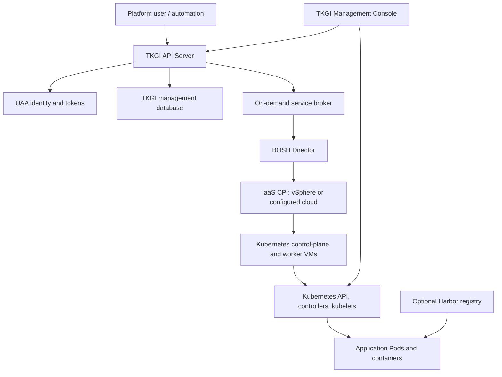

# TKGI Beginner-To-Architect Overview

Tanzu Kubernetes Grid Integrated Edition (TKGI), formerly Enterprise PKS, is a
platform for creating and operating Kubernetes clusters on infrastructure such as
vSphere. A user asks TKGI for a cluster; the TKGI management plane validates and
records that request; BOSH creates and maintains the cluster VMs; Kubernetes then
manages Pods and applications inside those VMs.

## The One-Minute Mental Model



The components do different jobs:

| Component | Primary responsibility | It is not |
|---|---|---|
| TKGI API Server | cluster create, update, scale, delete, plans, credentials and lifecycle status | the Kubernetes API server |
| UAA | operator identity, OAuth2 tokens, scopes and API authorization inputs | Kubernetes workload RBAC by itself |
| TKGI database | durable management metadata, cluster/plan associations and operation state | etcd or the BOSH database |
| BOSH Director | VM provisioning, release deployment, health reconciliation, repair and rolling changes | a Pod scheduler |
| Harbor | optional private OCI image registry, policy, scanning, retention and audit capabilities | a mandatory TKGI control-plane process |
| Management Console | graphical deployment, configuration and cluster-management experience | the source of every underlying truth |

## Three Control Planes You Must Distinguish

```text
TKGI management control plane
  answers: Which clusters were requested? Which plan? What lifecycle action/status?

BOSH infrastructure lifecycle control plane
  answers: Which VMs and jobs should exist? Are they healthy? What task changed them?

Kubernetes workload control plane
  answers: Which Kubernetes objects and Pods should exist inside one cluster?
```

An incident can affect only one plane. For example, existing Pods may continue
running while UAA prevents new `tkgi login` operations. Conversely, TKGI can report
a cluster as provisioned while an application Deployment is unhealthy inside it.

## Core Internal Services

### TKGI API Server

The API is the front door for cluster lifecycle requests. It evaluates plans and
profiles, records desired lifecycle state, delegates infrastructure work and reports
asynchronous task results. Historical process and file names commonly contain `pks`.

### UAA

User Account and Authentication issues OAuth2 access tokens and provides the identity
boundary used by TKGI API clients. Kubernetes API authorization is a separate step
after cluster credentials are obtained.

### TKGI Database

The management database stores product control-plane metadata. It must be treated as
one member of a distributed consistency model: TKGI database state, BOSH deployment
state, BOSH named cloud configuration and IaaS resources can disagree after a partial
failure. Operators should reconcile through supported product workflows.

### BOSH Director

BOSH converts a generated deployment manifest into infrastructure and software. Its
Cloud Provider Interface creates VMs, disks and network attachments; its agents apply
jobs; its health monitor and reconciliation mechanisms repair drift according to the
deployment definition.

### Harbor Registry

Harbor is commonly deployed as an optional companion private registry. Kubernetes
nodes and Pods need DNS, routing, TLS trust and credentials to pull images from it.
Harbor availability affects new pulls and rollouts, but already-running containers
can continue because their image layers are already present on a node.

## Complete TKGI Route

1. [TKGI Control Plane Architecture And Component Interactions](./TKGI-CONTROL-PLANE-ARCHITECTURE.md)
2. [TKGI API Server And Cluster Lifecycle](./TKGI-API-SERVER-LIFECYCLE.md)
3. [TKGI UAA Authentication And Authorization](./TKGI-UAA-SECURITY.md)
4. [TKGI Database, State And Consistency](./TKGI-DATABASE-STATE.md)
5. [TKGI BOSH Provisioning, Healing And Upgrades](./TKGI-BOSH-LIFECYCLE.md)
6. [TKGI And Harbor Registry](./TKGI-HARBOR-REGISTRY.md)
7. [TKGI Management Console, Monitoring And Operations](./TKGI-CONSOLE-MONITORING.md)
8. [TKGI End-To-End Architecture, Services, Concourse And Operations](./TKGI-ARCHITECTURE-OPERATIONS.md)

Use the end-to-end architecture page after the focused pages. It connects product
internals to BOSH deployments, NSX, cluster manifests, Concourse pipelines, Go/BOSH
packages, upgrades and production interview scenarios.

## Request-To-Running-Pod Trace

1. The client resolves and establishes TLS to the TKGI API endpoint.
2. UAA authenticates the client and issues a scoped token.
3. The TKGI API validates the cluster request and chosen plan.
4. Management state and an asynchronous operation are recorded.
5. The broker generates cluster-specific BOSH configuration and a deployment manifest.
6. BOSH validates global and named cloud configuration.
7. The CPI creates control-plane and worker VMs, disks and network attachments.
8. BOSH agents install and start versioned release jobs.
9. TKGI errands configure cluster add-ons and integrations.
10. The cluster reaches a lifecycle state visible through TKGI.
11. A user obtains Kubernetes credentials and talks to that cluster's API server.
12. Kubernetes schedules Pods; the runtime pulls images, optionally from Harbor.

## Diagnosis By Symptom

| Symptom | Start here | Then prove |
|---|---|---|
| `tkgi login` fails | DNS, TLS and UAA | API certificate chain, time, token endpoint and scopes |
| create/update remains in progress | TKGI operation and BOSH task | broker request ID, task output, CPI and errands |
| cluster listed but `kubectl` fails | Kubernetes endpoint path | LB, certificate, credentials and API health |
| console shows no cluster details | console-to-TKGI/Kubernetes auth path | console logs, token refresh, client compatibility and cluster reachability |
| nodes exist but Pods cannot pull | registry path | image name, pull secret, DNS, TLS trust, proxy and Harbor project policy |
| a VM was manually changed and reverts | BOSH reconciliation | deployment manifest, release job and supported configuration source |
| cluster update fails after AZ change | layered BOSH config | global cloud config, named config and cluster manifest alignment |

## Interview-Level Summary

**How does TKGI offer Kubernetes as a service?** It exposes an authenticated cluster
lifecycle API backed by plans and durable management state. The broker translates a
request into cluster-specific BOSH configuration. BOSH provisions and reconciles the
VMs and Kubernetes software. The resulting Kubernetes API is then used independently
for application workloads.

**What remains available if the TKGI API is down?** Existing clusters and workloads
may remain operational because their Kubernetes control planes do not depend on the
TKGI API for every workload action. New cluster lifecycle actions and credential flows
that require TKGI can fail.

**Is Harbor built into every TKGI cluster?** No. Treat Harbor as an optional registry
service/integration. Its topology, lifecycle and failure domain must be designed and
operated explicitly.

## Official Version Context

This track uses the user-provided TKGI 1.25 documentation as its version anchor. Exact
process names, deployment layouts and console features vary by TKGI release and enabled
integrations. Confirm an installed environment with product documentation, tile/release
manifests, BOSH deployments and supported Broadcom procedures.

- [Broadcom TKGI 1.25 control-plane documentation](https://techdocs.broadcom.com/us/en/vmware-tanzu/standalone-components/tanzu-kubernetes-grid-integrated-edition/1-25/tkgi/control-plane.html)
- [Broadcom TKGI 1.25 Management Console cluster operations](https://techdocs.broadcom.com/us/en/vmware-tanzu/standalone-components/tanzu-kubernetes-grid-integrated-edition/1-25/tkgi/console-monitor-manage-clusters.html)
