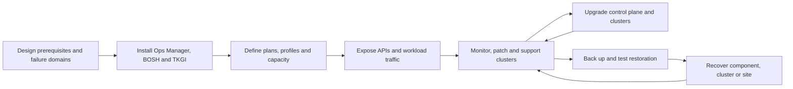

# TKGI Production Platform Operations Path

This track continues after [TKGI Control Plane Architecture](./TKGI-CONTROL-PLANE-ARCHITECTURE.md).
It covers the production lifecycle around that architecture: prerequisites, deployment,
capacity, networking, upgrades, recovery, observability and incident response.

## Production Lifecycle

## Read In Order

1. [Installation Foundations And Platform Topology](./TKGI-INSTALLATION-FOUNDATION.md)
2. [Plans, Profiles, VM Sizing And Capacity](./TKGI-PLANS-SIZING-CAPACITY.md)
3. [Networking, NSX, Antrea And Load Balancers](./TKGI-NETWORKING-LOAD-BALANCERS.md)
4. [Upgrade Architecture And Lifecycle](./TKGI-UPGRADE-LIFECYCLE.md)
5. [Backup, Restore And Disaster Recovery](./TKGI-BACKUP-RESTORE-DR.md)
6. [Telemetry, Sinks And Observability](./TKGI-TELEMETRY-SINKS-OBSERVABILITY.md)
7. [Production Incidents, CLI And Interview Revision](./TKGI-PRODUCTION-INCIDENT-REVISION.md)

## Ownership Map

| Concern | Authoritative workflow/evidence |
|---|---|
| product configuration | Management Console or Operations Manager plus applied product config |
| infrastructure mappings | BOSH global/named cloud config and CPI/IaaS evidence |
| cluster lifecycle | TKGI API/broker state and BOSH deployment tasks |
| Kubernetes workloads | workload-cluster API, controllers and application SLIs |
| NSX networking | TKGI network profile, NSX Proxy Broker and NSX realization state |
| backups | supported BBR/Velero workflow plus independently verified restore artifacts |
| logs and metrics | configured sink resources, agents, destination and end-to-end delivery |

## Completion Standard

You should be able to design prerequisites; calculate node and IP capacity; explain every
load-balancer path; choose full versus staged upgrades; recover management, cluster and
workload layers; prove telemetry delivery; and diagnose a failed lifecycle operation using
correlated TKGI, BOSH, NSX, IaaS and Kubernetes evidence.

## Version Boundary

Concrete values and product behavior are anchored to TKGI 1.25 documentation. Validate
the exact release notes, compatibility matrix and installed tile before changing a real
environment.

