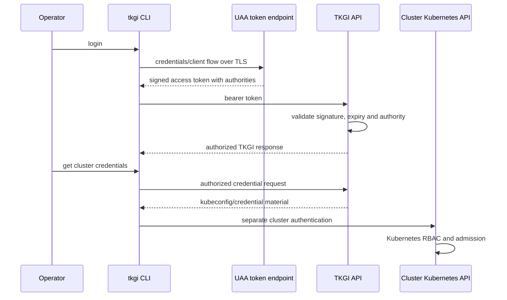

# TKGI UAA Authentication And Authorization

UAA is the identity and OAuth2 token service used at the TKGI management boundary.
It answers “who is calling the TKGI API and what token authorities were granted?” It
does not replace authorization inside every provisioned Kubernetes cluster.

## Trust Flow



## Authentication Versus Authorization

```text
Authentication: prove identity and issue/validate a token.
Authorization: decide whether that identity may perform an operation.
```

For TKGI management, token authorities/scopes and API policy govern cluster actions.
For Kubernetes resources, cluster credentials, subjects, Roles/ClusterRoles and
bindings govern API access. Keep platform-admin and cluster-admin privileges distinct.

## Token Validation Inputs

The API must be able to validate:

- issuer and expected audience/client context;
- token signature using current trusted keys;
- expiry and not-before timing;
- requested authorities/scopes;
- endpoint certificate and hostname trust on client connections.

Clock skew, stale signing keys, expired certificates and incorrect endpoint names can
all look like an “authentication problem” while requiring different corrections.

## Human And Machine Identities

Use individually attributable identities for operators and narrowly scoped OAuth
clients for automation. Avoid one shared administrative secret in every pipeline.

For service credentials:

- store secrets in an approved secret manager;
- restrict pipeline exposure and log redaction;
- grant the minimum authorities required;
- rotate with an overlap/validation plan;
- inventory dependants before revocation;
- audit token requests and privileged API actions.

Never paste access tokens, client secrets, private keys or generated kubeconfigs into
incident tickets, shell history, documentation or chat.

## Certificate And Key Rotation

A safe rotation plan includes:

1. inventory API endpoint, UAA signing and client-trust dependencies;
2. generate a certificate with correct SANs, key usage and chain;
3. distribute new trust before removing old trust where overlap is supported;
4. apply through the supported Ops Manager/TKGI configuration workflow;
5. update Management Console and automation trust separately when required;
6. validate login, token refresh, cluster listing and credential retrieval;
7. monitor errors before retiring old material.

The TKGI Management Console may hold its own copy of API certificate material. A
certificate change on the TKGI tile without the corresponding console update can leave
CLI operations healthy while console authentication fails.

## Diagnostic Commands

Inspect connectivity without exposing credentials:

```bash
getent hosts api.tkgi.example.com
openssl s_client -connect api.tkgi.example.com:9021 \
  -servername api.tkgi.example.com -showcerts
curl -vk https://api.tkgi.example.com:9021/
```

On a BOSH-managed management VM, after identifying the correct deployment and instance:

```bash
sudo monit summary
ls /var/vcap/jobs/uaa
ls /var/vcap/sys/log/uaa
ls /var/vcap/sys/log/pks-api
```

Prefer reading logs and certificate metadata first. Do not restart UAA or replace files
manually until the active topology, HA behavior and supported rotation workflow are known.

## Failure Matrix

| Symptom | Test | Interpretation |
|---|---|---|
| hostname not found | resolver lookup from client | DNS/search-domain issue |
| connection timeout/refused | route, firewall and listener | TCP/network or service issue |
| certificate hostname/expiry error | SAN, chain and clock | TLS configuration |
| token endpoint rejects credentials | client/user state and UAA logs | authentication |
| token issued but API returns 403 | authorities and API operation | authorization |
| console token signature error | console token/cache and UAA keys | signing/trust synchronization |
| TKGI works, Kubernetes denies | kubeconfig identity and RBAC | cluster authorization |

## Security Design Checklist

- expose TKGI and Kubernetes APIs only on intended networks;
- use trusted TLS and automated expiry alerting;
- separate Ops Manager, BOSH, TKGI and Kubernetes privileges;
- apply least privilege to humans and CI/CD clients;
- centralize identity where supported and preserve attribution;
- monitor failed logins, privileged lifecycle actions and unusual token use;
- protect backups because management databases and credentials are sensitive;
- exercise certificate and secret rotation before an emergency.

## Interview Questions

**Does UAA provide Kubernetes RBAC?** UAA authenticates and authorizes at the TKGI
management API boundary. After cluster credentials are acquired, the Kubernetes API
performs its own authentication, RBAC authorization and admission.

**A user gets a token but cannot delete a cluster. What do you check?** Confirm the
request reaches the intended API, inspect token expiry/audience/authorities, compare the
operation's required role, and inspect API authorization logs. Token issuance proves
authentication, not permission for every lifecycle action.

**Why can the Management Console fail after certificate rotation while the CLI works?**
They can use different trust stores or retained configuration. The console's configured
TKGI API certificate/key/trust may not have been synchronized with the tile change.

## References

- [Broadcom: Management Console and expired TKGI API certificate](https://knowledge.broadcom.com/external/article/327473)
- [Broadcom: Management Console token verification failures](https://knowledge.broadcom.com/external/article/394632)
- [TKGI API Server And Lifecycle](./TKGI-API-SERVER-LIFECYCLE.md)

