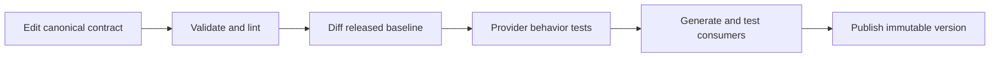

# Generate, Package, And Consume Quarkus OpenAPI Clients

There are two useful artifact strategies:

| Artifact | Contains | Consumer action |
|---|---|---|
| specification artifact | canonical YAML or JSON | generate a client with consumer-selected options |
| generated-client JAR | Java interfaces and models | add the JAR as a normal dependency |

A specification artifact preserves language independence. A client JAR gives
Java consumers a controlled, repeatable API but couples them to generator and
runtime choices.

## 1. Generate In A Consumer

Add the Quarkiverse client generator version compatible with the project's
Quarkus platform, and follow its plugin configuration:

```xml
<dependency>
  <groupId>io.quarkiverse.openapi.generator</groupId>
  <artifactId>quarkus-openapi-generator</artifactId>
  <version>${quarkus-openapi-generator.version}</version>
</dependency>
```

Put a local specification in `src/main/openapi/customer-api.yaml`, then run:

```powershell
.\mvnw.cmd compile
Get-ChildItem target\generated-sources -Recurse
```

The exact generated package and configuration key depend on generator options;
inspect the generated interface rather than guessing. Inject its API interface
with `@RestClient`, and configure the URL through the generated client's config
key. Never embed credentials in generated sources or a published specification.

## 2. Publish A Specification Artifact

A dedicated module can package `customer-api.yaml` with coordinates such as:

```text
com.example.contracts:customer-openapi:1.2.0
```

`package` creates the artifact in `target`; `install` also copies it to the
developer's local Maven repository; `deploy` publishes it to the repository
configured by the organization. Publishing is an external write and needs the
normal release authorization and credentials.

The Quarkiverse generator can consume specifications from Maven GAV coordinates,
including supported YAML, JSON, JAR, and ZIP packaging. Pin an exact released
version. A floating or snapshot contract makes consumer builds non-reproducible.

## 3. Release Compatibility Deliberately



Usually additive changes include a new optional property, response, or endpoint.
Potentially breaking changes include removing or renaming a field, making an
optional input required, narrowing accepted values, or changing an operation ID.
Compatibility is behavioral as well as structural: altered authorization,
pagination, rate limits, idempotency, or error semantics may break consumers
without changing a schema.

Do not share service database entities through the client artifact. Publish
boundary models only. Each service still owns its data and transaction boundary;
a typed HTTP client does not create a distributed transaction.

## 4. Production Client Responsibilities

Generated transport code does not choose safe policies for your domain. The
consumer still owns:

- connect, read, and overall timeouts;
- retry eligibility and idempotency;
- authentication and token propagation without logging secrets;
- correlation identifiers, metrics, and traces;
- circuit breaking, concurrency limits, and unknown-outcome recovery;
- tests for error decoding and backward compatibility.

Do not blindly regenerate and commit a huge source diff. Review generator
version changes separately, inspect the diff for model and serialization changes,
and prove the consumer against the provider or a faithful contract test.

## Capstone Exercise

Publish `customer-openapi:1.0.0`, generate a client in a separate Quarkus
consumer, and test one success plus `401`, `403`, `404`, timeout, and malformed
error responses. Add an optional field for `1.1.0`, run a compatibility diff,
and demonstrate that the old consumer still works.

## Recommended Next

For organization-wide policy, continue with
[API Contract Lifecycle, OpenAPI, Versioning, And Deprecation](../architecture/governance/API-CONTRACT-GOVERNANCE.md).

## Official References

- [Quarkus OpenAPI Generator Client](https://docs.quarkiverse.io/quarkus-openapi-generator/dev/client.html)
- [Quarkus REST Client](https://quarkus.io/guides/rest-client)
- [OpenAPI Specification](https://spec.openapis.org/oas/latest.html)
