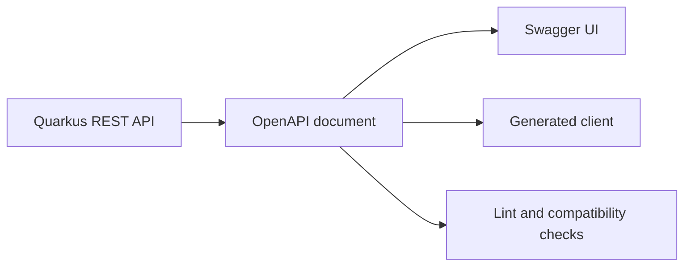

# OpenAPI Fundamentals For Quarkus

OpenAPI is a machine-readable description of an HTTP API. Swagger UI renders
that description as an interactive web page. A generated Java client is code
derived from the description, while a Maven artifact is a packaged file that
can carry the description or generated code. These are related, not synonyms.



## 1. Read A Minimal Contract

Save this as `customer-api.yaml` while learning:

```yaml
openapi: 3.1.0
info:
  title: Customer API
  version: 1.0.0
paths:
  /customers/{customerId}:
    get:
      operationId: getCustomer
      parameters:
        - name: customerId
          in: path
          required: true
          schema:
            type: string
      responses:
        "200":
          description: Customer found
          content:
            application/json:
              schema:
                $ref: "#/components/schemas/Customer"
        "404":
          description: Customer not found
components:
  schemas:
    Customer:
      type: object
      required: [id, displayName]
      properties:
        id:
          type: string
        displayName:
          type: string
          maxLength: 120
```

The `paths` object defines operations. `components.schemas` holds reusable data
shapes, and `$ref` avoids copying them. `operationId` should be unique and stable
because generators commonly turn it into a method name.

## 2. Expose A Quarkus Description

Add the extension without hard-coding its version; the Quarkus platform BOM
should manage it:

```xml
<dependency>
  <groupId>io.quarkus</groupId>
  <artifactId>quarkus-smallrye-openapi</artifactId>
</dependency>
```

Start dev mode, then inspect the default endpoints:

```powershell
.\mvnw.cmd quarkus:dev
Invoke-WebRequest http://localhost:8080/q/openapi
```

Open `http://localhost:8080/q/swagger-ui` for the UI. Quarkus generates an
OpenAPI document by scanning REST endpoints. It can also merge a static
`src/main/resources/META-INF/openapi.yaml` document with the scanned model.

## 3. Know What The Contract Does Not Prove

An OpenAPI document describes the HTTP boundary. It does not prove that the
implementation authorizes object access, uses a transaction correctly, remains
idempotent under retries, or satisfies its latency objective. Swagger UI is a
manual exploration aid, not a regression or security test suite.

Never place real bearer tokens, customer records, payment values, or internal
hostnames in committed examples. An operation marked as secured still needs
runtime authentication, authorization, and negative tests.

## Practice

1. Add `POST /customers` with a required JSON body and `201` response.
2. Define one reusable problem schema for `400` and `404`.
3. Run the service and compare `/q/openapi` with the Java resource.
4. Rename an `operationId` and explain why a generated client may break.

## Recommended Next

Continue with [Generating A Quarkus OpenAPI Contract](./QUARKUS-OPENAPI-PROVIDER.md).

## Official References

- [OpenAPI Specification](https://spec.openapis.org/oas/latest.html)
- [Quarkus OpenAPI And Swagger UI Guide](https://quarkus.io/guides/openapi-swaggerui)
