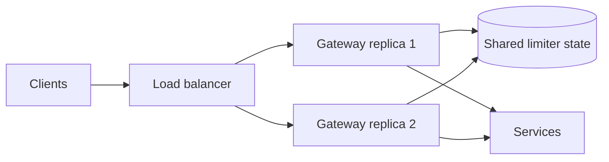

# Distributed Rate Limiting

A rate limiter decides whether a request is allowed to enter the system now.
A distributed rate limiter enforces that decision across multiple replicas by
storing limiter state in a shared system such as Redis, a dedicated gateway
service, or another strongly coordinated store.

Use this page for generic concepts. For the concrete Shopverse rollout, see
[Rate Limiting Implementation Guide](RATE-LIMITING-IMPLEMENTATION-GUIDE.md).

## Why Local Limits Are Not Enough

If four replicas each allow 100 requests per second:

```text
effective aggregate limit can approach 4 x 100 = 400 requests/second
```

That is acceptable for local process protection, but not for a global customer,
tenant, IP, route, or API-key quota. Use:

- local rate limiters and bulkheads for per-instance protection;
- distributed rate limiters for shared client admission control;
- dependency-specific limits near scarce dependencies such as payment
  providers, databases, email, SMS, or object storage.

## Generic Architecture



The shared store makes every replica charge the same bucket for the same
identity. Without shared state or deterministic traffic ownership, every
replica owns an independent quota.

## Where Limits Belong

| Layer | Purpose |
|---|---|
| Edge/load balancer/WAF | coarse abuse filtering, IP reputation, TLS, DDoS protection |
| API Gateway | user, tenant, API-key, route, login, and public API quotas |
| Service controller | local process admission and back pressure |
| Dependency client | provider quota and concurrency protection |
| Database or queue worker | protect scarce internal resources |

Apply the cheapest safe rejection as early as possible, but do not rely on one
layer only. Internal jobs, retries, and service-to-service calls can still
overload downstream resources.

## Core Algorithms

### Fixed Window

Count requests in a fixed interval:

```text
limit: 100 requests from 12:00:00 through 12:00:59
```

It is simple and cheap, but permits boundary bursts. A client can send 100
requests at the end of one window and 100 more at the start of the next.

Use it for simple quotas where burst smoothness is not important.

### Sliding Log

Store every request timestamp and remove expired entries before deciding.

It is accurate, but memory and CPU cost grow with request volume. Use it only
when exact rolling-window behavior is worth the cost.

### Sliding Window Counter

Maintain counters for the current and previous windows, then weight the
previous window by overlap. It is smoother than a fixed window and cheaper
than a full timestamp log.

Use it for practical per-minute or per-hour quotas when exactness is not
required.

### Token Bucket

A bucket contains tokens. Tokens refill at a steady rate until the bucket
reaches its maximum capacity. A request is allowed only if enough tokens are
available.

```text
replenish rate = 10 tokens/second
bucket capacity = 40 tokens
request cost = 1 token
```

Behavior:

- a full bucket allows an immediate burst of 40 requests;
- sustained traffic settles near 10 requests per second;
- a request is rejected when it needs more tokens than remain;
- expensive requests can consume more than one token.

This is a strong default for API traffic because it supports controlled bursts
without allowing unlimited spikes.

### Leaky Bucket

Requests enter a bounded queue and leave at a fixed rate. It smooths traffic,
but queued requests add latency and must be rejected when the queue is full.

Use it when smoothing is more important than immediate rejection. For public
APIs, token bucket is often easier to reason about.

### Concurrency Limiter

Controls active work, not requests per time window.

```text
maximum in-flight checkout requests = 100
```

Use it when the scarce resource is active execution: threads, DB connections,
remote calls, CPU, memory, or worker slots.

## Bucket Concepts

| Concept | Meaning |
|---|---|
| Token | Permission unit consumed by a request |
| Refill rate | Tokens added per second or per period |
| Capacity | Maximum tokens the bucket can hold |
| Burst | Immediate traffic allowed while the bucket has saved tokens |
| Cost | Tokens required by a request |
| Key | Identity whose bucket is being charged |
| TTL | Expiration for idle bucket state in a shared store |

Example:

```text
capacity = 60
refill = 10 tokens/second
cost = 1
```

A client can send 60 requests immediately when idle. After that, it can sustain
about 10 requests per second. If the client pauses, the bucket refills up to 60
again.

For expensive endpoints:

```text
GET /inventory/items      cost = 1
POST /orders/checkout     cost = 5
POST /payments/capture    cost = 10
```

## Key Strategy

The key determines who owns the bucket. A poor key strategy creates unfairness
or security gaps.

| Traffic | Recommended key |
|---|---|
| Authenticated user request | `user:{subject}` |
| Partner API client | `client:{client-id}` |
| Tenant-level quota | `tenant:{tenant-id}` |
| Anonymous public request | `ip:{trusted-client-ip}` |
| Login/register abuse control | `route:{route}:ip:{trusted-client-ip}` |
| Expensive user route | `route:{route}:user:{subject}` |

Avoid these keys:

- one global `anonymous` key for all public users;
- raw full URL including high-cardinality IDs;
- caller-supplied user identity headers;
- untrusted `X-Forwarded-For`;
- email addresses, phone numbers, tokens, or secrets.

Behind a reverse proxy, only trust forwarded client IP headers if the
application is reachable only from trusted infrastructure.

## Capacity Calculation

Start from the tightest downstream constraint:

```text
safe throughput = min(
  application capacity,
  database capacity,
  dependency quota,
  broker capacity
) x safety factor
```

Example:

```text
application tested capacity: 1,200 RPS
database safe capacity:        900 RPS
payment-provider quota:        500 RPS
safety factor:                    0.8

safe admitted rate = 500 x 0.8 = 400 RPS
```

For active requests, Little's Law gives:

```text
concurrency = throughput x latency
```

At 400 RPS and 300 ms:

```text
400 x 0.3 = 120 active requests
```

Use percentile latency and load tests for final sizing. Average latency can
hide tail saturation.

## Burst Capacity

Choose burst capacity from tolerated burst duration:

```text
burst tokens = sustained rate x tolerated burst duration
```

For 400 RPS and a 500 ms burst:

```text
400 x 0.5 = 200 tokens
```

Start with a burst capacity between one and three seconds of sustained rate for
interactive APIs, then tune from load tests and real traffic.

## Shared Store Model

A distributed token bucket must update state atomically:

```text
key: request_rate_limiter.{route}.{identity}
state: tokens and last refill timestamp
operation: refill, test, consume, return remaining
```

Separate `GET` and `SET` calls are unsafe under concurrency because multiple
replicas can read the same token count and all decide to allow. Use a proven
implementation or an atomic operation such as a Redis Lua script.

Consider:

- key TTL cleanup for idle identities;
- cluster key placement;
- hot keys from large tenants or public endpoints;
- store latency added to every limited request;
- failure behavior when the store is unavailable;
- memory pressure from high-cardinality identities;
- whether limiter state needs persistence after restart.

## Failure Policy

| Endpoint type | Limiter unavailable behavior |
|---|---|
| Login/register | normally fail closed or use strict local fallback |
| Costly writes | fail closed or strict degraded policy |
| Low-risk reads | may fail open with local protection |
| Admin endpoints | fail closed |
| Health checks | avoid limiter dependency unless testing limiter health explicitly |

The policy is a business and security decision. Record fallback mode in logs
and metrics. Silent fail-open behavior can hide abuse during limiter incidents.

## HTTP Response

Return `429 Too Many Requests` for rejected calls:

```http
HTTP/1.1 429 Too Many Requests
Retry-After: 2
Content-Type: application/problem+json
```

Use `Retry-After` only when the value is meaningful. Include a stable error
code and correlation ID, but do not expose limiter internals.

## Metrics

Measure:

- allowed and rejected requests by route;
- `429` rate;
- store command latency and errors;
- limiter decision latency;
- top limited route categories;
- downstream saturation during rejection spikes;
- retry traffic after rejection.

Avoid high-cardinality labels such as user ID, IP, email, order ID, or full raw
path.

## Best Practices

- Put the primary distributed limiter at the API Gateway or another edge
  admission-control layer.
- Use shared state for quotas that must survive horizontal scaling.
- Keep local limiters and bulkheads for service instance protection.
- Use route-specific policies instead of one global number.
- Use authenticated identity for authenticated APIs and trusted IP for
  anonymous endpoints.
- Make auth and payment stricter than read-heavy catalog routes.
- Exclude or separately protect health, metrics, and infrastructure endpoints.
- Never trust caller-supplied identity headers.
- Avoid personal data and secrets in keys, logs, and metric labels.
- Return `429` consistently with correlation IDs.
- Tune from load tests and production metrics, not guesses.
- Document fail-open versus fail-closed behavior per route.
- Prove distributed behavior with at least two replicas.

## Common Mistakes

| Mistake | Impact |
|---|---|
| In-memory limiter on each replica | aggregate limit scales with replica count |
| One key for all anonymous users | one caller can consume every public user's quota |
| IP-only limit for authenticated users | unfair behind NAT and mobile networks |
| Trusting raw `X-Forwarded-For` | clients can spoof identities |
| Full path or user ID as metrics label | high cardinality and metrics pressure |
| Long wait for limiter permission | ties up request resources and worsens latency |
| Retrying rejected requests | amplifies load during overload |
| No store failure policy | unpredictable availability and abuse behavior |

## References

- [Spring Cloud Gateway RequestRateLimiter](https://docs.spring.io/spring-cloud-gateway/reference/spring-cloud-gateway-server-webflux/gatewayfilter-factories/requestratelimiter-factory.html)
- [Redis Lua scripting](https://redis.io/docs/latest/develop/programmability/eval-intro/)
- [Resilience4j documentation](https://resilience4j.readme.io/docs)
- [Bucket4j documentation](https://bucket4j.com/)

## Related Guides

- [Rate Limiting Implementation Guide](RATE-LIMITING-IMPLEMENTATION-GUIDE.md)
- [API Gateway](../development/API-GATEWAY-GENERIC.md)
- [Advanced Spring Cloud Gateway](../development/SPRING-CLOUD-GATEWAY-ADVANCED.md)
- [Resilience4j patterns](RESILIENCE4J-GENERIC.md)
- [Caching](../architecture/CACHING-GENERIC.md)
- [Prometheus](../observability/PROMETHEUS.md)
