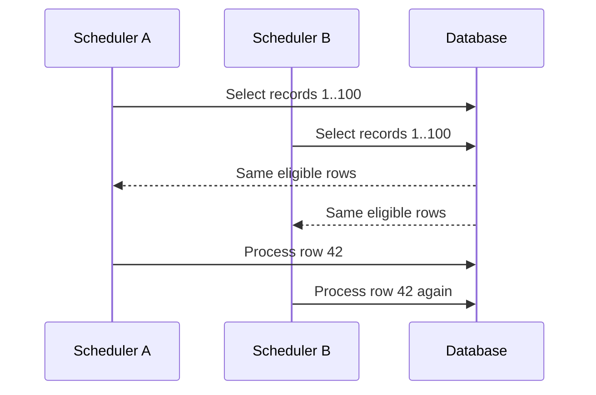

# Distributed Schedulers And Safe Work Claiming


*A lease expiring cannot stop paused code. Incremented fencing generations let the
protected resource reject the previous owner after work is reassigned.*

`@Scheduled` is local to one application process. With four replicas, the same
method can run four times. Preventing simultaneous method entry is also different
from ensuring that each database record produces one correct business effect.

## The Failure

Suppose every replica runs this query:

```sql
SELECT id FROM reservation
WHERE status = 'ACTIVE' AND expires_at <= CURRENT_TIMESTAMP
ORDER BY expires_at LIMIT 100;
```

Replica A and replica B can select the same rows before either updates them.
Both may release inventory, send notifications, or publish events. A process can
also crash after the side effect but before marking the record complete. Network
timeouts make it impossible to know whether a remote effect occurred.



The goal is normally **at-least-once attempts plus idempotent effects**, bounded
concurrency, and recoverable ownership—not an unsupported “exactly once” claim.

## First Decide The Ownership Unit

Choose among:

- one whole scheduled job;
- one business record;
- a batch of records;
- a stable range/shard such as tenant, region, or hash bucket;
- a queue or Kafka partition.

If records are independent, locking the entire job wastes parallelism. If the
job builds one indivisible report, singleton leadership may be appropriate.

## Strategy Matrix

| Strategy | Best fit | Parallelism | Main risk |
|---|---|---:|---|
| idempotent processing only | duplicates are harmless and cheap | high | repeated cost/side effects |
| database conditional update | single-record state transition | high | extra claim lifecycle needed for long work |
| `FOR UPDATE SKIP LOCKED` | short transactional database work | high | holding locks during remote calls |
| claim columns plus lease | work continues outside transaction | high | stale owner requires fencing/idempotency |
| static hash/range assignment | stable workers and even data | high | hotspots and reassignment during failure |
| dynamic shard leases | many partitions and changing workers | high | lease renewal and fencing complexity |
| queue/Kafka partitions | event-driven independent work | high | redelivery and ordering scope |
| singleton distributed lock | one global job must run | one | lock loss, pauses, split brain |

## Fix 1: Atomic Conditional Transition

For one record, make eligibility and ownership one database statement:

```sql
UPDATE reservation
SET status = 'EXPIRING', claimed_by = :worker, claimed_at = CURRENT_TIMESTAMP
WHERE id = :id
  AND status = 'ACTIVE'
  AND expires_at <= CURRENT_TIMESTAMP;
```

Only the worker receiving update count `1` owns the transition. The business
effect must still be idempotent, and a stale `EXPIRING` state needs recovery.

## Fix 2: Row Locks And `SKIP LOCKED`

Parallel workers can claim different batches:

```sql
BEGIN;
SELECT id FROM reservation
WHERE status = 'ACTIVE' AND expires_at <= CURRENT_TIMESTAMP
ORDER BY expires_at, id
FOR UPDATE SKIP LOCKED
LIMIT 100;

-- Perform only short database state changes here.
UPDATE reservation SET status = 'EXPIRED' WHERE id IN (...);
COMMIT;
```

This is effective when all protected work fits in a short transaction. Do not
hold database locks while calling payment, email, HTTP, Kafka, or other slow
systems. Engine syntax and isolation behavior differ; inspect the real plan and
test concurrent workers.

## Fix 3: Durable Claims With Leases

For work performed outside the transaction, persist ownership:

```text
status, claim_token, claimed_by, lease_until, attempt_count, next_attempt_at
```

Claim a bounded batch atomically, commit, then process. Every completion update
must include `WHERE claim_token = :token`; a worker whose lease expired cannot
overwrite a newer owner's result. A monotonically increasing generation is a
fencing token when downstream resources can reject stale writers.

Lease duration must exceed normal processing plus jitter but remain bounded.
Renew only while the worker is healthy. Reclaim expired rows with attempt limits,
backoff, a dead-letter/manual-review state, and metrics. Wall-clock leases require
clock discipline; prefer database time for database-owned claims.

## Fix 4: Range Or Hash Ownership

Partition work into many more logical ranges than workers:

```text
bucket = stable_hash(tenant_id) mod 256
worker A owns 0..63; B owns 64..127; ...
```

Each query includes owned buckets and a supporting index. Avoid simple ID ranges
when inserts or large tenants create skew. Static assignment is simple but needs
orchestration on failure. Dynamic assignment stores a lease and generation per
bucket; reassignment increments the generation so the previous owner is fenced.

Use consistent hashing or rendezvous hashing when minimizing movement matters,
but still handle hotspots, membership changes, and stale ownership.

## Fix 5: Singleton Distributed Lock

ShedLock, a database advisory lock, Redis, ZooKeeper, etcd, or Kubernetes leader
election can ensure one scheduler *normally* launches a global job. A correct
design defines acquire, renewal, expiry, release, owner identity, time source,
and behavior after pauses or network partitions.

A lease alone does not stop an old paused worker from resuming after ownership
moved. Use a fencing token at the protected resource or make the operation
idempotent. Do not use a global lock when record-level claims safely provide more
throughput and smaller failure domains.

## Side Effects And Transaction Boundaries

The safest flow is often:

1. In one local transaction, claim/change the business record and insert an
   outbox event with a unique business key.
2. Commit.
3. Publish from the outbox with its own recoverable claim.
4. Make every consumer idempotent using a unique processed-event key or an
   atomic business constraint.

Never assume a database transaction can atomically cover an arbitrary remote API.
For timeouts, reconcile using provider operation IDs and state-machine rules.

## Queries And Indexes

The claim query should use a deterministic order and an index beginning with
equality/status fields followed by time and a unique tiebreaker, for example:

```sql
CREATE INDEX ix_reservation_claim
ON reservation(status, next_attempt_at, expires_at, id);
```

Use small batches and keyset continuation. Offset pagination can skip or repeat
rows while statuses change. Prevent starvation by ordering oldest eligible work
first and monitoring the age of the oldest unprocessed record.

## Capacity And Backpressure

- Cap scheduler threads, claimed batches, in-flight remote calls, and retries.
- Claim only what can finish before lease expiry.
- Add jitter so replicas do not poll simultaneously.
- Back off when no work exists or dependencies/database are saturated.
- Separate workloads or priorities so poison/slow records cannot block all work.
- Scale from database and downstream headroom, not queue depth alone.

## Required Metrics

Track eligible/claimed/in-flight/completed/failed/reclaimed counts, oldest-work
age, claim conflicts, lease renewals/expirations, attempts, dead-letter count,
batch and item latency, scheduler drift, lock waits, pool wait, and downstream
latency/errors. Log worker ID, record ID, claim token, attempt, and correlation ID
without exposing PII.

## Testing Checklist

1. Start two or more workers at the same instant against the same records.
2. Pause or kill one after claim, during effect, and before completion.
3. Lose the network until its lease expires, then let the stale worker resume.
4. Inject duplicates, timeouts, slow records, skewed ranges, and poison records.
5. Verify no invariant is violated and all eligible work eventually reaches a
   terminal state or explicit manual-review queue.
6. Verify upgrades do not let old and new worker versions corrupt the same claim.

## Selection Rule

- Use **conditional updates** for small atomic state transitions.
- Use **`SKIP LOCKED`** for short parallel transactional batches.
- Use **durable claims/leases** when processing leaves the transaction.
- Use **range or partition ownership** for predictable high-scale distribution.
- Use **queue partitions** when work is naturally event-driven.
- Use a **singleton distributed lock** only when the whole job truly has one owner.
- In every case, keep business effects idempotent and recovery observable.

## Recommended Next Pages

Read [Database Locking And Claims](./locking/DATABASE-LOCKING-AND-CLAIMS.md) for
engine-specific SQL, [Partition And Queue Ownership](./locking/PARTITION-AND-QUEUE-OWNERSHIP.md)
for dynamic shard assignment, and [Idempotency](./IDEMPOTENCY-GENERIC.md) for safe retries.

## Official References

- [Spring transaction management](https://docs.spring.io/spring-framework/reference/data-access/transaction.html)
- [Apache Kafka documentation](https://kafka.apache.org/documentation/)
- [PostgreSQL explicit locking](https://www.postgresql.org/docs/current/explicit-locking.html)
