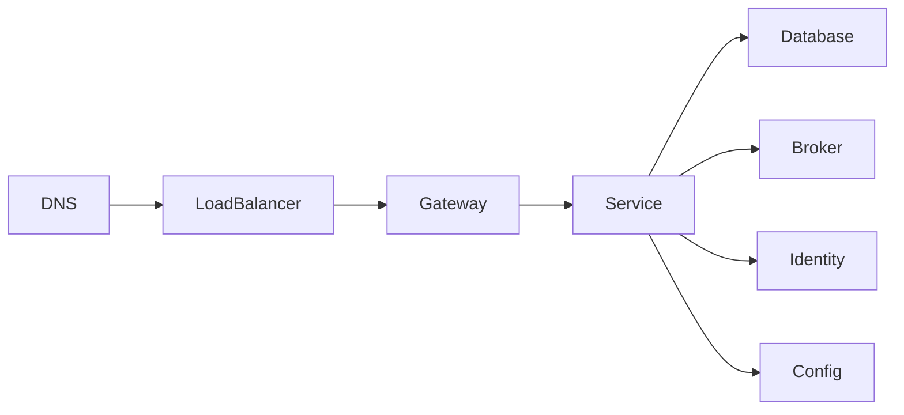

# High Availability And Single Points Of Failure

A single point of failure (SPOF) is a component whose loss makes a required
system capability unavailable. High availability removes or reduces these
single dependencies and provides tested failover.

## Find The SPOFs

Trace each critical request:



For every node ask:

1. Is there more than one healthy instance?
2. Is state replicated?
3. Can routing detect failure and move traffic?
4. Can the replacement safely take ownership?
5. Has failover been tested?

Two instances do not automatically provide availability if both depend on one
database, zone, credential, DNS provider, or network path.

## Prevention Techniques

| Risk | Typical control |
|---|---|
| One application instance | multiple stateless replicas and health-based routing |
| One load balancer | managed regional balancer or redundant balancers |
| One database node | replication, automated failover, backups, restore testing |
| One Kafka broker | multi-broker cluster, replicated partitions, quorum controller |
| One Redis node | replication/cluster and failure-aware clients |
| One availability zone | spread instances and quorum across zones |
| One region | tested regional recovery or active-active design where justified |
| One secret/config store | replicated managed service and cached bootstrap strategy |
| One CI runner | runner pool and reproducible pipeline |
| One operator | runbooks, least-privilege shared access, audited automation |

## Stateless Application Replicas

Application instances should not keep required user state only in memory.
Externalize sessions or use stateless tokens where appropriate. Ensure:

- readiness fails until dependencies needed for traffic are ready;
- liveness detects deadlock without restarting merely slow applications;
- graceful shutdown stops new traffic and drains active requests;
- consumers stop polling and commit/process offsets safely;
- local schedulers use ownership/locking when only one execution is allowed.

## Database Availability

Replication is not backup:

- replication supports availability and read scaling;
- backup protects against deletion, corruption, and operator error.

Safe failover requires:

1. detect failure;
2. elect/promote a new writer;
3. fence the old writer;
4. update client routing;
5. reconcile the recovered node.

Without fencing, split-brain can allow two writers.

## Quorum

Majority quorum:

```text
quorum = floor(N / 2) + 1
```

Three voters tolerate one failure while retaining progress. Five tolerate two.
Place voters across independent failure domains.

## Prevent Cascading Failure

Redundancy does not help if overload spreads to every replica. Use:

- deadlines and timeouts;
- bounded retry with backoff and jitter;
- circuit breakers;
- bulkheads;
- load shedding;
- rate limiting;
- bounded queues;
- autoscaling with capacity headroom.

## Recovery Objectives

```text
RTO = maximum acceptable recovery time
RPO = maximum acceptable data loss
```

Architecture should follow these objectives. A five-minute RTO and zero-data-
loss RPO require different cost and coordination than a four-hour RTO and
one-hour RPO.

## Deployment Availability

- use rolling, blue-green, or canary deployment;
- set disruption budgets;
- keep old and new APIs/events/schema compatible;
- use immutable image tags;
- automatically verify readiness and business smoke tests;
- retain a tested rollback path.

## Shopverse Status

Docker Compose runs one local instance of most components and is intentionally
not highly available. Shopverse demonstrates application resilience patterns,
but production HA would require:

- multiple Gateway and service replicas;
- managed or clustered MySQL, Kafka, Redis, Loki, Prometheus, and Grafana;
- multi-zone orchestration;
- external secret management;
- replicated ingress and DNS;
- backup/restore and failure-injection exercises.

## Interview Questions

<ExpandableAnswer title="How Do You Prevent A Single Point Of Failure?">

Map the complete dependency path, replicate stateful and stateless components,
spread them across failure domains, add health-based routing, use quorum and
fencing for ownership, preserve backups, and test failover. Redundancy without
automatic and safe recovery is only spare capacity.

</ExpandableAnswer>
<ExpandableAnswer title="Active-Active Or Active-Passive?">

Active-active serves traffic from multiple sites and provides faster failover
but requires conflict and consistency design. Active-passive is simpler but
needs capacity readiness, replication, and regularly tested promotion.

</ExpandableAnswer>
<ExpandableAnswer title="Why Is A Backup Not High Availability?">

A backup enables recovery after loss. It does not keep the service serving
traffic while a live component fails.

</ExpandableAnswer>
## Related Guides

- [Distributed Failure And Consensus](DISTRIBUTED-FAILURE-CONSENSUS.md)
- [Distributed Databases](../data/DISTRIBUTED-DATABASES.md)
- [Deployment Strategies](../operations/DEPLOYMENT-STRATEGIES.md)
- [Distributed Rate Limiting](DISTRIBUTED-RATE-LIMITING.md)

