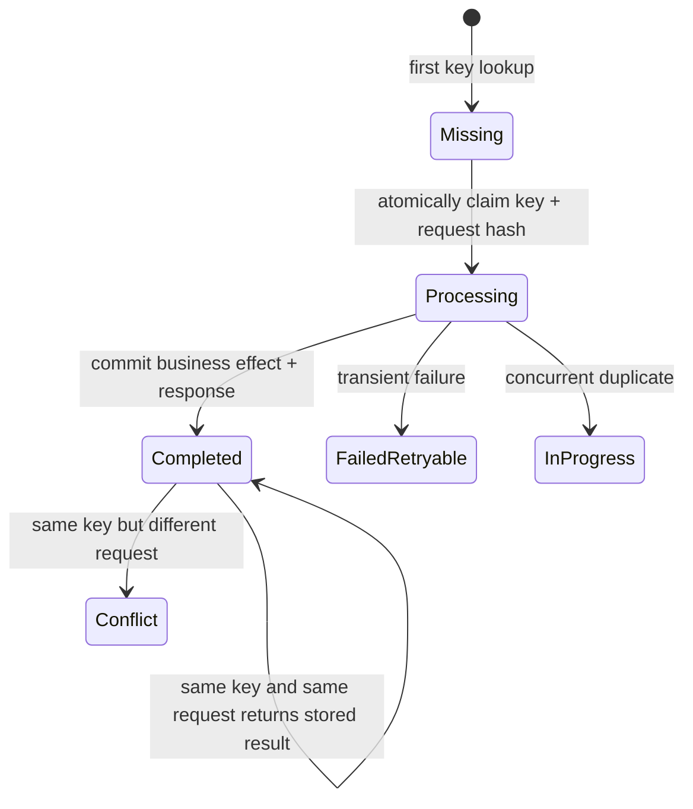

# Idempotency In APIs And Distributed Systems

An idempotent operation has the same intended business effect when performed
more than once as when performed once. It does not mean every response byte is
identical, and it does not mean duplicate requests never reach the server.


*Visual summary supplied by the project owner. Related source discussions:
[API idempotency](https://www.linkedin.com/posts/namra-patel01_java-springboot-backenddevelopment-activity-7480169557085548544-0ea7/)
and [payment idempotency](https://www.linkedin.com/posts/sahithi-p-900648406_springboot-java-paymentsystems-activity-7474808539627110400-Ugy1/).*

## Where It Is Required

- payment authorization, capture, refund, and payout;
- order/booking creation after timeout and client retry;
- message consumers under at-least-once delivery;
- scheduled jobs, webhook processing, and replay;
- inventory reserve/release and other retryable commands;
- deployment/bootstrap/migration operations that may restart.

HTTP `GET`, `PUT`, and `DELETE` are defined with idempotent semantics, while
`POST` is not inherently idempotent. Application design can make a POST command
idempotent with a client-generated key and a durable result record.

## API State Machine



The idempotency key identifies one intended command, not the user or correlation
trace. Bind it to caller/tenant, operation, and a canonical request fingerprint.

## Durable Data Model

```sql
CREATE TABLE idempotency_record (
    tenant_id       VARCHAR(64)  NOT NULL,
    operation       VARCHAR(64)  NOT NULL,
    idempotency_key VARCHAR(128) NOT NULL,
    request_hash    VARCHAR(128) NOT NULL,
    status          VARCHAR(24)  NOT NULL,
    resource_id     VARCHAR(64),
    response_code   INTEGER,
    response_body   TEXT,
    created_at      TIMESTAMP    NOT NULL,
    expires_at      TIMESTAMP,
    PRIMARY KEY (tenant_id, operation, idempotency_key)
);
```

The unique constraint is the final concurrency guard. A check-then-insert in
application code alone races when two requests arrive together.

## Correct Processing

1. Require a high-entropy caller-generated key for retryable commands.
2. Validate caller, payload, and key size before work.
3. Compute a canonical request hash excluding volatile headers.
4. Atomically insert/claim the key inside the business transaction when possible.
5. On conflict, load the existing record:
   - same hash + completed: return the stored status/result;
   - different hash: return `409 Conflict` or equivalent;
   - processing: wait briefly, return a retryable in-progress response, or poll.
6. Commit the business effect and completed result together.
7. Retain the record longer than the maximum client/provider retry window.

If an external payment provider is involved, send a stable provider idempotency
key and reconcile uncertain timeouts by querying provider state. A local record
cannot prove whether an external side effect happened after the network response was lost.

## API, Producer, And Consumer Idempotency

| Layer | What it prevents | Mechanism |
|---|---|---|
| HTTP command | repeated client/gateway request repeating business effect | idempotency key + request hash + unique durable record |
| Kafka producer idempotence | duplicates from certain producer-to-broker retries | producer ID/sequence behavior in Kafka |
| consumer idempotency | redelivered event repeating downstream effect | inbox/event ID, business uniqueness, state machine |
| domain-state idempotency | repeated command moving state twice | conditional transition/version/invariant |

Kafka producer idempotence does not merge two separate application sends and
does not make database, email, or payment effects idempotent.

## Common Failures

- storing keys only in local memory or Redis without acceptable durability;
- using correlation ID as the idempotency identity;
- reusing the same key with a different payload;
- expiring keys before delayed retries stop;
- returning success before the business transaction commits;
- holding a database transaction open while calling a slow remote provider;
- replaying a message with a new event ID;
- assuming “exactly once” transport eliminates application-level duplicates;
- logging complete request/response bodies containing secrets or personal data.

## Security And Operations

Scope keys to the authenticated tenant, limit length and request rate, prevent
key enumeration, encrypt sensitive stored results, redact logs, and apply data
retention rules. Monitor duplicate hit rate, key conflicts, in-progress age,
cleanup failures, provider uncertainty, inbox conflicts, and repeated side effects.

Test concurrent identical requests, same key/different payload, timeout after
commit, process crash before/after commit, broker redelivery, provider timeout,
and replay after deployment.
