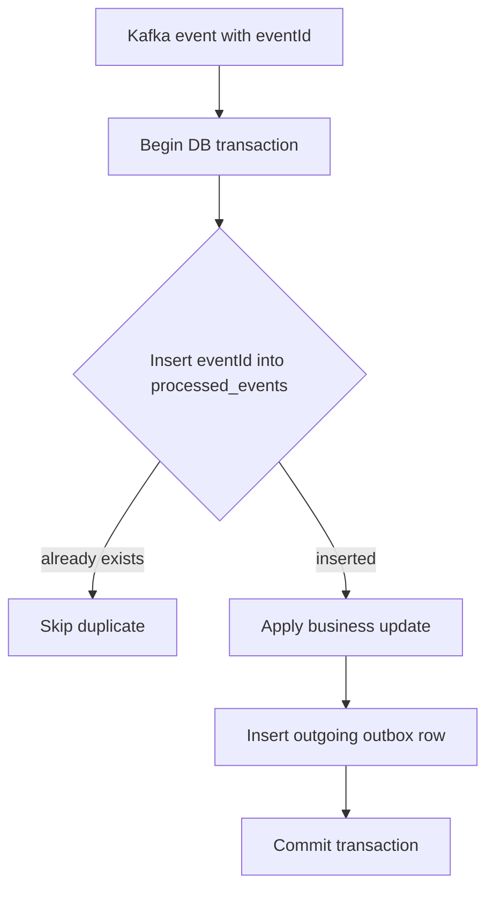

# Inbox Pattern And Idempotent Consumers

The inbox pattern solves the consumer-side duplicate-processing problem:

> How do we make sure the same received event does not apply the same business
> effect twice?

It is the natural partner of the transactional outbox pattern.

## Problem Statement

Kafka and most message brokers are commonly used with at-least-once delivery.
That means a record should not be lost, but it can be delivered more than once.

Duplicate delivery can happen when:

- a consumer updates its database but crashes before committing the Kafka
  offset;
- Kafka rebalances partitions before the previous consumer commits progress;
- retry topics redeliver a failed event;
- a DLT replay republishes the original payload;
- an outbox publisher republishes after crash recovery.

Without idempotent consumers, duplicate delivery can repeat business effects:

```text
Duplicate order.created      -> reserve stock twice
Duplicate inventory.reserved -> charge payment twice
Duplicate payment.completed  -> append duplicate confirmation work
```

## Solution

Every event carries an immutable event ID. Each consumer records that event ID
before applying business logic.

```json
{
  "eventId": "evt-7b0b8c8f",
  "orderNumber": "ORD-1003",
  "correlationId": "SAGA-ORD-1003"
}
```

Each consuming service owns a table such as:

```sql
CREATE TABLE processed_events (
  event_id VARCHAR(100) NOT NULL,
  consumer_name VARCHAR(100) NOT NULL,
  processed_at TIMESTAMP NOT NULL,
  PRIMARY KEY (event_id, consumer_name)
);
```

Then the handler performs the inbox insert, business update, and outgoing
outbox insert in one local transaction:

```java
@Transactional
public void handle(OrderCreatedEvent event) {
    if (!processedEventRepository.tryInsert(
            event.eventId(),
            "inventory-service"
    )) {
        return;
    }

    inventoryService.reserve(...);
    outboxService.enqueue(...);
}
```

If the event was already processed, the unique constraint prevents a second
insert and the handler skips the business effect.

## Why This Must Be Transactional

The inbox row and business change must commit together.

```text
processed_events insert
business update
outgoing outbox row
= one local transaction
```

If the business update fails, the processed-event insert must roll back too.
Otherwise the service would remember the event as processed even though it did
not complete the work.

## Why Not Use Consumer ID, Offset, Or Trace ID?

Technical identifiers do not represent durable business identity.

| Identifier | Why it is not enough |
|---|---|
| consumer ID | changes after restart, scaling, and rebalance |
| group ID | identifies a whole consumer group, not one event |
| topic + partition + offset | identifies one physical Kafka record only; retry, DLT, and replay can create another physical record for the same business event |
| Kafka key | controls partitioning and ordering, but Kafka allows many records with the same key |
| trace ID | tracks one technical execution path, not durable business identity |
| correlation ID | useful for searching a business journey, but not necessarily unique per event |

The duplicate-detection key must identify the event itself. That is why the
inbox pattern uses an immutable `eventId`.

## Shopverse Current Status

Shopverse has not fully implemented the inbox pattern yet.

Current implementation uses state-based idempotency:

| Service | Current duplicate protection |
|---|---|
| Order checkout | mandatory `Idempotency-Key` and unique order column |
| Inventory consumer | checks reservation by `orderNumber` before reserving stock |
| Payment consumer | checks payment by `orderNumber` before processing payment |
| DLT persistence | suppresses common duplicate unresolved records by source topic and payload |

Inventory example:

```java
if (reservationRepository.findByOrderNumber(orderNumber).isPresent()) {
    return true;
}
```

Payment example:

```java
return repository.findByOrderNumber(orderNumber).orElseGet(() -> {
    // create and process payment once
});
```

This is acceptable for the POC because the business invariant is simple:

```text
one order -> one reservation
one order -> one payment
```

## Recommended Shopverse Enhancement

To make Shopverse stronger, add:

1. `eventId` to every SAGA event.
2. `processed_events` table in Order, Inventory, and Payment services.
3. unique constraint on `(event_id, consumer_name)`.
4. inbox insert inside the same transaction as business state update.
5. outgoing outbox enqueue in the same transaction when the consumer emits the
   next SAGA event.

Example consumer flow:



## Benefits

- duplicate Kafka records do not repeat business effects;
- replay becomes safer;
- event processing is auditable;
- consumer deduplication is explicit instead of inferred only from current
  business state;
- outbox and inbox together form a reliable at-least-once event-processing
  model.

## Limits

Inbox does not remove the need for:

- business-level idempotency for external providers;
- payment-provider idempotency keys;
- careful schema compatibility;
- monitoring of poison events, retries, and DLT;
- compensation for valid business failures.

## Related Guides

- [Transactional outbox pattern](OUTBOX-PATTERN.md)
- [SAGA and transactional outbox patterns](SAGA-GENERIC.md)
- [Shopverse SAGA and outbox](SAGA-OUTBOX.md)
- [Spring Kafka](../spring/SPRING-KAFKA.md)
