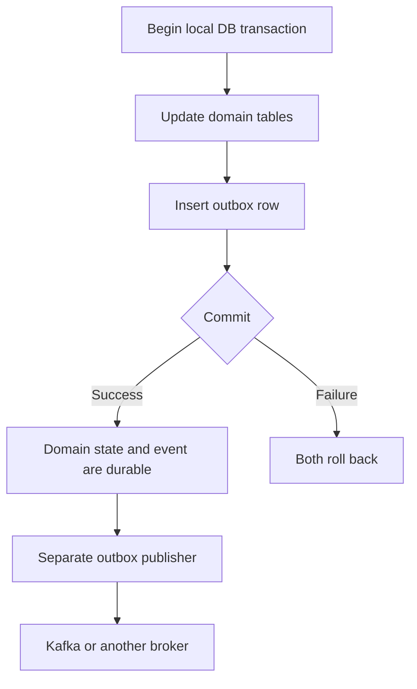

# Outbox Delivery And Operations

<DocLabels items={[{label: 'Advanced', tone: 'advanced'}, {label: 'Shopverse', tone: 'shopverse'}, {label: 'Production', tone: 'production'}]} />

## Transactional Outbox Pattern

The transactional outbox solves the dual-write problem. For a focused
problem/solution and implementation guide, see
[Transactional outbox pattern](OUTBOX-PATTERN.md). For the consumer-side
deduplication partner, see [Inbox pattern](INBOX-PATTERN.md).

## The Dual-Write Failure

Without an outbox:

```java
orderRepository.save(order);
kafkaTemplate.send("order.created", event);
```

The database commit and Kafka send are separate operations. Failures create
inconsistent outcomes:

| Database | Kafka | Result |
|---|---|---|
| commit | send succeeds | expected |
| commit | send fails | state changed but no event |
| rollback | send succeeds | event describes state that does not exist |

No ordinary local transaction can atomically commit a MySQL update and a Kafka
send.

## Outbox Solution

Write the domain change and an event record to the same database transaction:



The outbox row is durable evidence that an event still needs publication.

## Typical Outbox Schema

```text
id
aggregate_type
aggregate_id
event_type
topic
message_key
payload
correlation_id
status
publish_attempts
created_at
published_at
next_attempt_at
last_error
```

Useful indexes include:

```text
(status, next_attempt_at, created_at)
```

The event should also have a globally unique event ID when consumers use an
inbox or processed-event table.

## Writer Transaction

```java
@Transactional
public void changeState(Command command) {
    Aggregate aggregate = repository.save(...);
    outboxRepository.save(OutboxEvent.from(aggregate));
}
```

If serialization or outbox insertion fails, the transaction must fail. Do not
catch and ignore that failure, because the domain update would then commit
without a recoverable event.

## Publisher Transaction

A polling publisher usually:

1. selects eligible pending rows;
2. claims or locks a bounded batch;
3. sends each event;
4. waits for broker acknowledgement;
5. marks the row published;
6. records attempts and errors on failure.

Use short transactions and bounded batches. Multiple publisher replicas need a
claiming strategy such as row locking, skip-locked selection, or atomic status
updates.

## Polling Publisher Versus CDC

### Polling

The application queries the outbox table on a schedule.

Advantages:

- simple application ownership;
- no separate change-data-capture platform;
- easy to understand in a POC.

Trade-offs:

- database polling load;
- publication delay;
- concurrency and cleanup logic reside in the application.

### Change Data Capture

A CDC tool reads the database transaction log and publishes new outbox rows.

Advantages:

- low-latency publication;
- less application polling;
- scales well for high event volume.

Trade-offs:

- additional infrastructure and operational knowledge;
- connector offsets, schema evolution, and failure recovery must be managed.

Debezium is a common CDC implementation, but the pattern is not tied to one
product. See [Change Data Capture In Microservices](../architecture/CHANGE-DATA-CAPTURE.md)
for direct-table versus outbox CDC, snapshots, connector offsets, ordering,
log-retention failures, and the Shopverse migration decision.

## Delivery Guarantee

The outbox prevents **lost events after a committed domain change**, but it
does not create global exactly-once processing.

A crash can occur after Kafka accepts an event but before the publisher marks
the row `PUBLISHED`:

```text
Kafka accepted event
        |
        v
Publisher process crashes
        |
        v
Outbox row still appears pending
        |
        v
Event is published again
```

Therefore, outbox delivery is normally at least once. Consumers must be
idempotent.

## SAGA Implementation Maturity

Many systems implement the first working SAGA path before they implement every
failure guard. Document the maturity level explicitly:

| Level | Typical evidence |
|---|---|
| Happy-path choreography | Events move the workflow through the expected success path. |
| Recoverable local transactions | Each service commits domain state and outgoing event intent atomically. |
| Idempotent consumption | Duplicate messages and client retries do not duplicate business effects. |
| Operational baseline | DLT, replay audit, correlation IDs, metrics, and bounded retries exist. |
| Production hardening | Event IDs, schema versioning, inbox/processed-event tables, backoff, terminal failure, alerting, and replay policy are in place. |

When writing architecture docs, do not collapse these levels into one word such
as "reliable". State exactly which guarantees exist and which are target
hardening work.

### Operational Visibility

A SAGA should expose enough state for operators to answer:

- which business operation is in progress;
- which service owns the current step;
- which event or command last changed state;
- whether the workflow is waiting, failed, compensated, or complete;
- which correlation ID connects logs across services;
- which recovery action is allowed.

For choreography, this usually requires a local timeline, correlated logs,
metrics, and replayable failure records. Without those, the system may be
eventually consistent in theory but difficult to operate during incidents.

## Ordering

Global ordering is expensive and usually unnecessary. Preserve ordering only
where the domain requires it:

- use the aggregate ID as the broker message key;
- keep events for one aggregate in one partition;
- store aggregate version or sequence number;
- reject or defer stale transitions.

Concurrent publishers must not reorder events for the same aggregate.

## Retry And Backoff

A production publisher should support:

- attempt count;
- exponential backoff with jitter;
- `next_attempt_at`;
- maximum attempts or terminal failed status;
- alerts for old pending and terminal rows;
- operator replay after root-cause correction.

Retrying every failed row on every scheduler tick can overload the database,
broker, and logs during a prolonged outage.

## Cleanup And Retention

Published rows should not grow forever. Options include:

- delete after a retention period;
- archive to cheaper storage;
- partition the table by date;
- retain failures longer than successes.

Cleanup must not remove pending or still-required audit records.

## Observability

Monitor:

- pending row count;
- age of the oldest pending row;
- publication success/failure rate;
- attempt count;
- publish latency from `created_at` to `published_at`;
- terminal failures;
- consumer lag and duplicate handling.

Log event ID, aggregate ID, event type, topic, and correlation ID. Do not log
sensitive payloads by default.

## Outbox Production Practices

1. Insert domain state and outbox row in one local transaction.
2. fail the transaction when event serialization fails.
3. assign a unique event ID.
4. use a stable aggregate message key.
5. publish bounded batches.
6. coordinate multiple publishers safely.
7. wait for broker acknowledgement before marking published.
8. make consumers idempotent.
9. use bounded retry and backoff.
10. monitor pending age, not only pending count.
11. define cleanup and replay policies.
12. evolve event schemas compatibly.

## Related Guides

- [Shopverse SAGA and outbox implementation](SAGA-OUTBOX.md)
- [Apache Kafka](../integration/APACHE-KAFKA.md)
- [Spring Kafka](../spring/SPRING-KAFKA.md)
- [Shopverse transactions](TRANSACTIONS.md)
- [Spring transaction concepts](../spring/SPRING-TRANSACTIONS.md)
- [Distributed systems](../architecture/DISTRIBUTED-SYSTEMS.md)

## Recommended Next

Return to [SAGA And Transactional Outbox](./SAGA-GENERIC.md) to select the next focused guide.


## Official References

- [Resilience4j documentation](https://resilience4j.readme.io/docs)
- [Apache Kafka documentation](https://kafka.apache.org/documentation/)
