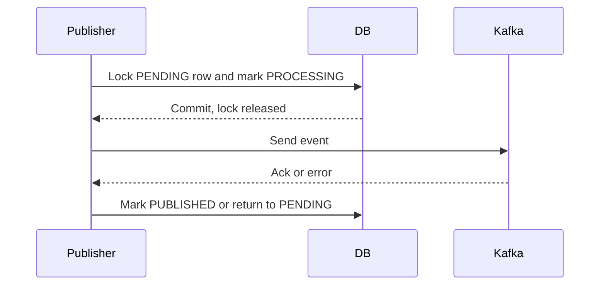

# Outbox Implementation Guide

This guide explains how Shopverse implements the transactional outbox pattern.
For general theory, see [Transactional outbox pattern](OUTBOX-PATTERN.md). For
the checkout-specific flow, see [SAGA implementation guide](SAGA-IMPLEMENTATION-GUIDE.md).

## Shopverse Outbox Stack

| Component | Role |
|---|---|
| Service database | Stores domain rows and outbox rows in the same local transaction. |
| `outbox_events` table | Durable event intent waiting to be published. |
| `OutboxService` | Serializes and inserts event payloads inside the caller's transaction. |
| Scheduled publisher | Claims pending rows, sends them to Kafka, and finalizes status. |
| Kafka | Receives integration events after the database commit. |
| Metrics/logs | Show publication success, failure, and retry behavior. |

The outbox prevents the unsafe dual write:

```text
save database row
send Kafka message
```

Those two operations cannot be committed atomically with a normal local MySQL
transaction. The outbox makes the event durable before Kafka is involved.


## Step 1: Create The Outbox Table

A typical Shopverse outbox table contains:

```text
id
aggregate_type
aggregate_id
event_type
topic
message_key
payload
correlation_id
status
publish_attempts
claimed_at
published_at
last_error
created_at
updated_at
```

Core statuses:

```text
PENDING -> PROCESSING -> PUBLISHED
```

On publish failure:

```text
PROCESSING -> PENDING
```

On stale worker claim:

```text
PROCESSING -> PENDING
```

## Step 2: Insert Outbox Rows Inside Domain Transactions

The owning service writes domain state and the outgoing event together:

```java
@Transactional
public void handleInventoryReserved(InventoryReservedEvent event) {
    paymentRepository.save(...);
    outboxService.enqueue(
            "PAYMENT",
            event.orderNumber(),
            "PaymentCompletedEvent",
            topics.paymentCompleted(),
            event.orderNumber(),
            paymentCompletedEvent,
            event.correlationId()
    );
}
```

`OutboxService.enqueue(...)` should require an existing transaction:

```java
@Transactional(propagation = Propagation.MANDATORY)
public void enqueue(...) {
    repository.save(outboxEvent);
}
```

`MANDATORY` prevents a caller from accidentally writing the outbox row in a
separate transaction.

## Step 3: Keep Kafka Outside The Domain Transaction

Do not call `KafkaTemplate.send(...)` before the database transaction commits.
If Kafka succeeds but the database rolls back, downstream services will receive
an event for state that does not exist.

Correct flow:

```text
begin DB transaction
  -> update domain rows
  -> insert outbox row
commit DB transaction
publisher later sends outbox row to Kafka
```

## Step 4: Claim Work With A Short Transaction

The publisher should not hold a database lock while waiting for Kafka:

```text
1. find pending rows
2. claim one row in a short transaction
3. commit claim and release lock
4. send to Kafka outside the transaction
5. finalize success or failure in a new transaction
```

This protects the database from slow Kafka brokers and keeps row locks short.

Shopverse currently loads a bounded set of pending IDs and claims each event
with a per-row pessimistic lock before publishing. The higher-throughput target
is an atomic bounded `SKIP LOCKED` batch claim; batching a plain `SELECT` alone
would not prevent two replicas from selecting the same records.



## Step 5: Publish With Stable Message Keys

Use a stable aggregate key, usually `orderNumber`, as the Kafka key:

```text
topic: shopverse.order.created
key: ORD-2026-00001
payload: OrderCreatedEvent JSON
```

This keeps events for the same order ordered within a partition.

## Step 6: Retry And Recover

A failed send should increase attempts, store the error, and make the row
retryable unless the error is classified as permanently invalid.

Recommended retry state:

| Field | Purpose |
|---|---|
| `publish_attempts` | Shows retry pressure and avoids silent infinite loops. |
| `last_error` | Keeps the latest failure reason for debugging. |
| `claimed_at` | Allows stale `PROCESSING` rows to be released. |
| `status` | Drives publisher scans and operational queries. |

## Step 7: Add Metrics And Logs

Publishers should record success and failure:

```java
meterRegistry.counter(
        "shopverse.outbox.publish",
        "outcome", "success"
).increment();
```

Prometheus exports this as:

```text
shopverse_outbox_publish_total
```

Useful query:

```promql
sum by (application, outcome) (
  increase(shopverse_outbox_publish_total[15m])
)
```

Log with bounded business context:

```java
log.atWarn()
        .addKeyValue("outboxId", id)
        .addKeyValue("aggregateId", aggregateId)
        .addKeyValue("topic", topic)
        .log("Outbox publish failed");
```

## Step 8: Verify Outbox Correctness

Verification checklist:

1. Force a successful domain transaction and confirm one outbox row exists.
2. Force a rollback and confirm no outbox row remains.
3. Start Kafka and confirm `PENDING` rows become `PUBLISHED`.
4. Stop Kafka and confirm rows return to `PENDING` with attempts/error data.
5. Restart Kafka and confirm pending rows eventually publish.
6. Confirm duplicate publishes are safe because consumers are idempotent.
7. Confirm outbox metrics appear in Prometheus and Grafana.

## Related Guides

- [Transactional outbox pattern](OUTBOX-PATTERN.md)
- [SAGA implementation guide](SAGA-IMPLEMENTATION-GUIDE.md)
- [Choreography SAGA and transactional outbox](SAGA-OUTBOX.md)
- [Database locking and work claims](locking/DATABASE-LOCKING-AND-CLAIMS.md)
- [Spring distributed locking options](locking/SPRING-DISTRIBUTED-LOCKING-OPTIONS.md)
- [Change data capture in microservices](../architecture/CHANGE-DATA-CAPTURE.md)
- [Micrometer metrics](../observability/MICROMETER-METRICS.md)
