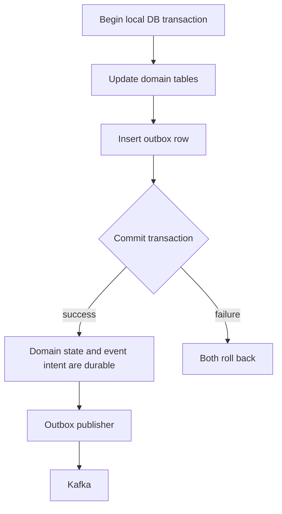
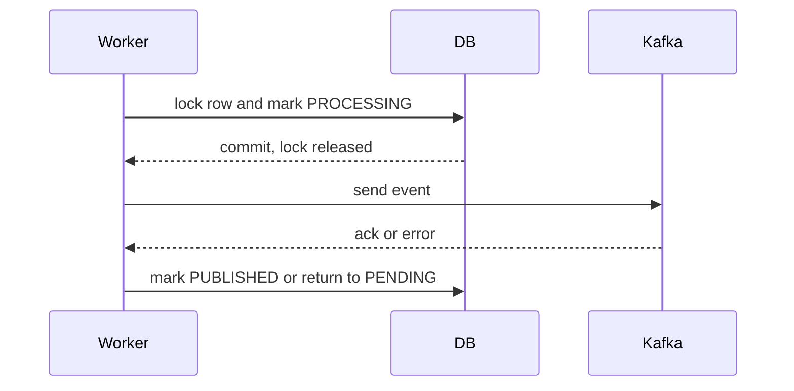

# Transactional Outbox Pattern

The transactional outbox pattern solves the producer-side reliability problem
in event-driven systems:

> How do we make sure a committed database change eventually publishes its
> integration event?

## Shopverse Links

Shopverse applies this pattern through:

- [Outbox Starter](../platform/OUTBOX-STARTER.md) for shared claim, publish, stale-claim release, metrics, and logging;
- [Shopverse SAGA And Outbox](SAGA-OUTBOX.md) for the checkout flow;
- [Outbox Runtime Problems](problems/OUTBOX-RUNTIME-PROBLEMS.md) for lock scope and stale claims;
- [Runtime Optimization](problems/optimization/RUNTIME-OPTIMIZATION.md) for replay indexes and local runtime tuning.

The platform starter owns infrastructure mechanics. Services still own domain
event creation, outbox entities, repositories, and Liquibase schemas.

## Problem Statement

A service often needs to update its database and publish an event:

```java
orderRepository.save(order);
kafkaTemplate.send("order.created", event);
```

This is a dual write. The database commit and Kafka send are separate
operations. Normal local database transactions cannot atomically commit both
MySQL and Kafka.

| Database result | Kafka result | Failure |
|---|---|---|
| commit succeeds | send succeeds | expected |
| commit succeeds | send fails | state changed but downstream services never know |
| rollback happens | send succeeds | event describes state that does not exist |

This creates lost SAGA steps, stuck orders, manual repair, and inconsistent
service state.

## Solution

Store the domain change and the outgoing event in the same local database
transaction.



The outbox row is durable event intent. A background publisher later reads
pending rows and sends them to Kafka.

## Typical Table

```text
outbox_events
--------------
id
aggregate_type
aggregate_id
event_type
topic
message_key
payload
correlation_id
status
publish_attempts
claimed_at
published_at
last_error
created_at
```

Typical status flow:

```text
PENDING -> PROCESSING -> PUBLISHED
```

On send failure:

```text
PROCESSING -> PENDING
```

On worker crash:

```text
PROCESSING --stale claim timeout--> PENDING
```

## Shopverse Implementation

Shopverse uses outbox tables in:

| Service | Purpose |
|---|---|
| Order Service | publish `order.created` and replay failed Order-side Kafka events |
| Inventory Service | publish `inventory.reserved` or `inventory.failed` |
| Payment Service | publish `payment.completed` or `payment.failed` |

The domain transaction writes state and outbox together:

```java
@Transactional
public OrderResponse checkout(...) {
    OrderEntity order = orderRepository.save(...);
    timelineRepository.save(...);
    outboxService.enqueue(
            "ORDER",
            order.getOrderNumber(),
            "OrderCreatedEvent",
            topics.orderCreated(),
            order.getOrderNumber(),
            event,
            correlationId
    );
    return mapper.toResponse(order);
}
```

`OutboxService.enqueue(...)` uses mandatory transaction participation:

```java
@Transactional(propagation = Propagation.MANDATORY)
public void enqueue(...) {
    repository.save(new OutboxEvent(...));
}
```

That prevents accidental outbox insertion outside the business transaction.
If order save, timeline save, JSON serialization, or outbox save fails, the
local transaction rolls back.

## Publisher Flow

Shopverse avoids holding database locks while waiting for Kafka.

The current implementation uses a short per-row pessimistic claim. The
comparison with conditional updates, MySQL `SKIP LOCKED`, and PostgreSQL
`UPDATE ... RETURNING` is maintained in
[Database Locking And Work Claims](locking/DATABASE-LOCKING-AND-CLAIMS.md).

```text
1. Claim row in a short DB transaction.
2. Commit and release the database lock.
3. Send to Kafka outside the DB transaction.
4. Finalize success or failure in another short DB transaction.
```



This keeps database lock scope short and prevents Kafka latency from consuming
database connections.

### Claiming Strategy Checklist

Before running more than one publisher replica, confirm the claim strategy is
race-safe:

- pending selection is bounded;
- a row can move from `PENDING` to `PROCESSING` only once per claim attempt;
- locks or conditional updates are held only for short database work;
- Kafka send happens after the claim transaction commits;
- stale claims have a timeout and release path;
- indexes support pending and stale-claim queries.

If a service cannot prove those properties, scale out the publisher only after
adding row locks, `SKIP LOCKED`, atomic updates, or another explicit ownership
mechanism.

## Crash Recovery

If a publisher crashes after claiming a row, the row can stay `PROCESSING`.
Shopverse records `claimed_at` and releases stale claims:

```text
status = PROCESSING
claimed_at < now - claim timeout
```

The recovery action is:

```text
PROCESSING -> PENDING
```

That makes the row retryable because normal publisher scans select pending
rows.

## Guarantees

Outbox gives:

- atomic local domain state and event intent;
- recoverable publication;
- no lost event intent after database commit;
- controlled retries and failure visibility.

Outbox does not give:

- global ACID transaction across services;
- exactly-once business processing;
- automatic consumer deduplication;
- protection from duplicate event delivery after crash/replay.

## Why Consumers Must Be Idempotent

A crash can happen after Kafka stores the event but before the outbox row is
marked `PUBLISHED`:

```text
Kafka has event
DB still says PROCESSING
application crashes
stale claim recovery returns row to PENDING
publisher sends same business event again
```

Therefore outbox is normally at least once. Consumers must tolerate repeated
events through business keys or the inbox pattern.

## Shopverse Status

| Capability | Status |
|---|---|
| domain row + outbox row in one transaction | implemented |
| short claim/publish/finalize transactions | implemented |
| stale claim recovery | implemented |
| Kafka producer idempotence | implemented in centralized config |
| full exactly-once end-to-end | not claimed |
| full inbox/event-ID consumer deduplication | planned |

## Related Guides

- [Outbox Starter](../platform/OUTBOX-STARTER.md)
- [Inbox pattern](INBOX-PATTERN.md)
- [SAGA and transactional outbox patterns](SAGA-GENERIC.md)
- [Shopverse SAGA and outbox](SAGA-OUTBOX.md)
- [Shopverse problems and solutions](PROBLEMS-AND-SOLUTIONS.md)
- [Spring Kafka](../spring/SPRING-KAFKA.md)
- [Database locking and Outbox claim strategies](locking/DATABASE-LOCKING-AND-CLAIMS.md)
- [Locking and work ownership](locking/LOCKING-AND-WORK-OWNERSHIP.md)
- [Change Data Capture in microservices](../architecture/CHANGE-DATA-CAPTURE.md)
