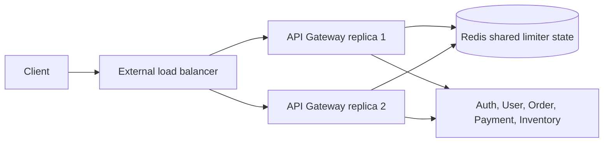

# Rate Limiting Implementation Guide

This guide describes how to implement distributed rate limiting in Shopverse.
For generic algorithms, buckets, key design, and sizing concepts, read
[Distributed Rate Limiting](DISTRIBUTED-RATE-LIMITING.md) first.

## Implementation Status

| Capability | Status |
|---|---|
| Local service rate limits with Resilience4j | implemented in selected services |
| API Gateway routing through Spring Cloud Gateway | implemented |
| Redis-backed distributed Gateway rate limiter | planned implementation |
| Multi-replica distributed quota tests | planned implementation |
| Rate-limit dashboards and alerts | planned implementation |

Do not describe Redis-backed distributed rate limiting as current runtime
behavior until Redis, Gateway Redis dependencies, key resolvers, route filters,
tests, and observability are added.

## Target Shopverse Architecture



The API Gateway rejects excessive traffic before it reaches service code,
database pools, Kafka producers, or external providers. Redis makes the quota
shared across Gateway replicas.

## Recommended Shopverse Policies

Initial values should be conservative and changed after load tests.

| Route | Key | Starting policy |
|---|---|---|
| `/auth/login` | route + IP | 5 requests/min/IP |
| `/auth/register` | route + IP | 3 requests/min/IP |
| `/auth/.well-known/jwks.json` | IP | higher read limit or no app limit |
| `/api/v1/users/**` | user | 60 requests/min/user |
| `/api/v1/orders/**` | user | 30 requests/min/user |
| `/api/v1/orders/checkout` | user + route | stricter write limit plus idempotency |
| `/api/v1/payments/**` | user + route | 10 requests/min/user |
| `/api/v1/inventory/**` | user or IP | 120 requests/min/user for reads |
| `/api/v1/*/public/**` | IP | route-specific public read limits |
| `/actuator/health`, `/actuator/prometheus` | infrastructure | normally exclude or protect separately |

Do not use one global limit for all routes. A login endpoint, checkout
endpoint, and public catalog read have different abuse and capacity profiles.

## Spring Cloud Gateway Implementation

Shopverse should use Spring Cloud Gateway's `RequestRateLimiter` filter with
the Redis-backed token bucket implementation.

| Argument | Meaning |
|---|---|
| `redis-rate-limiter.replenishRate` | tokens added per second |
| `redis-rate-limiter.burstCapacity` | maximum tokens in the bucket |
| `redis-rate-limiter.requestedTokens` | tokens consumed per request |

## 1. Add Redis

Add Redis to `docker-compose.yml`:

```yaml
redis:
  image: redis:7.4-alpine
  container_name: shopverse-redis
  ports:
    - "6379:6379"
  networks:
    - shopverse
  healthcheck:
    test: ["CMD", "redis-cli", "ping"]
    interval: 10s
    timeout: 3s
    retries: 10
```

In production, prefer managed or clustered Redis with TLS, authentication,
bounded latency, backups appropriate for the deployment, and clear failure
policy.

## 2. Add Gateway Dependency

Add reactive Redis to `api-gateway/build.gradle`:

```gradle
implementation 'org.springframework.boot:spring-boot-starter-data-redis-reactive'
```

The Gateway is WebFlux based, so use the reactive Redis starter.

## 3. Configure Redis

Add shared Redis configuration in `cloud-configs/API-GATEWAY.yml`:

```yaml
spring:
  data:
    redis:
      host: ${REDIS_HOST:localhost}
      port: ${REDIS_PORT:6379}
```

Then pass Docker values to the `api-gateway` service:

```yaml
api-gateway:
  environment:
    REDIS_HOST: redis
    REDIS_PORT: 6379
  depends_on:
    redis:
      condition: service_healthy
```

Every Gateway replica must point to the same Redis deployment for a shared
quota.

## 4. Add Key Resolvers

Create `api-gateway/src/main/java/io/shopverse/gateway/config/RateLimitConfig.java`:

```java
package io.shopverse.gateway.config;

import java.net.InetSocketAddress;
import java.security.Principal;
import java.util.Optional;

import org.springframework.cloud.gateway.filter.ratelimit.KeyResolver;
import org.springframework.context.annotation.Bean;
import org.springframework.context.annotation.Configuration;
import org.springframework.web.server.ServerWebExchange;

import reactor.core.publisher.Mono;

@Configuration
public class RateLimitConfig {

    @Bean
    KeyResolver userOrIpKeyResolver() {
        return exchange -> exchange.getPrincipal()
                .map(Principal::getName)
                .filter(name -> !name.isBlank())
                .map(name -> "user:" + name)
                .switchIfEmpty(Mono.fromSupplier(() -> "ip:" + clientIp(exchange)));
    }

    @Bean
    KeyResolver ipKeyResolver() {
        return exchange -> Mono.fromSupplier(() -> "ip:" + clientIp(exchange));
    }

    private static String clientIp(ServerWebExchange exchange) {
        return Optional.ofNullable(exchange.getRequest().getRemoteAddress())
                .map(InetSocketAddress::getAddress)
                .map(address -> address.getHostAddress())
                .orElse("unknown");
    }
}
```

This simple version uses the direct remote address. If Shopverse is deployed
behind a trusted load balancer, add explicit trusted forwarded-header handling
rather than blindly trusting any client-supplied header.

## 5. Add Route Filters

Add route-specific `RequestRateLimiter` filters in `cloud-configs/API-GATEWAY.yml`:

```yaml
spring:
  cloud:
    gateway:
      server:
        webflux:
          routes:
            - id: order-service
              uri: lb://ORDER-SERVICE
              predicates:
                - Path=/api/v1/orders/**
              filters:
                - name: RequestRateLimiter
                  args:
                    key-resolver: "#{@userOrIpKeyResolver}"
                    redis-rate-limiter.replenishRate: 1
                    redis-rate-limiter.burstCapacity: 30
                    redis-rate-limiter.requestedTokens: 1

            - id: payment-service
              uri: lb://PAYMENT-SERVICE
              predicates:
                - Path=/api/v1/payments/**
              filters:
                - name: RequestRateLimiter
                  args:
                    key-resolver: "#{@userOrIpKeyResolver}"
                    redis-rate-limiter.replenishRate: 1
                    redis-rate-limiter.burstCapacity: 10
                    redis-rate-limiter.requestedTokens: 1

            - id: auth-service
              uri: lb://AUTH-SERVICE
              predicates:
                - Path=/auth/**
              filters:
                - name: RequestRateLimiter
                  args:
                    key-resolver: "#{@ipKeyResolver}"
                    redis-rate-limiter.replenishRate: 1
                    redis-rate-limiter.burstCapacity: 5
                    redis-rate-limiter.requestedTokens: 1
```

The example expresses short-term bucket behavior in per-second terms. For
human-readable policy, document the intended per-minute equivalent next to the
configuration and validate it with tests.

## 6. Keep Service Guards

Keep existing service-level Resilience4j configuration as a second layer:

```yaml
resilience4j:
  ratelimiter:
    instances:
      order-api:
        limit-for-period: ${ORDER_RATE_LIMIT:100}
        limit-refresh-period: 1s
        timeout-duration: 0
  bulkhead:
    instances:
      order-api:
        max-concurrent-calls: ${ORDER_MAX_CONCURRENT_CALLS:100}
        max-wait-duration: 0
```

Gateway rate limiting controls client admission. Service rate limiting and
bulkheads protect each service instance from local overload.

## 7. Response Contract

Return `429 Too Many Requests` for rejected calls:

```http
HTTP/1.1 429 Too Many Requests
Retry-After: 2
X-Correlation-Id: <correlation-id>
Content-Type: application/problem+json
```

Use `Retry-After` only when the value is meaningful. A standard problem
response should include a stable error code and correlation ID, but never
include Redis keys, tokens, internal service names, or security details.

## 8. Observability

Measure:

- allowed and rejected requests by route;
- `429` rate by route and outcome;
- Redis command latency and errors;
- limiter decision latency;
- top limited route categories;
- Gateway request latency before and after rate limiting;
- downstream saturation during rejection spikes.

Useful Prometheus starting points:

```promql
sum(rate(http_server_requests_seconds_count{status="429"}[5m])) by (uri)
```

```promql
sum(rate(shopverse_gateway_requests_logged_total{status="429"}[5m])) by (routeId)
```

Avoid high-cardinality labels such as user ID, IP, email, order ID, or full raw
path.

## 9. Multi-Replica Test

Distributed behavior is not proven until two Gateway replicas share one Redis.

Test outline:

1. Start Redis.
2. Start two Gateway instances pointing to the same Redis.
3. Send requests alternately through both instances using the same identity.
4. Confirm the combined allowed count does not exceed the configured bucket.
5. Confirm both instances return `429` after the shared bucket is exhausted.
6. Confirm a different identity receives a separate bucket.
7. Restart one Gateway and confirm quota state remains shared.
8. Stop Redis and confirm the documented failure policy.

Example PowerShell loop for a local smoke check:

```powershell
$gateway = "http://localhost:8080"
1..20 | ForEach-Object {
  try {
    Invoke-WebRequest "$gateway/auth/login" -Method Post -Body "{}" -ContentType "application/json"
  } catch {
    $_.Exception.Response.StatusCode.value__
  }
}
```

Use a real load tool such as k6, Gatling, JMeter, or Vegeta for final sizing.

## Shopverse Failure Policy

| Endpoint | Redis unavailable behavior |
|---|---|
| Login/register | fail closed or strict local fallback |
| Payment and checkout writes | fail closed or strict degraded policy |
| Low-risk catalog read | may fail open with local protection |
| Admin endpoints | fail closed |
| Health checks | avoid Redis dependency unless testing Redis health explicitly |

The policy is a business and security decision. Record fallback mode in logs
and metrics. Silent fail-open behavior can hide abuse during Redis incidents.

## Interactions With Retries

Rate limiting and retries must be coordinated:

- charge the original client request, not each internal Gateway retry;
- do not retry `429`;
- keep Gateway retry budgets small and method-safe;
- require idempotency keys for retried write operations;
- avoid retry storms after a limiter starts rejecting.

Shopverse already limits Gateway retries to selected `GET` failures. That is
the right default for checkout and payment safety.

## Rollout Plan

1. Add Redis to local Docker and deployment environments.
2. Add reactive Redis dependency to `api-gateway`.
3. Add `RateLimitConfig` with user/IP key resolvers.
4. Add conservative route-level `RequestRateLimiter` filters.
5. Keep existing service-level Resilience4j guards.
6. Add tests for allowed, rejected, anonymous, authenticated, and multi-replica
   behavior.
7. Add Prometheus/Grafana visibility for `429` and Redis health.
8. Run load tests and tune route policies.
9. Document the final production failure policy.
10. Roll out gradually, starting with public/auth abuse controls before
    stricter paid or user quota enforcement.

## References

- [Spring Cloud Gateway RequestRateLimiter](https://docs.spring.io/spring-cloud-gateway/reference/spring-cloud-gateway-server-webflux/gatewayfilter-factories/requestratelimiter-factory.html)
- [Spring Cloud Gateway GatewayFilter factories](https://docs.spring.io/spring-cloud-gateway/reference/spring-cloud-gateway-server-webflux/gatewayfilter-factories.html)
- [Redis Lua scripting](https://redis.io/docs/latest/develop/programmability/eval-intro/)
- [Resilience4j documentation](https://resilience4j.readme.io/docs)

## Related Guides

- [Distributed Rate Limiting](DISTRIBUTED-RATE-LIMITING.md)
- [API Gateway Implementation Guide](../development/API-GATEWAY-IMPLEMENTATION-GUIDE.md)
- [Advanced Spring Cloud Gateway](../development/SPRING-CLOUD-GATEWAY-ADVANCED.md)
- [Resilience4j patterns](RESILIENCE4J-GENERIC.md)
