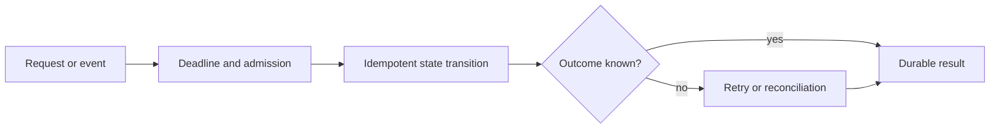

# Distributed Reliability Overview

Distributed reliability is the ability to produce an acceptable and explainable
outcome when components are slow, unavailable, duplicated, reordered, overloaded,
or recovering.

## Important Patterns

| Pattern | Brief explanation | Main warning |
|---|---|---|
| timeout/deadline | Bounds how long work may consume resources. | Timeout does not prove the remote operation failed. |
| retry | Reattempts a transient operation. | Multiplies load and duplicates unless bounded and idempotent. |
| circuit breaker | Stops calls to a failing dependency temporarily. | Does not repair the dependency or guarantee fallback correctness. |
| bulkhead | Isolates resource pools so one workload cannot exhaust all capacity. | Too many pools waste resources and hide queue growth. |
| rate limiting | Controls admission by identity, tenant, or operation. | Rejection semantics and distributed coordination matter. |
| idempotency | Makes repeated attempts converge on one authoritative effect. | Requires stable identity and atomic persistence. |
| outbox | Commits business state and publish intent in one database transaction. | Relay delivery remains at least once. |
| inbox | Records processed event identity with the business effect. | Read-before-insert alone races; use a unique constraint. |
| saga | Coordinates local transactions and compensations across services. | Compensation is a business action, not a database rollback. |
| reconciliation | Repairs uncertain or divergent state from authoritative evidence. | Must be observable, bounded, and auditable. |
| fencing | Rejects work from obsolete lock or ownership holders. | A lease without a fencing token cannot stop stale writers. |
| backpressure | Prevents producers from overwhelming constrained consumers. | Hidden unbounded queues postpone and magnify failure. |

## Failure Model

For each step distinguish:

- definite success;
- definite failure before effect;
- timeout with unknown effect;
- duplicate attempt;
- out-of-order or late result;
- partial commit across boundaries;
- overload and resource starvation;
- recovery after ownership changes.

The unknown outcome is the most important distributed case. Retrying blindly can
create another effect; failing permanently can abandon a completed effect.

## Composition Order

A typical synchronous call uses an overall deadline, admission/rate limit,
concurrency bulkhead, per-attempt timeout, bounded retry for approved failures, and
circuit breaking. The exact order depends on whether limits apply per logical call
or per attempt. Measure amplification and queueing.

Asynchronous workflows need durable publication, idempotent consumption, bounded
retry, terminal recovery, ordering policy, lag limits, and replay controls.

## Recovery Is A Product Feature

Define ownership, detection, durable evidence, automated/manual action, rate limit,
audit, completion proof, and rollback for every recovery workflow. A DLT, failed
row, or compensation request without an operator path is unfinished design.

## Recommended Route

1. [Transactions](./TRANSACTIONS.md)
2. [Idempotency](./IDEMPOTENCY-GENERIC.md)
3. [Outbox Pattern](./OUTBOX-PATTERN.md)
4. [Inbox Pattern](./INBOX-PATTERN.md)
5. [Saga Consistency And Compensation](./SAGA-CONSISTENCY-COMPENSATION.md)
6. [Resilience4j Composition](./RESILIENCE4J-COMPOSITION-OPERATIONS.md)
7. [Locking And Work Ownership](./locking/LOCKING-AND-WORK-OWNERSHIP.md)
8. [SRE, DR, And Chaos](../operations/SRE-DR-CHAOS.md)
9. [Reliability Revision Sheet](./RELIABILITY-REVISION-SHEET.md)

## Completion Check

- classify definite, unknown, duplicate, late, and partial outcomes;
- calculate timeout and retry amplification;
- make externally visible state transitions idempotent;
- protect database-to-message and message-to-database boundaries;
- design overload behavior before resource exhaustion;
- define compensation and reconciliation from business invariants;
- prove recovery with durable evidence and failure tests.
