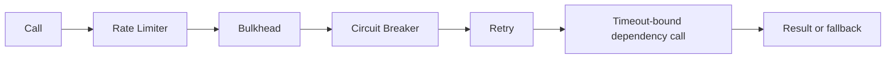

# Resilience Pattern Composition And Operations

<DocLabels items={[{label: 'Advanced', tone: 'advanced'}, {label: 'Shopverse', tone: 'shopverse'}, {label: 'Production', tone: 'production'}]} />

## Pattern Composition

Patterns solve different problems:

| Pattern | Protects against |
|---|---|
| Time Limiter | work exceeding a deadline |
| Rate Limiter | excessive call rate |
| Bulkhead | excessive concurrent work |
| Circuit Breaker | repeatedly calling an unhealthy dependency |
| Retry | transient failures |
| Fallback | unavailable primary result |

Illustrative composition:



This is not a universal ordering. Trade-offs include:

- retry inside a breaker records each attempt differently from retry outside;
- bulkhead outside retry holds a permit for the complete retry sequence;
- bulkhead inside retry reacquires a permit for each attempt;
- a rate limiter outside retry counts one user call;
- a rate limiter inside retry counts every attempt;
- the total timeout must bound all waits and attempts.

Resilience4j annotation aspect order can be configured. Test the effective order
instead of inferring it from annotation placement.

## Retry Amplification

Retries multiply across layers:

```text
Gateway: 2 retries
Service: 3 attempts
Potential dependency attempts: 3 x 3 = 9
```

The exact number depends on semantics, but the principle is important. Define
one owner for retries where possible and keep the end-to-end deadline bounded.

## Reactive And Servlet Usage

Servlet annotation aspects operate on synchronous methods and supported
asynchronous return types.

Spring Cloud Gateway is reactive and uses Reactor circuit-breaker operators
through Gateway filter factories. Do not block the event loop while applying a
resilience policy.

For reactive pipelines, cancellation, context propagation, and timeout
semantics differ from a synchronous controller call.

## Metrics And Events

Resilience4j can publish Micrometer metrics for:

- successful and failed calls;
- permitted and rejected Rate Limiter calls;
- available permissions;
- Bulkhead available concurrent calls;
- Bulkhead rejected calls;
- Circuit Breaker state;
- buffered, failed, slow, and not-permitted calls;
- Retry attempts and outcomes.

Example PromQL patterns depend on the exported version and tags. Discover the
actual names at `/actuator/prometheus`, then query by `name` and `kind`.

Typical investigations:

```promql
sum by (name) (
  rate(resilience4j_ratelimiter_calls_total{kind="rejected"}[5m])
)
```

```promql
sum by (name) (
  rate(resilience4j_bulkhead_calls_total{kind="rejected"}[5m])
)
```

```promql
resilience4j_circuitbreaker_state
```

Metric names can differ by Resilience4j/Micrometer version. Confirm them from
the running endpoint before creating dashboards or alerts.

## Production Practices

1. Define the failure being handled before adding a pattern.
2. use measured limits rather than arbitrary values.
3. establish connection and response timeouts.
4. retry only safe operations.
5. use exponential backoff and jitter where appropriate.
6. keep the total retry/time budget inside the caller deadline.
7. size bulkheads against real downstream capacity.
8. distinguish local Rate Limiters from distributed quotas.
9. map rejection exceptions to explicit HTTP responses.
10. keep fallbacks truthful and observable.
11. monitor rejected calls, open breakers, and retry volume.
12. test failure, recovery, saturation, and half-open behavior.
13. avoid annotation self-invocation.
14. coordinate resilience policies across gateway and services.
15. exclude health probes from business limits when operationally necessary.

## Related Guides

- [Shopverse Resilience4j usage](RESILIENCE4J.md)
- [API Gateway](../development/API-GATEWAY-GENERIC.md)
- [Micrometer metrics](../observability/MICROMETER-METRICS.md)
- [Distributed systems](../architecture/DISTRIBUTED-SYSTEMS.md)

## Official Reference

- [Resilience4j documentation](https://resilience4j.readme.io/docs)

## Official References

- [Spring transaction management](https://docs.spring.io/spring-framework/reference/data-access/transaction.html)
- [Apache Kafka documentation](https://kafka.apache.org/documentation/)
- [PostgreSQL explicit locking](https://www.postgresql.org/docs/current/explicit-locking.html)

## Recommended Next

Return to [Resilience4j Engineering](./RESILIENCE4J-GENERIC.md) to select the next focused guide.
