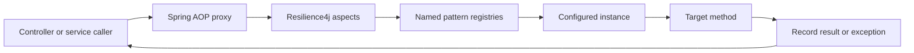
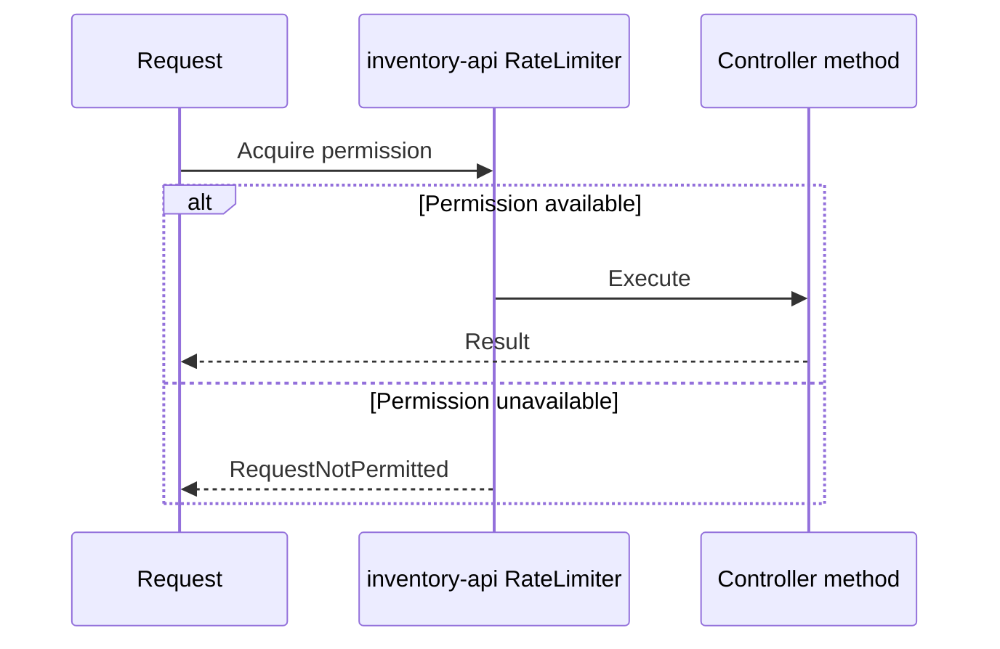
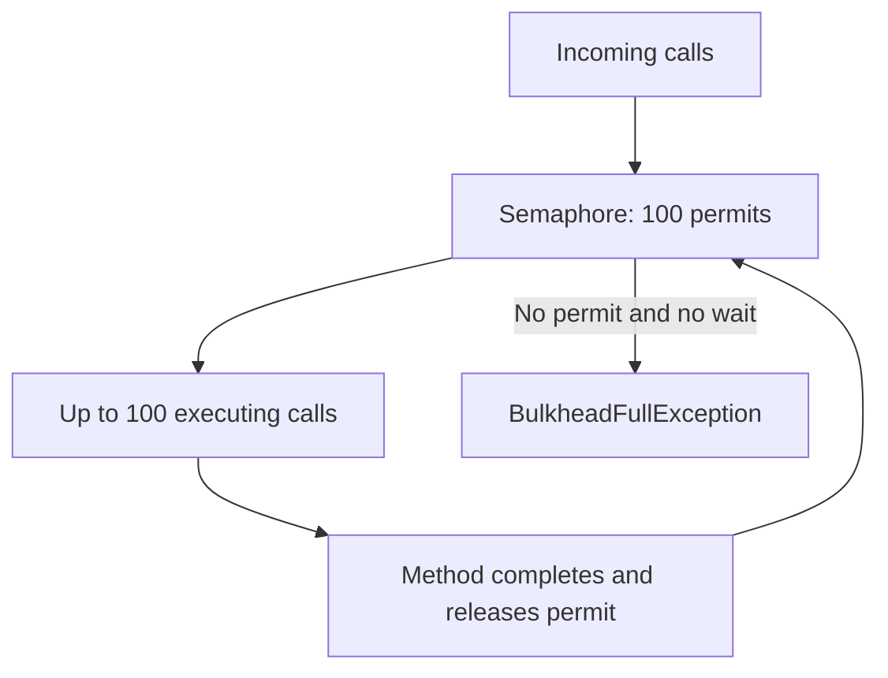
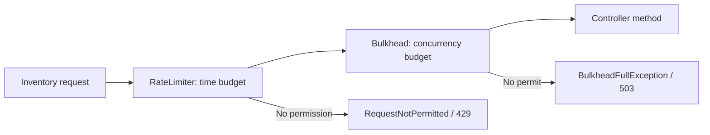
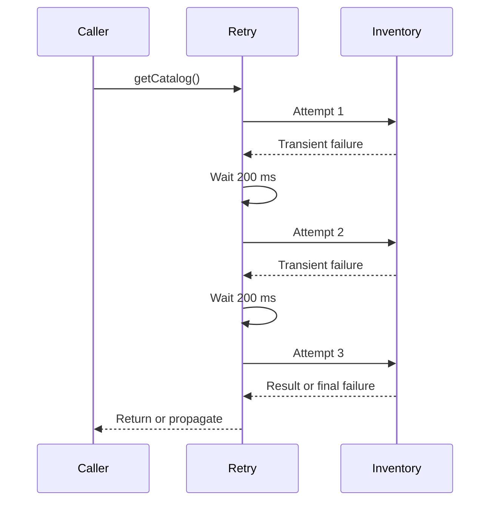
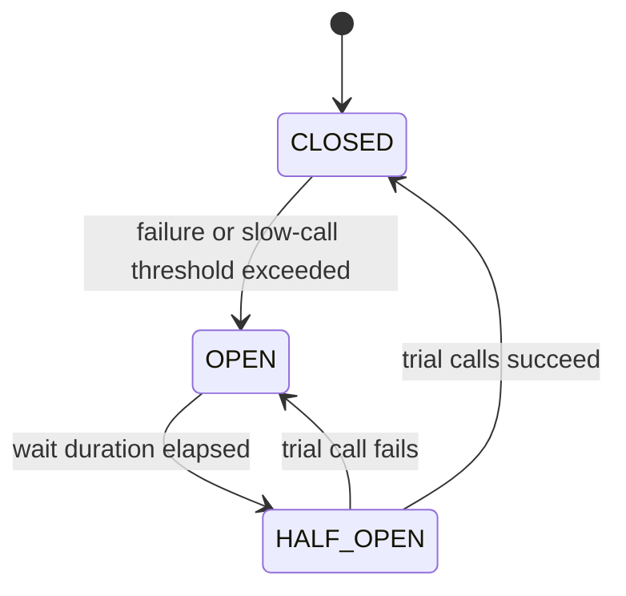
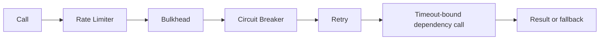

# Resilience4j Patterns

Resilience4j is a fault-tolerance library for Java. It provides small,
composable patterns for controlling traffic, isolating resources, handling
transient failures, and failing predictably when a dependency is unhealthy.

This guide explains the patterns generically and uses Shopverse code and
configuration as examples.

Read this page if you want to understand:

- when to use retry, circuit breaker, rate limiter, timeout, and bulkhead;
- how Resilience4j annotations are applied through Spring AOP;
- how fallback methods should be designed;
- how to classify retryable and non-retryable failures;
- how these policies interact with upstream and downstream capacity.

## Dependencies

Shopverse servlet services use:

```gradle
implementation "io.github.resilience4j:resilience4j-spring-boot4:${resilience4jVersion}"
implementation 'org.springframework:spring-aop'
implementation 'org.aspectj:aspectjweaver'
```

Actuator exposes resilience metrics:

```gradle
implementation 'org.springframework.boot:spring-boot-starter-actuator'
runtimeOnly 'io.micrometer:micrometer-registry-prometheus'
```

Spring Cloud Gateway uses the reactive circuit-breaker integration:

```gradle
implementation 'org.springframework.cloud:spring-cloud-starter-circuitbreaker-reactor-resilience4j'
```

Use dependency versions compatible with the application's Spring Boot and
Spring Cloud release train.

## Spring Annotation Internals

Annotations such as `@Retry` and `@CircuitBreaker` are applied through Spring
AOP.



At startup, Resilience4j auto-configuration:

1. reads `resilience4j.*.instances` properties;
2. creates named registry entries;
3. creates annotation aspects;
4. intercepts calls made through Spring-managed bean proxies;
5. obtains permission or state from the named instance;
6. invokes the target or rejects the call;
7. records success, failure, duration, retries, or rejection;
8. invokes a configured fallback where applicable.

The annotation name must match the YAML instance name:

```java
@RateLimiter(name = "inventory-api")
```

```yaml
resilience4j:
  ratelimiter:
    instances:
      inventory-api:
```

Self-invocation is an AOP limitation. Calling an annotated method through
`this.method()` inside the same bean does not normally pass through the proxy.

## Inventory Controller Annotations

Shopverse Inventory Controller declares:

```java
@RateLimiter(name = "inventory-api")
@Bulkhead(
        name = "inventory-api",
        type = Bulkhead.Type.SEMAPHORE
)
public class InventoryController {
    ...
}
```

Because the annotations are on the class, they apply to the public controller
methods intercepted through that bean, including health, catalog, inventory,
and administrative operations.

The two annotations protect different dimensions:

```text
RateLimiter -> how many calls may enter during a time window
Bulkhead    -> how many calls may execute concurrently
```

They do not replace one another.

## Rate Limiter Pattern

A Rate Limiter controls call admission over time.

Inventory configuration:

```yaml
resilience4j:
  ratelimiter:
    instances:
      inventory-api:
        limit-for-period: 150
        limit-refresh-period: 1s
        timeout-duration: 0
```

### Parameters

`limit-for-period: 150`

Provides 150 permissions during each refresh period.

`limit-refresh-period: 1s`

Refreshes the permission budget every second.

`timeout-duration: 0`

Does not wait for a future permission. A call with no available permission
fails immediately.



With the current configuration, the 151st call in a still-exhausted period is
rejected with `RequestNotPermitted`.

### What A Local Rate Limiter Means

Resilience4j's in-process limiter is local to one application instance:

```text
3 replicas x 150 permissions/second
≈ up to 450 permissions/second collectively
```

It is not a distributed global customer quota. Use an API gateway with shared
state or a dedicated distributed limiter when the limit must apply across all
replicas.

### Rate-Limiter Practices

- choose limits from measured capacity;
- separate health and infrastructure traffic when needed;
- apply identity- or tenant-based quotas at an appropriate edge system;
- return `429 Too Many Requests`;
- include retry guidance only when meaningful;
- do not use long permission waits that consume request threads;
- monitor sustained rejection rather than isolated bursts.

## Bulkhead Pattern

A bulkhead limits how much concurrency one operation can consume. The name
comes from partitions that prevent one failure from flooding an entire system.

Inventory configuration:

```yaml
resilience4j:
  bulkhead:
    instances:
      inventory-api:
        max-concurrent-calls: 100
        max-wait-duration: 0
```

`max-concurrent-calls: 100` permits at most 100 simultaneous executions.

`max-wait-duration: 0` rejects additional calls immediately instead of
waiting for a slot.



### Semaphore Bulkhead

```java
@Bulkhead(
    name = "inventory-api",
    type = Bulkhead.Type.SEMAPHORE
)
```

A semaphore bulkhead:

- limits concurrent calls;
- executes on the caller's thread;
- does not create a new executor;
- has low overhead;
- is appropriate for bounded synchronous operations.

It does not make blocking work non-blocking. If 100 calls block on a slow
database, those caller threads remain occupied.

### Thread-Pool Bulkhead

A thread-pool bulkhead uses a dedicated executor and bounded queue. It can
isolate blocking work from caller threads, but introduces:

- queueing delay;
- context-propagation concerns;
- additional threads and memory;
- rejection when pool and queue are full.

Use it only when a dedicated asynchronous execution boundary is required.
Virtual threads may reduce thread cost but do not remove downstream capacity,
connection-pool, queue, or concurrency limits.

### Bulkhead Practices

- set concurrency below downstream saturation;
- account for datasource and HTTP connection-pool sizes;
- keep wait duration bounded;
- return a clear `503 Service Unavailable` when capacity is exhausted;
- separate unrelated dependencies into different bulkheads;
- alert on sustained saturation;
- load-test the configured permit count.

## Combined Inventory Flow

Conceptually:



The exact outer-to-inner annotation order is controlled by configured
Resilience4j aspect order, not by assuming source-code annotation order.
Document and test composition when ordering affects behavior.

Shopverse User Service explicitly maps:

```java
@ExceptionHandler(RequestNotPermitted.class)
ResponseEntity<?> handleRateLimitExceeded(...) {
    return ResponseEntity.status(429).body(...);
}
```

and:

```java
@ExceptionHandler(BulkheadFullException.class)
ResponseEntity<?> handleBulkheadFull(...) {
    return ResponseEntity.status(503).body(...);
}
```

Other services should provide equivalent explicit mappings; otherwise a
rejection can fall into a generic `500` handler.

## Retry Pattern

Retry repeats a failed operation when the failure is expected to be transient.

Shopverse Order catalog lookup:

```java
@Retry(name = "inventory-client")
@CircuitBreaker(
        name = "inventory-client",
        fallbackMethod = "fallbackCatalog"
)
public List<CatalogItemResponse> getCatalog() {
    return inventoryClient.getCatalog().stream()
            .map(this::toResponse)
            .toList();
}
```

Configuration:

```yaml
resilience4j:
  retry:
    instances:
      inventory-client:
        max-attempts: 3
        wait-duration: 200ms
```

`max-attempts` includes the original call. A value of three means:

```text
initial attempt + up to two retries
```



### Retry Safety

Retry only operations that are:

- read-only;
- naturally idempotent;
- protected by an idempotency key;
- safe to repeat after an uncertain response.

Do not blindly retry payment charges, order creation, email sends, or other
side effects.

Configure which exception types are recorded, ignored, or retried. Validation,
authorization, not-found, and permanent business failures normally should not
be retried.

Use exponential backoff and jitter for remote systems when many clients could
retry simultaneously.

## Circuit Breaker Pattern

A circuit breaker stops calling an unhealthy dependency after enough failures.



### CLOSED

Calls execute and outcomes are recorded.

### OPEN

Calls are rejected immediately with `CallNotPermittedException`. The
dependency is not called.

### HALF_OPEN

A limited number of trial calls determine whether the dependency recovered.

Shopverse configuration:

```yaml
resilience4j:
  circuitbreaker:
    instances:
      inventory-client:
        sliding-window-size: 10
        minimum-number-of-calls: 5
        failure-rate-threshold: 50
        wait-duration-in-open-state: 10s
```

`sliding-window-size: 10` keeps a window of recent outcomes.

`minimum-number-of-calls: 5` prevents calculating the failure threshold from
too little traffic.

`failure-rate-threshold: 50` opens the breaker when at least half the evaluated
calls fail.

`wait-duration-in-open-state: 10s` waits ten seconds before trial calls.

Production configuration may also define slow-call thresholds, permitted
half-open calls, recorded exceptions, and ignored exceptions.

## Fallback Methods

Shopverse declares:

```java
@CircuitBreaker(
    name = "inventory-client",
    fallbackMethod = "fallbackCatalog"
)
```

Fallback:

```java
private List<CatalogItemResponse> fallbackCatalog(
        Throwable throwable
) {
    log.warn(
        "Inventory catalog unavailable; returning an empty catalog",
        throwable
    );
    return List.of();
}
```

A fallback method should:

- return a type compatible with the protected method;
- accept the original method arguments in the same order, when present;
- accept a compatible exception as the final argument;
- be available to the Resilience4j aspect;
- provide a truthful degraded result.

An empty catalog may be acceptable for a public browse fallback, but it must
not be presented as proof that no products exist. A fallback should not hide:

- authentication or authorization failures;
- validation errors;
- data corruption;
- payment uncertainty;
- permanent business rejection.

## Time Limiter Pattern

A Time Limiter places a deadline on asynchronous or reactive execution. It is
commonly used with `CompletionStage`, `Future`, or Reactor integrations.

Gateway configuration:

```yaml
resilience4j:
  timelimiter:
    instances:
      gateway-downstream:
        timeout-duration: 5s
        cancel-running-future: true
```

`timeout-duration: 5s` fails the operation when the deadline is exceeded.

`cancel-running-future: true` attempts to cancel a future after timeout. It
does not guarantee that remote or blocking work has stopped.

Set HTTP connection and response timeouts as well. A Time Limiter should not be
the only network timeout.

## Pattern Composition

Patterns solve different problems:

| Pattern | Protects against |
|---|---|
| Time Limiter | work exceeding a deadline |
| Rate Limiter | excessive call rate |
| Bulkhead | excessive concurrent work |
| Circuit Breaker | repeatedly calling an unhealthy dependency |
| Retry | transient failures |
| Fallback | unavailable primary result |

Illustrative composition:



This is not a universal ordering. Trade-offs include:

- retry inside a breaker records each attempt differently from retry outside;
- bulkhead outside retry holds a permit for the complete retry sequence;
- bulkhead inside retry reacquires a permit for each attempt;
- a rate limiter outside retry counts one user call;
- a rate limiter inside retry counts every attempt;
- the total timeout must bound all waits and attempts.

Resilience4j annotation aspect order can be configured. Test the effective order
instead of inferring it from annotation placement.

## Retry Amplification

Retries multiply across layers:

```text
Gateway: 2 retries
Service: 3 attempts
Potential dependency attempts: 3 x 3 = 9
```

The exact number depends on semantics, but the principle is important. Define
one owner for retries where possible and keep the end-to-end deadline bounded.

## Reactive And Servlet Usage

Servlet annotation aspects operate on synchronous methods and supported
asynchronous return types.

Spring Cloud Gateway is reactive and uses Reactor circuit-breaker operators
through Gateway filter factories. Do not block the event loop while applying a
resilience policy.

For reactive pipelines, cancellation, context propagation, and timeout
semantics differ from a synchronous controller call.

## Metrics And Events

Resilience4j can publish Micrometer metrics for:

- successful and failed calls;
- permitted and rejected Rate Limiter calls;
- available permissions;
- Bulkhead available concurrent calls;
- Bulkhead rejected calls;
- Circuit Breaker state;
- buffered, failed, slow, and not-permitted calls;
- Retry attempts and outcomes.

Example PromQL patterns depend on the exported version and tags. Discover the
actual names at `/actuator/prometheus`, then query by `name` and `kind`.

Typical investigations:

```promql
sum by (name) (
  rate(resilience4j_ratelimiter_calls_total{kind="rejected"}[5m])
)
```

```promql
sum by (name) (
  rate(resilience4j_bulkhead_calls_total{kind="rejected"}[5m])
)
```

```promql
resilience4j_circuitbreaker_state
```

Metric names can differ by Resilience4j/Micrometer version. Confirm them from
the running endpoint before creating dashboards or alerts.

## Production Practices

1. Define the failure being handled before adding a pattern.
2. use measured limits rather than arbitrary values.
3. establish connection and response timeouts.
4. retry only safe operations.
5. use exponential backoff and jitter where appropriate.
6. keep the total retry/time budget inside the caller deadline.
7. size bulkheads against real downstream capacity.
8. distinguish local Rate Limiters from distributed quotas.
9. map rejection exceptions to explicit HTTP responses.
10. keep fallbacks truthful and observable.
11. monitor rejected calls, open breakers, and retry volume.
12. test failure, recovery, saturation, and half-open behavior.
13. avoid annotation self-invocation.
14. coordinate resilience policies across gateway and services.
15. exclude health probes from business limits when operationally necessary.

## Related Guides

- [Shopverse Resilience4j usage](RESILIENCE4J.md)
- [API Gateway](../development/API-GATEWAY-GENERIC.md)
- [Micrometer metrics](../observability/MICROMETER-METRICS.md)
- [Distributed systems](../architecture/DISTRIBUTED-SYSTEMS.md)

## Official Reference

- [Resilience4j documentation](https://resilience4j.readme.io/docs)
