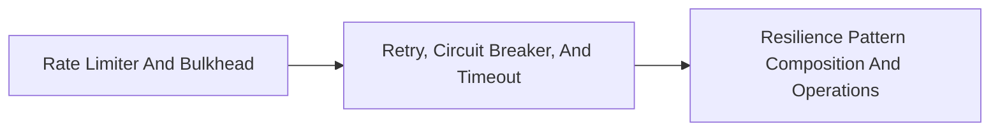

<!-- split-guide-index -->
# Resilience4j Engineering

<DocLabels items={[{label: 'Focused guides', tone: 'advanced'}, {label: 'Shopverse', tone: 'shopverse'}, {label: 'Architect route', tone: 'production'}]} />

Apply resilience patterns with explicit budgets, composition rules, and operational evidence. The original long-form material is preserved without duplication across the focused pages below.

<TopicCards items={[
  {title: 'Rate Limiter And Bulkhead', href: '/reliability/RESILIENCE4J-RATE-LIMITER-BULKHEAD', description: 'Part 1 of the focused Resilience4j Engineering learning route.', icon: 'route', tags: ['Focused', 'Advanced']},
  {title: 'Retry, Circuit Breaker, And Timeout', href: '/reliability/RESILIENCE4J-RETRY-CIRCUIT-TIMEOUT', description: 'Part 2 of the focused Resilience4j Engineering learning route.', icon: 'layers', tags: ['Focused', 'Advanced']},
  {title: 'Resilience Pattern Composition And Operations', href: '/reliability/RESILIENCE4J-COMPOSITION-OPERATIONS', description: 'Part 3 of the focused Resilience4j Engineering learning route.', icon: 'security', tags: ['Focused', 'Advanced']},
]} />

<DocCallout type="tip" title="Use the index as the stable entry point">

Each focused page owns one concern. Cross-links point to the canonical explanation instead of repeating the same material.

</DocCallout>

## Recommended Learning Order

1. [Rate Limiter And Bulkhead](./RESILIENCE4J-RATE-LIMITER-BULKHEAD.md)
2. [Retry, Circuit Breaker, And Timeout](./RESILIENCE4J-RETRY-CIRCUIT-TIMEOUT.md)
3. [Resilience Pattern Composition And Operations](./RESILIENCE4J-COMPOSITION-OPERATIONS.md)

## Reading Strategy

Use **Resilience4j Engineering** as a decision and verification guide inside **Resilience4j Engineering**. Start by naming the invariant or operational outcome, then follow the runtime flow and identify the owning component. For every example, record the expected success evidence, the most important failure mode, and the metric or test that proves recovery. This keeps the material useful for implementation reviews, production incidents, and architect interviews instead of treating it as isolated syntax.

Within **Resilience4j Engineering**, apply the Shopverse guidance incrementally: verify the current behavior, introduce one bounded change, test the unhappy path, and preserve a rollback or reconciliation route. Follow links to canonical pages when a concept belongs to another track; do not copy that explanation into this page. This ownership rule keeps the focused guides short while retaining technical depth and traceability.

## Official References

- [Resilience4j documentation](https://resilience4j.readme.io/docs)
- [Apache Kafka documentation](https://kafka.apache.org/documentation/)
