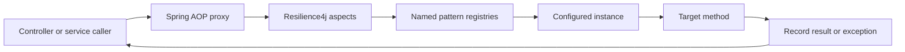
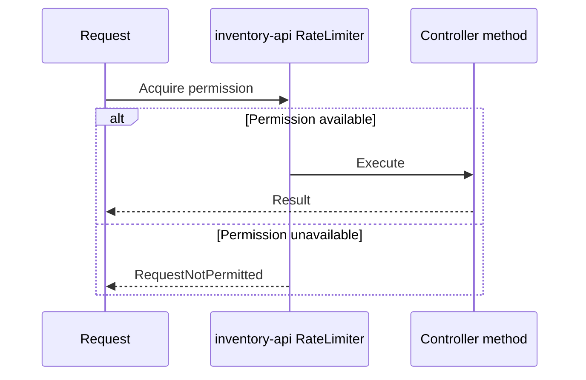
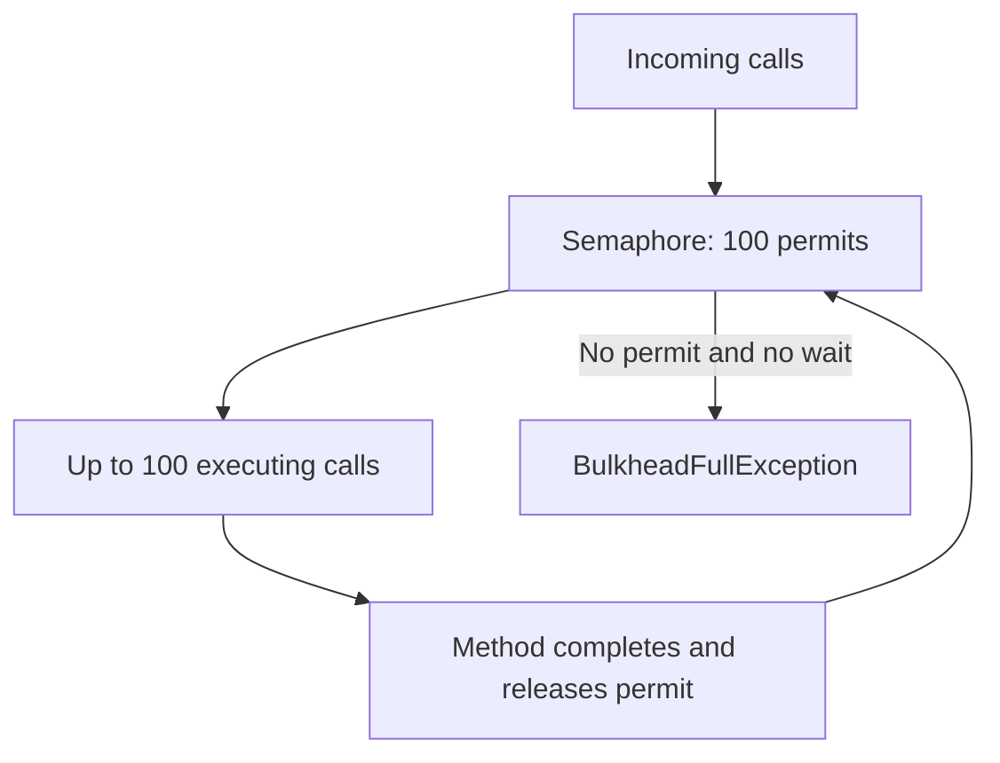
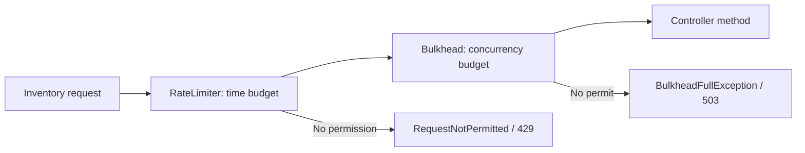

# Rate Limiter And Bulkhead

<DocLabels items={[{label: 'Advanced', tone: 'advanced'}, {label: 'Shopverse', tone: 'shopverse'}, {label: 'Production', tone: 'production'}]} />

## Dependencies

Shopverse servlet services use:

```gradle
implementation "io.github.resilience4j:resilience4j-spring-boot4:${resilience4jVersion}"
implementation 'org.springframework:spring-aop'
implementation 'org.aspectj:aspectjweaver'
```

Actuator exposes resilience metrics:

```gradle
implementation 'org.springframework.boot:spring-boot-starter-actuator'
runtimeOnly 'io.micrometer:micrometer-registry-prometheus'
```

Spring Cloud Gateway uses the reactive circuit-breaker integration:

```gradle
implementation 'org.springframework.cloud:spring-cloud-starter-circuitbreaker-reactor-resilience4j'
```

Use dependency versions compatible with the application's Spring Boot and
Spring Cloud release train.

## Spring Annotation Internals

Annotations such as `@Retry` and `@CircuitBreaker` are applied through Spring
AOP.



At startup, Resilience4j auto-configuration:

1. reads `resilience4j.*.instances` properties;
2. creates named registry entries;
3. creates annotation aspects;
4. intercepts calls made through Spring-managed bean proxies;
5. obtains permission or state from the named instance;
6. invokes the target or rejects the call;
7. records success, failure, duration, retries, or rejection;
8. invokes a configured fallback where applicable.

The annotation name must match the YAML instance name:

```java
@RateLimiter(name = "inventory-api")
```

```yaml
resilience4j:
  ratelimiter:
    instances:
      inventory-api:
```

Self-invocation is an AOP limitation. Calling an annotated method through
`this.method()` inside the same bean does not normally pass through the proxy.

## Inventory Controller Annotations

Shopverse Inventory Controller declares:

```java
@RateLimiter(name = "inventory-api")
@Bulkhead(
        name = "inventory-api",
        type = Bulkhead.Type.SEMAPHORE
)
public class InventoryController {
    ...
}
```

Because the annotations are on the class, they apply to the public controller
methods intercepted through that bean, including health, catalog, inventory,
and administrative operations.

The two annotations protect different dimensions:

```text
RateLimiter -> how many calls may enter during a time window
Bulkhead    -> how many calls may execute concurrently
```

They do not replace one another.

## Rate Limiter Pattern

A Rate Limiter controls call admission over time.

Inventory configuration:

```yaml
resilience4j:
  ratelimiter:
    instances:
      inventory-api:
        limit-for-period: 150
        limit-refresh-period: 1s
        timeout-duration: 0
```

### Parameters

`limit-for-period: 150`

Provides 150 permissions during each refresh period.

`limit-refresh-period: 1s`

Refreshes the permission budget every second.

`timeout-duration: 0`

Does not wait for a future permission. A call with no available permission
fails immediately.



With the current configuration, the 151st call in a still-exhausted period is
rejected with `RequestNotPermitted`.

### What A Local Rate Limiter Means

Resilience4j's in-process limiter is local to one application instance:

```text
3 replicas x 150 permissions/second
≈ up to 450 permissions/second collectively
```

It is not a distributed global customer quota. Use an API gateway with shared
state or a dedicated distributed limiter when the limit must apply across all
replicas.

### Rate-Limiter Practices

- choose limits from measured capacity;
- separate health and infrastructure traffic when needed;
- apply identity- or tenant-based quotas at an appropriate edge system;
- return `429 Too Many Requests`;
- include retry guidance only when meaningful;
- do not use long permission waits that consume request threads;
- monitor sustained rejection rather than isolated bursts.

## Bulkhead Pattern

A bulkhead limits how much concurrency one operation can consume. The name
comes from partitions that prevent one failure from flooding an entire system.

Inventory configuration:

```yaml
resilience4j:
  bulkhead:
    instances:
      inventory-api:
        max-concurrent-calls: 100
        max-wait-duration: 0
```

`max-concurrent-calls: 100` permits at most 100 simultaneous executions.

`max-wait-duration: 0` rejects additional calls immediately instead of
waiting for a slot.



### Semaphore Bulkhead

```java
@Bulkhead(
    name = "inventory-api",
    type = Bulkhead.Type.SEMAPHORE
)
```

A semaphore bulkhead:

- limits concurrent calls;
- executes on the caller's thread;
- does not create a new executor;
- has low overhead;
- is appropriate for bounded synchronous operations.

It does not make blocking work non-blocking. If 100 calls block on a slow
database, those caller threads remain occupied.

### Thread-Pool Bulkhead

A thread-pool bulkhead uses a dedicated executor and bounded queue. It can
isolate blocking work from caller threads, but introduces:

- queueing delay;
- context-propagation concerns;
- additional threads and memory;
- rejection when pool and queue are full.

Use it only when a dedicated asynchronous execution boundary is required.
Virtual threads may reduce thread cost but do not remove downstream capacity,
connection-pool, queue, or concurrency limits.

### Bulkhead Practices

- set concurrency below downstream saturation;
- account for datasource and HTTP connection-pool sizes;
- keep wait duration bounded;
- return a clear `503 Service Unavailable` when capacity is exhausted;
- separate unrelated dependencies into different bulkheads;
- alert on sustained saturation;
- load-test the configured permit count.

## Combined Inventory Flow

Conceptually:



The exact outer-to-inner annotation order is controlled by configured
Resilience4j aspect order, not by assuming source-code annotation order.
Document and test composition when ordering affects behavior.

Shopverse User Service explicitly maps:

```java
@ExceptionHandler(RequestNotPermitted.class)
ResponseEntity<?> handleRateLimitExceeded(...) {
    return ResponseEntity.status(429).body(...);
}
```

and:

```java
@ExceptionHandler(BulkheadFullException.class)
ResponseEntity<?> handleBulkheadFull(...) {
    return ResponseEntity.status(503).body(...);
}
```

Other services should provide equivalent explicit mappings; otherwise a
rejection can fall into a generic `500` handler.

## Recommended Next

Return to [Resilience4j Engineering](./RESILIENCE4J-GENERIC.md) to select the next focused guide.


## Official References

- [Resilience4j documentation](https://resilience4j.readme.io/docs)
- [Apache Kafka documentation](https://kafka.apache.org/documentation/)
