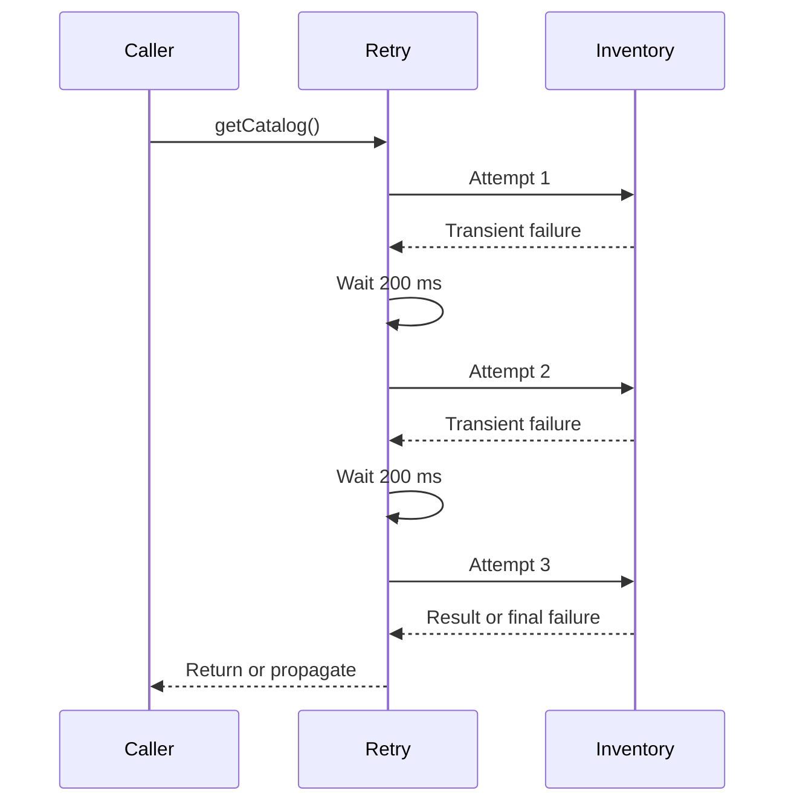
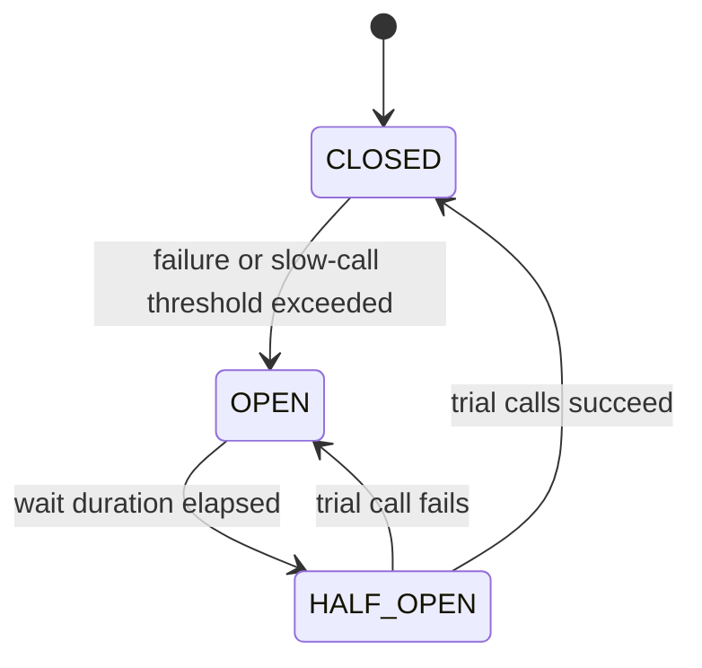

# Retry, Circuit Breaker, And Timeout

<DocLabels items={[{label: 'Advanced', tone: 'advanced'}, {label: 'Shopverse', tone: 'shopverse'}, {label: 'Production', tone: 'production'}]} />

## Retry Pattern

Retry repeats a failed operation when the failure is expected to be transient.

Shopverse Order catalog lookup:

```java
@Retry(name = "inventory-client")
@CircuitBreaker(
        name = "inventory-client",
        fallbackMethod = "fallbackCatalog"
)
public List<CatalogItemResponse> getCatalog() {
    return inventoryClient.getCatalog().stream()
            .map(this::toResponse)
            .toList();
}
```

Configuration:

```yaml
resilience4j:
  retry:
    instances:
      inventory-client:
        max-attempts: 3
        wait-duration: 200ms
```

`max-attempts` includes the original call. A value of three means:

```text
initial attempt + up to two retries
```



### Retry Safety

Retry only operations that are:

- read-only;
- naturally idempotent;
- protected by an idempotency key;
- safe to repeat after an uncertain response.

Do not blindly retry payment charges, order creation, email sends, or other
side effects.

Configure which exception types are recorded, ignored, or retried. Validation,
authorization, not-found, and permanent business failures normally should not
be retried.

Use exponential backoff and jitter for remote systems when many clients could
retry simultaneously.

## Circuit Breaker Pattern

A circuit breaker stops calling an unhealthy dependency after enough failures.



### CLOSED

Calls execute and outcomes are recorded.

### OPEN

Calls are rejected immediately with `CallNotPermittedException`. The
dependency is not called.

### HALF_OPEN

A limited number of trial calls determine whether the dependency recovered.

Shopverse configuration:

```yaml
resilience4j:
  circuitbreaker:
    instances:
      inventory-client:
        sliding-window-size: 10
        minimum-number-of-calls: 5
        failure-rate-threshold: 50
        wait-duration-in-open-state: 10s
```

`sliding-window-size: 10` keeps a window of recent outcomes.

`minimum-number-of-calls: 5` prevents calculating the failure threshold from
too little traffic.

`failure-rate-threshold: 50` opens the breaker when at least half the evaluated
calls fail.

`wait-duration-in-open-state: 10s` waits ten seconds before trial calls.

Production configuration may also define slow-call thresholds, permitted
half-open calls, recorded exceptions, and ignored exceptions.

## Fallback Methods

Shopverse declares:

```java
@CircuitBreaker(
    name = "inventory-client",
    fallbackMethod = "fallbackCatalog"
)
```

Fallback:

```java
private List<CatalogItemResponse> fallbackCatalog(
        Throwable throwable
) {
    log.warn(
        "Inventory catalog unavailable; returning an empty catalog",
        throwable
    );
    return List.of();
}
```

A fallback method should:

- return a type compatible with the protected method;
- accept the original method arguments in the same order, when present;
- accept a compatible exception as the final argument;
- be available to the Resilience4j aspect;
- provide a truthful degraded result.

An empty catalog may be acceptable for a public browse fallback, but it must
not be presented as proof that no products exist. A fallback should not hide:

- authentication or authorization failures;
- validation errors;
- data corruption;
- payment uncertainty;
- permanent business rejection.

## Time Limiter Pattern

A Time Limiter places a deadline on asynchronous or reactive execution. It is
commonly used with `CompletionStage`, `Future`, or Reactor integrations.

Gateway configuration:

```yaml
resilience4j:
  timelimiter:
    instances:
      gateway-downstream:
        timeout-duration: 5s
        cancel-running-future: true
```

`timeout-duration: 5s` fails the operation when the deadline is exceeded.

`cancel-running-future: true` attempts to cancel a future after timeout. It
does not guarantee that remote or blocking work has stopped.

Set HTTP connection and response timeouts as well. A Time Limiter should not be
the only network timeout.

## Recommended Next

Return to [Resilience4j Engineering](./RESILIENCE4J-GENERIC.md) to select the next focused guide.


## Official References

- [Resilience4j documentation](https://resilience4j.readme.io/docs)
- [Apache Kafka documentation](https://kafka.apache.org/documentation/)
