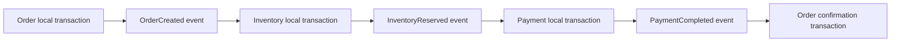
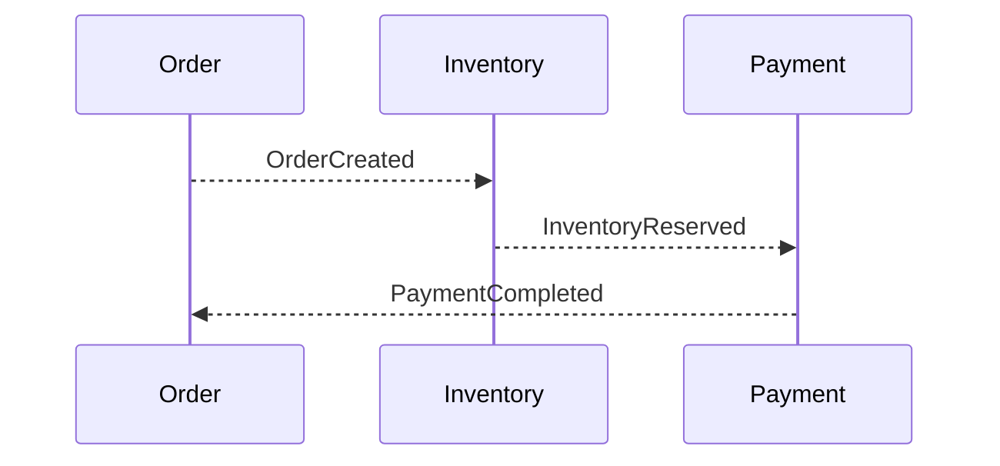
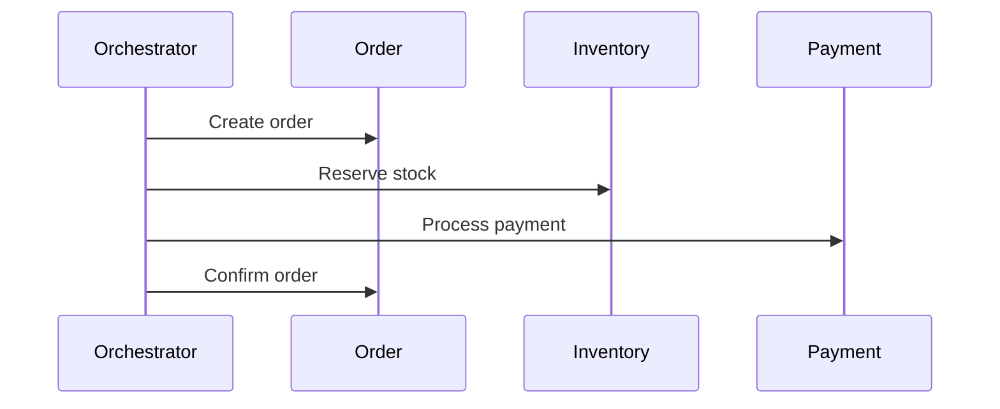

# SAGA Consistency And Compensation

<DocLabels items={[{label: 'Advanced', tone: 'advanced'}, {label: 'Shopverse', tone: 'shopverse'}, {label: 'Production', tone: 'production'}]} />

## Shopverse Links

Shopverse demonstrates SAGA concepts through:

- [Shopverse SAGA And Outbox](SAGA-OUTBOX.md) for the checkout choreography;
- [Shopverse SAGA Code Flow](SHOPVERSE-SAGA-CODE-FLOW.md) for service-level flow;
- [Outbox Starter](../platform/OUTBOX-STARTER.md) for durable event publication mechanics;
- [Kafka Recovery Starter](../platform/KAFKA-RECOVERY-STARTER.md) for failed event recovery;
- [Runtime Reliability Problems](problems/RUNTIME-RELIABILITY-PROBLEMS.md) for checkout failure scenarios.

Use this page for generic SAGA theory. Use the Shopverse pages for current
code paths, measured gaps, and implementation-specific decisions.

If a later step fails, the system executes compensating business actions for
earlier committed work.

## Why A SAGA Is Needed

Consider checkout:

```text
Create Order -> Reserve Inventory -> Process Payment -> Confirm Order
```

Each step belongs to a different service and database. A local transaction can
atomically update only one service's resources. Holding one transaction across
several databases and a message broker creates tight coupling, long locks, and
difficult failure recovery.

A SAGA accepts temporary inconsistency and drives the system toward a valid
final state.

## Local Transaction Model



Each transaction is independently atomic. The complete flow is eventually
consistent.

## Choreography And Orchestration

### Choreography

Services react to events without a central coordinator:



Advantages:

- loose runtime coupling;
- natural event-driven flow;
- participants remain autonomous.

Trade-offs:

- flow is distributed across listeners;
- event dependencies can become difficult to understand;
- debugging requires correlation, timeline, and event visibility.

### Orchestration

A coordinator sends commands and receives outcomes:



Advantages:

- workflow and state are visible in one component;
- complex branching and timeouts are easier to model.

Trade-offs:

- coordinator availability and complexity;
- stronger coupling to participant contracts;
- risk of putting domain logic into the orchestrator.

Choose based on workflow complexity, ownership, failure handling, and
operational visibility rather than service count alone.

## Compensation

Compensation is a new business transaction that semantically reverses or
neutralizes an earlier action.

Examples:

- release reserved inventory;
- refund or void a payment;
- cancel an order;
- restore a usage quota.

Compensation is not a database rollback. The earlier transaction already
committed and may have been observed by other systems.

Compensations should be:

- idempotent;
- safe to retry;
- auditable;
- valid when the resource is already compensated;
- explicit about partial or irreversible outcomes.

## Consistency

### Local Consistency

Within one service transaction, database constraints and transaction isolation
maintain local correctness.

### Eventual Consistency

Across services, states can temporarily disagree:

```text
Order = PAYMENT_PROCESSING
Payment = CAPTURED
Order confirmation event = not consumed yet
```

This is valid intermediate state if the event remains recoverable and the
system eventually converges.

### Semantic Consistency

The final business outcome matters more than identical instantaneous database
state. For example, a failed payment should eventually produce a cancelled
order and released reservation.

## Isolation Problems

SAGAs can expose intermediate state. Common risks include:

- dirty business reads of an unfinished workflow;
- two SAGAs competing for the same stock;
- stale or out-of-order events;
- a compensation racing with successful completion;
- duplicate event delivery;
- a user retrying while the first request is still progressing.

Controls include:

- explicit state machines;
- optimistic locking;
- database uniqueness;
- idempotency keys;
- event IDs and processed-event records;
- version or sequence checks;
- reservation expiry;
- ownership of one aggregate by one service.

## Idempotency

At-least-once messaging means a handler may receive the same event more than
once. Processing the duplicate must not repeat the business effect.

Common techniques:

- unique business keys;
- a `processed_events` or inbox table keyed by event ID;
- checking the aggregate's current state;
- compare-and-set state transitions;
- database unique constraints;
- idempotency keys on external commands.

An existence check without a database constraint can still race under
concurrency. Strong idempotency should be enforced by durable storage.

---

## Recommended Next

Return to [SAGA And Transactional Outbox](./SAGA-GENERIC.md) to select the next focused guide.


## Official References

- [Resilience4j documentation](https://resilience4j.readme.io/docs)
- [Apache Kafka documentation](https://kafka.apache.org/documentation/)
