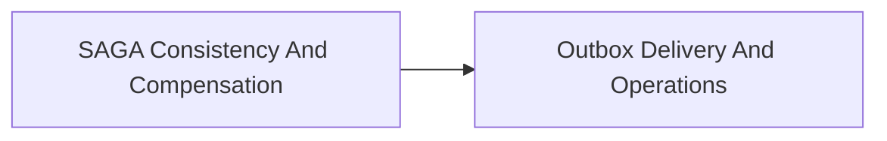

<!-- split-guide-index -->
# SAGA And Transactional Outbox

<DocLabels items={[{label: 'Focused guides', tone: 'advanced'}, {label: 'Shopverse', tone: 'shopverse'}, {label: 'Architect route', tone: 'production'}]} />

Design distributed transactions, compensation, outbox delivery, and operations. The original long-form material is preserved without duplication across the focused pages below.

<TopicCards items={[
  {title: 'SAGA Consistency And Compensation', href: '/reliability/SAGA-CONSISTENCY-COMPENSATION', description: 'Part 1 of the focused SAGA And Transactional Outbox learning route.', icon: 'route', tags: ['Focused', 'Advanced']},
  {title: 'Outbox Delivery And Operations', href: '/reliability/OUTBOX-DELIVERY-OPERATIONS', description: 'Part 2 of the focused SAGA And Transactional Outbox learning route.', icon: 'security', tags: ['Focused', 'Advanced']},
]} />

<DocCallout type="tip" title="Use the index as the stable entry point">

Each focused page owns one concern. Cross-links point to the canonical explanation instead of repeating the same material.

</DocCallout>

## Recommended Learning Order

1. [SAGA Consistency And Compensation](./SAGA-CONSISTENCY-COMPENSATION.md)
2. [Outbox Delivery And Operations](./OUTBOX-DELIVERY-OPERATIONS.md)

## Reading Strategy

Use **SAGA And Transactional Outbox** as a decision and verification guide inside **SAGA And Transactional Outbox**. Start by naming the invariant or operational outcome, then follow the runtime flow and identify the owning component. For every example, record the expected success evidence, the most important failure mode, and the metric or test that proves recovery. This keeps the material useful for implementation reviews, production incidents, and architect interviews instead of treating it as isolated syntax.

Within **SAGA And Transactional Outbox**, apply the Shopverse guidance incrementally: verify the current behavior, introduce one bounded change, test the unhappy path, and preserve a rollback or reconciliation route. Follow links to canonical pages when a concept belongs to another track; do not copy that explanation into this page. This ownership rule keeps the focused guides short while retaining technical depth and traceability.

## Official References

- [Resilience4j documentation](https://resilience4j.readme.io/docs)
- [Apache Kafka documentation](https://kafka.apache.org/documentation/)
