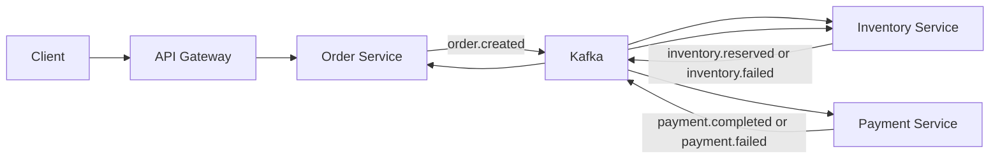

# SAGA Implementation Guide

This guide explains how the Shopverse checkout SAGA is implemented step by
step. For deeper theory, see [SAGA generic](SAGA-GENERIC.md). For the current
Shopverse runtime flow, see [Choreography SAGA and transactional outbox](SAGA-OUTBOX.md).

## Shopverse SAGA Stack

| Component | Role |
|---|---|
| Order Service | Starts checkout, owns order state, records the order timeline, and reacts to inventory/payment outcomes. |
| Inventory Service | Reserves or rejects stock and releases reservations on compensation. |
| Payment Service | Processes payment and emits completion or failure events. |
| Kafka | Carries integration events between services. |
| Transactional outbox | Makes each outgoing event durable with the local database change. |
| Idempotent consumers | Prevent duplicate event delivery from creating duplicate state transitions. |
| Correlation ID | Joins the full business journey across logs, events, and timeline rows. |

Shopverse uses choreography. There is no central SAGA orchestrator. Each
service reacts to events it owns and publishes the next event through its local
outbox.




## Step 1: Define Service Ownership

Before writing event handlers, define which service owns which state:

| Service | Owns |
|---|---|
| Order | order lifecycle, checkout idempotency, order timeline |
| Inventory | stock quantity, reservation status, reservation expiry |
| Payment | payment attempt, payment outcome, reconciliation state |

No service directly writes another service's database. Cross-service progress
happens through events.

## Step 2: Define The Success Path

The normal checkout path is:

```text
ORDER_CREATED
  -> INVENTORY_RESERVED
  -> PAYMENT_PROCESSING
  -> PAYMENT_COMPLETED
  -> ORDER_CONFIRMED
```

Each state transition is local. For example, Inventory reserves stock in its
own database and then emits an inventory event. Order consumes that event later
and updates its own database.

## Step 3: Define Failure And Compensation Paths

Failure paths are part of the design, not edge cases:

| Failure | Expected behavior |
|---|---|
| insufficient stock | Inventory emits `inventory.failed`; Order moves to an inventory rejection state. |
| payment declined | Payment emits `payment.failed`; Order moves to payment failure; Inventory releases reservation. |
| payment timeout | Payment remains timeout/reconciliation-oriented; Order should not be confirmed without durable evidence. |
| duplicate checkout request | Order returns the existing idempotent result instead of creating a second order. |
| duplicate Kafka event | Consumer idempotency ignores or safely replays the message. |

Use explicit terminal states so operators can tell whether a checkout is
complete, rejected, failed, expired, or still pending.

## Step 4: Create Event Contracts

Events should carry the minimum durable facts required by the next service:

```java
public record OrderCreatedEvent(
        Long orderId,
        String orderNumber,
        String correlationId,
        String customerUsername,
        Long productId,
        int quantity,
        BigDecimal amount
) {}
```

Event rules:

- include `correlationId`;
- include stable business identifiers such as `orderNumber`;
- use a Kafka key that preserves per-order ordering;
- avoid leaking tokens, passwords, or sensitive customer data;
- version contracts when incompatible changes are needed.

## Step 5: Write Local State And Outbox Together

The service that changes state and needs to publish an event writes both in one
database transaction:

```java
@Transactional
public OrderResponse checkout(...) {
    OrderEntity order = orderRepository.save(...);
    timelineRepository.save(...);
    outboxService.enqueue(
            "ORDER",
            order.getOrderNumber(),
            "OrderCreatedEvent",
            topics.orderCreated(),
            order.getOrderNumber(),
            event,
            correlationId
    );
    return mapper.toResponse(order);
}
```

The event is not sent to Kafka inside this transaction. It is stored as durable
intent and published later by the outbox publisher.

## Step 6: Consume Events Idempotently

Kafka can redeliver messages. Consumer handlers must tolerate duplicates:

```text
receive event
  -> check whether this aggregate/event was already processed
  -> if already processed, acknowledge safely
  -> otherwise apply local transition and enqueue outgoing event
```

Good idempotency anchors include order number, event type, message key, and
service-owned unique constraints. Do not rely on "Kafka normally delivers once"
as a correctness guarantee.

## Step 7: Restore Correlation Context

Every event carries `correlationId`. Consumers restore it before processing so
logs and metrics remain connected:

```java
CorrelationContext.run(
        event.correlationId(),
        () -> handleOrderCreated(event)
);
```

This creates a clear investigation path:

```text
customer request -> gateway log -> order log -> inventory log -> payment log -> timeline/outbox rows
```

## Step 8: Record A Queryable Timeline

Order Service records timeline rows for important business transitions. This
is different from logs: logs are diagnostic evidence, while timeline rows are
business-state evidence.

Recommended timeline fields:

```text
order_number
stage
status
message
correlation_id
created_at
```

Use the timeline to answer: "Where did this order stop?"

## Step 9: Add Observability

The SAGA should emit:

- structured logs with `correlationId`, `orderNumber`, and transition stage;
- counters for transition outcomes;
- outbox publication success/failure metrics;
- DLT persistence/replay metrics;
- traces for synchronous HTTP calls.

Useful PromQL:

```promql
sum by (application, outcome) (
  increase(shopverse_outbox_publish_total[15m])
)
```

Useful LogQL:

```logql
{log_type="application"} | json | correlationId="checkout-observe-101"
```

## Step 10: Verify The SAGA

Verification checklist:

1. Submit checkout with a unique `Idempotency-Key` and `X-Correlation-Id`.
2. Confirm Order row and first timeline row exist.
3. Confirm Order outbox row is created and later published.
4. Confirm Inventory reservation or rejection is persisted.
5. Confirm Inventory outbox event is published.
6. Confirm Payment outcome is persisted.
7. Confirm Payment outbox event is published.
8. Confirm Order reaches a terminal state.
9. Repeat the same checkout idempotency key and confirm no duplicate order,
   reservation, or payment is created.
10. Search the full journey by `correlationId` in Loki.

## Related Guides

- [Choreography SAGA and transactional outbox](SAGA-OUTBOX.md)
- [Shopverse SAGA code flow](SHOPVERSE-SAGA-CODE-FLOW.md)
- [Transactional outbox implementation guide](OUTBOX-IMPLEMENTATION-GUIDE.md)
- [SAGA generic](SAGA-GENERIC.md)
- [Kafka idempotency and operations](../spring/kafka/SPRING-KAFKA-IDEMPOTENCY-OPERATIONS.md)
- [Observability implementation guide](../observability/OBSERVABILITY-IMPLEMENTATION-GUIDE.md)
