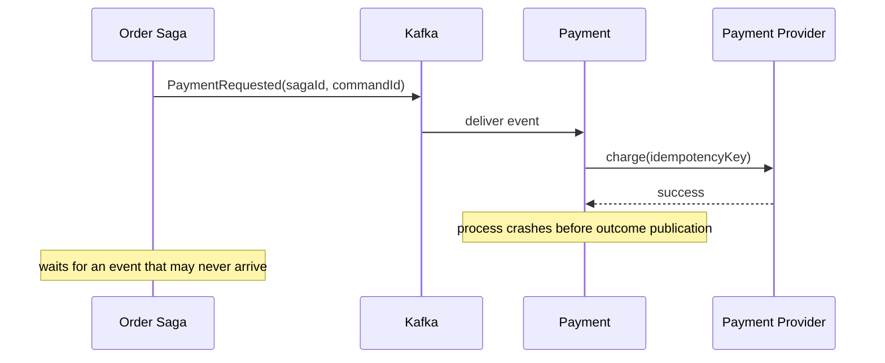

# Saga Liveness Timeout And Recovery

A Saga is not complete merely because every service can consume and publish an
event. It also needs a durable answer to: **what detects that the expected next
event never arrived?**

## The Missing-Reply Scenario

Assume Payment consumes `PaymentRequested`, charges the customer, but never
publishes `PaymentCompleted`:



What happens depends on Payment's transaction boundary:

| Payment implementation | Likely result |
|---|---|
| commits Kafka offset before work | input may be lost to this group |
| charges provider, crashes before offset commit | input replays; stable provider idempotency key is essential |
| commits DB state and offset, publishes later without outbox | payment exists but reply can be missing forever |
| commits payment state and outbox row atomically | relay can eventually publish the outcome |

The robust local boundary is:

```text
one local DB transaction:
  deduplicate command
  record payment state/provider reference
  insert PaymentCompleted outbox row
commit

then commit input progress
```

This closes the application-crash publication gap. It does not solve permanent
service downtime, a stuck relay, an ambiguous provider result, or an operational
mistake. The Saga still needs liveness controls.

## Durable Saga State

Persist a state machine, not an in-memory chain:

```sql
CREATE TABLE saga_instance (
    saga_id              UUID PRIMARY KEY,
    saga_type            VARCHAR(80) NOT NULL,
    state                VARCHAR(40) NOT NULL,
    expected_event       VARCHAR(100),
    step                 INTEGER NOT NULL,
    version              BIGINT NOT NULL,
    deadline_at          TIMESTAMP,
    last_event_id        UUID,
    failure_code         VARCHAR(100),
    updated_at           TIMESTAMP NOT NULL
);
```

The version enables compare-and-set transitions so a timeout and late success
cannot both advance the same state.

## Timeout Is A Business Decision

Kafka consumer session timeouts detect group members, not business workflow
deadlines. A Saga deadline must be stored durably and evaluated after restarts.

```text
WAITING_FOR_PAYMENT until 10:05
deadline fires at 10:05
probe payment status before deciding
```

Do not compensate immediately on silence when the action may have occurred. For
payments, shipments, and external reservations, silence means **unknown**, not
failure.

## Recovery Algorithm

When the expected event is overdue:

1. atomically claim the overdue Saga instance;
2. inspect its current version and expected event;
3. query the participant or external provider using the original command/idempotency ID;
4. if completed, repair the missing outcome or advance from authoritative state;
5. if definitely not started, retry the idempotent command;
6. if definitely failed, begin compensation or alternate forward recovery;
7. if ambiguous, move to `RECONCILIATION_REQUIRED` and alert an owner;
8. record every decision and correlation ID.

```java
@Transactional
public void handlePaymentDeadline(UUID sagaId, long expectedVersion) {
    Saga saga = repository.lockById(sagaId).orElseThrow();

    if (saga.version() != expectedVersion || !saga.waitingForPayment()) {
        return; // stale timer or an outcome already won the race
    }

    saga.markReconciling();
    outbox.add(PaymentStatusRequested.forSaga(saga));
}
```

Publish the probe through the outbox. Do not hold a database transaction open
while making a remote status call.

## Orchestration Versus Choreography

An orchestrator naturally stores expected command, deadline, and next state. A
choreographed Saga still needs a process manager, watchdog, or domain-specific
expiry event; otherwise no component owns missing-event detection.

```text
Choreography does not mean no coordination.
It means coordination is distributed and must still have explicit ownership.
```

## Late Outcomes And Compensation Races

Example:

```text
timeout starts RefundPayment
late PaymentCompleted arrives
```

Handle with a transition table and optimistic version:

| Current state | Incoming event | Action |
|---|---|---|
| `WAITING_PAYMENT` | `PaymentCompleted` | advance |
| `COMPENSATING_PAYMENT` | late `PaymentCompleted` | record and ensure refund completes |
| `CANCELLED` | duplicate failure | ignore idempotently |
| terminal success | stale timeout | ignore |

Never “last event wins” without business rules. Keep event ID, causation ID,
participant command ID, Saga ID, aggregate version, and occurred/received times.

## Compensation Can Fail

Compensation is another distributed operation, not rollback magic. It needs:

- a durable command and state;
- idempotency key;
- bounded retry and backoff;
- its own timeout and reconciliation;
- a terminal/manual-repair state;
- alerts and business ownership.

Some actions cannot be perfectly reversed. A shipped parcel may require a return;
a settled payment may require a refund. Model semantic compensation explicitly.

## Other Production Saga Failures

| Failure | Control |
|---|---|
| duplicate event | inbox/unique event ID and idempotent transition |
| out-of-order event | state/version guard, defer or reject invalid transition |
| participant down | durable deadline, retry budget, probe, alternate/manual state |
| orchestrator down | persisted state, leased timer workers, outbox |
| retry storm after recovery | jitter, rate limits, tenant fairness, gradual drain |
| schema mismatch | compatible schemas, quarantine, producer/consumer contract tests |
| poison Saga blocks partition | bounded retry, isolate recovery, preserve audit |
| compensation partly complete | step-level compensation state and reconciliation |
| event retained less than outage | retention/capacity design or authoritative repair path |

## Observability And SLOs

Track:

- Sagas by state and age;
- time spent in each step;
- overdue deadlines;
- missing expected events;
- command retry and duplicate rate;
- compensation success, age, and failure;
- outbox oldest pending age for every participant;
- reconciliation queue and manual cases;
- late-outcome frequency.

Use a business SLO such as “99.9% of orders reach a terminal state within 10
minutes,” not only Kafka transport metrics.

## Interview Answer

If a service consumed an event but emitted no reply, first determine whether its
business effect committed. Atomic inbox/business/outbox storage prevents a local
commit from losing its outcome event, while an idempotency key makes input replay
safe. The Saga stores an expected outcome and durable deadline. On timeout it
probes authoritative participant/provider state before retrying or compensating,
uses versioned transitions to handle late replies, and moves ambiguous cases to
reconciliation. Compensation is itself idempotent, retriable, observable work.

## Related Guides

- [Saga Consistency And Compensation](./SAGA-CONSISTENCY-COMPENSATION.md)
- [Outbox Production Failure Modes](./OUTBOX-PRODUCTION-FAILURE-MODES.md)
- [Inbox Pattern](./INBOX-PATTERN.md)
- [Kafka Offset Commits](../integration/kafka/KAFKA-CONSUMER-OFFSET-COMMITS.md)

## Recommended Next

Study [Outbox Production Failure Modes](./OUTBOX-PRODUCTION-FAILURE-MODES.md).

