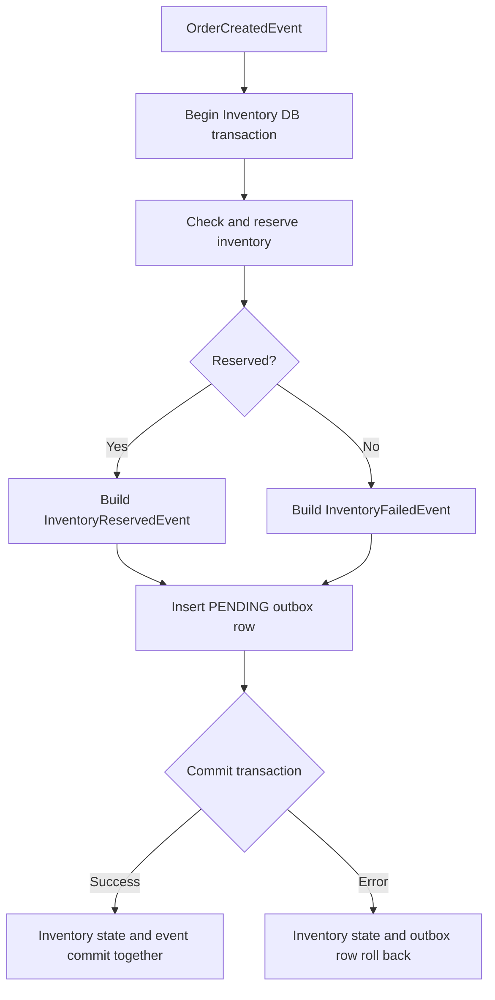
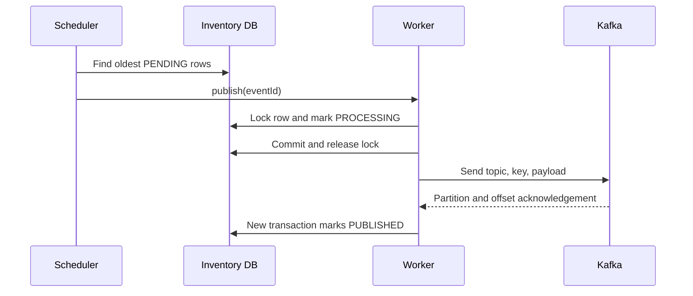

# Choreography SAGA And Transactional Outbox

For generic SAGA theory, choreography versus orchestration, consistency,
compensation, isolation, and idempotency, see
[SAGA and transactional outbox patterns](SAGA-GENERIC.md). For dedicated
producer and consumer reliability patterns, see
[Transactional outbox pattern](OUTBOX-PATTERN.md) and
[Inbox pattern](INBOX-PATTERN.md). This document describes the Shopverse
implementation.

Implementation statements on this page describe the current POC. Sections that
use target or production language identify future hardening work and should not
be read as implemented guarantees. The feature matrix remains the canonical
status record.

For a focused explanation of why the publisher must not retain a database lock
while waiting for Kafka, see
[Shopverse problems and solutions](PROBLEMS-AND-SOLUTIONS.md).

## Why A SAGA

Checkout changes Order, Inventory, and Payment data owned by different services. A single ACID transaction cannot safely cover those databases and Kafka. Shopverse uses local transactions plus events and compensation.

## Success Path

```text
ORDER_CREATED
  -> INVENTORY_RESERVED
  -> PAYMENT_PROCESSING
  -> PAYMENT_COMPLETED
  -> ORDER_CONFIRMED
```

## Failure Paths

- insufficient stock: Inventory emits `inventory.failed`; Order becomes `INVENTORY_REJECTED`;
- payment decline: Payment emits `payment.failed`; Order becomes `PAYMENT_FAILED`; Inventory releases the reservation;
- payment timeout: Payment remains `TIMED_OUT` and waits for reconciliation;
- reservation expiry baseline: Inventory scans `RESERVED` rows after their TTL,
  marks them `EXPIRED`, and restores stock. Atomic multi-replica ownership and
  the successful-payment terminal transition remain planned; see
  [Multi-Replica Reservation Expiry](problems/runtime/MULTI-REPLICA-RESERVATION-EXPIRY.md).

### Late Payment After Expiry

The current choreography confirms Order directly from `payment.completed` and
does not automatically refund a capture discovered after Inventory expiry.
The following target choreography is planned hardening. It makes Inventory's
atomic post-payment commitment the final stock decision:

```text
payment.completed
  -> Inventory RESERVED -> COMMITTED
  -> inventory.committed
  -> Order confirmed

payment.completed after Inventory EXPIRED
  -> late-payment.detected
  -> Payment REFUND_PENDING -> REFUNDED
  -> payment.refunded
  -> Order cancelled with refund evidence
```

The detailed state machines, event contracts, idempotency rules, transaction
boundaries, failure matrix, and Testcontainers plan are in
[Late Payment Reconciliation After Expiry](problems/runtime/LATE-PAYMENT-AFTER-EXPIRY.md).

## Transactional Outbox

The domain update and outgoing event are saved in the same MySQL transaction:

```java
@Transactional
public OrderResponse checkout(...) {
    OrderEntity order = orderRepository.save(...);
    timelineRepository.save(...);
    outboxService.enqueue("ORDER", order.getOrderNumber(),
            "ORDER_CREATED", topic, order.getOrderNumber(), event, correlationId);
    return mapper.toResponse(order);
}
```

`OutboxService.enqueue` uses `Propagation.MANDATORY`, so it fails when called outside the owning transaction. This closes the failure window where a database commit succeeds but `KafkaTemplate.send` never occurs.

A scheduled publisher:

1. selects the oldest 50 `PENDING` rows;
2. claims one row as `PROCESSING` in a short transaction;
3. commits the claim and releases the database lock;
4. sends with `KafkaTemplate` outside the database transaction;
5. marks it `PUBLISHED`, or returns it to `PENDING`, in another short
   transaction.

## Inventory SAGA Transaction

Inventory processes `OrderCreatedEvent` through one local transaction:

```java
@Transactional
public void handleOrderCreated(OrderCreatedEvent event) {
    boolean reserved = inventoryService.reserve(
            event.orderNumber(),
            event.correlationId(),
            event.productId(),
            event.quantity()
    );

    Object outgoingEvent = reserved
            ? new InventoryReservedEvent(
                    event.orderId(),
                    event.orderNumber(),
                    event.correlationId(),
                    event.customerUsername(),
                    event.productId(),
                    event.quantity(),
                    event.amount()
            )
            : new InventoryFailedEvent(
                    event.orderId(),
                    event.orderNumber(),
                    event.correlationId(),
                    "Inventory not available for product " + event.productId()
            );

    String topic = reserved
            ? topics.inventoryReserved()
            : topics.inventoryFailed();

    outboxService.enqueue(
            "INVENTORY_RESERVATION",
            event.orderNumber(),
            outgoingEvent.getClass().getSimpleName(),
            topic,
            event.orderNumber(),
            outgoingEvent,
            event.correlationId()
    );
}
```

### What `@Transactional` Achieves

Spring opens one Inventory database transaction around the public service
method. Within that transaction:

1. `inventoryService.reserve(...)` checks stock and changes inventory and
   reservation state;
2. the code creates either a success or failure event;
3. `outboxService.enqueue(...)` serializes and saves the outgoing event.

`OutboxService.enqueue(...)` uses:

```java
@Transactional(propagation = Propagation.MANDATORY)
```

`MANDATORY` requires the caller's transaction. It prevents the outbox row from
being accidentally inserted in an independent transaction.



If reservation persistence, event construction, JSON serialization, or outbox
insertion throws an unchecked exception, neither the inventory change nor the
outbox row commits.

### Event And Topic Selection

`reserved` determines both the event contract and destination:

| Result | Event | Topic |
|---|---|---|
| stock reserved | `InventoryReservedEvent` | `shopverse.inventory.reserved` |
| stock unavailable | `InventoryFailedEvent` | `shopverse.inventory.failed` |

The order number is used as aggregate ID and Kafka message key. This supports
per-order partition ordering.

### What This Transaction Does Not Do

The transaction does not:

- include Order Service's database;
- include Payment Service's database;
- publish to Kafka before commit;
- roll back the already-created Order when inventory is unavailable.

The Inventory transaction commits its local outcome. Order Service later
consumes that outcome and applies its own local transaction.

## Outbox Publication

The scheduled publisher reads the oldest 50 `PENDING` rows. Publication is
split into three steps:

1. a short database transaction locks the row and changes it from `PENDING` to
   `PROCESSING`;
2. the transaction commits and releases the row lock before
   `KafkaTemplate.send(...)` waits for Kafka;
3. another short transaction changes the row to `PUBLISHED`, or returns it to
   `PENDING` when the send fails.

This prevents a slow Kafka broker from holding a database connection and
pessimistic row lock for the network timeout.



If Kafka fails, the worker records the error and increments attempts while the
row remains `PENDING`. The current POC retries it on later scheduler runs.

`claimed_at` supports crash recovery. A row becomes stale when it remains
`PROCESSING` longer than `shopverse.outbox.claim-timeout-ms`:

```text
status = PROCESSING
claimed_at < now - claim timeout
```

The recovery scheduler resets that row back to `PENDING`. This makes the row
retryable because normal publisher scans pick pending rows:

```text
PENDING -> PROCESSING -> send to Kafka -> PUBLISHED
```

The claim timeout must remain longer than the Kafka send timeout. Otherwise a
slow but healthy send could be reclaimed while it is still running.

A crash after Kafka acknowledgement but before `PUBLISHED` commits can cause a
duplicate send. Shopverse therefore provides at-least-once publication, not
global exactly once.

## SAGA Transaction And Consistency Summary

```text
Inventory state + Inventory outbox row
    = one local ACID transaction

Outbox row + Kafka publication
    = separate recoverable publication step

Order + Inventory + Payment
    = eventually consistent SAGA

Failure after remote commits
    = compensation, not database rollback
```

Shopverse achieves reliable event intent: a committed local domain change has
a durable outbox record. It still requires idempotent consumers because
publication and consumption are at least once.

## Idempotency

HTTP checkout requires `Idempotency-Key`. Repeating the same key returns the existing order instead of inserting another one. A unique database constraint protects races that pass the application lookup concurrently.

Kafka remains at-least-once. Producer idempotence is enabled in centralized
Kafka configuration, but it only protects supported producer retries to the
broker. It does not deduplicate business effects after outbox restart, retry
topics, DLT replay, or consumer crashes.

Consumers must treat repeated state transitions as harmless by checking
existing order, payment, and reservation state and by using unique business
keys:

```text
Order checkout -> Idempotency-Key
Inventory      -> orderNumber
Payment        -> orderNumber
Kafka key      -> orderNumber
```

Consumer ID, group ID, offset, and trace ID are runtime or observability
identifiers. They are not stable business duplicate keys. For a full
production inbox pattern, add an immutable event ID to every event and store
`(event_id, consumer_name)` with a database uniqueness constraint in the same
transaction as the business update.

## Inventory Concurrency

`InventoryItem` uses `@Version`. Two transactions reading the last unit cannot both successfully update the same version. One update wins; the other receives an optimistic-lock failure and can be retried or rejected.

## DLT And Replay

Listeners use `@RetryableTopic(attempts = "3")`. After retries, `@DltHandler` persists one unresolved recovery record containing source topic, payload, reason, retry count, failure time, replay count, replay user, and replay time.

Admin replay APIs enqueue the event through the outbox and update the audit fields. Replay is observable through logs and `shopverse.kafka.dlt.replays`.

## Timeline

Order Service persists queryable stages with timestamp, correlation ID, and
details. The timeline is protected by ownership authorization. It is the
business audit trail; Kafka logs and Zipkin traces are operational evidence,
not the source of order state.

Typical success path:

```text
ORDER_CREATED
  -> INVENTORY_RESERVED
  -> PAYMENT_PROCESSING
  -> PAYMENT_COMPLETED
  -> ORDER_CONFIRMED
```

Typical failure paths:

```text
ORDER_CREATED
  -> INVENTORY_REJECTED
```

```text
ORDER_CREATED
  -> INVENTORY_RESERVED
  -> PAYMENT_PROCESSING
  -> PAYMENT_FAILED
```

The timeline table stores:

| Field | Purpose |
|---|---|
| `orderNumber` | groups rows for one order |
| `correlationId` | connects timeline to logs, events, DLT, and traces |
| `stage` | durable business transition |
| `detail` | human-readable reason or reference |
| `occurredAt` | chronological ordering |

API:

```http
GET /api/v1/orders/{id}/timeline
```

Authorization:

```java
@PreAuthorize("hasRole('ADMIN') or @orderAuthorization.isOwner(#id, authentication.name)")
```

Use the timeline first to understand the order's business state, then use the
correlation ID to inspect Loki logs and the trace ID to inspect Zipkin spans.

## Guarantees And Limits

- local state and outgoing event: atomic;
- cross-service state: eventually consistent;
- message delivery: at least once;
- ordering: per Kafka key/partition;
- global exactly once: not claimed;
- compensation: explicit business action, not database rollback.
