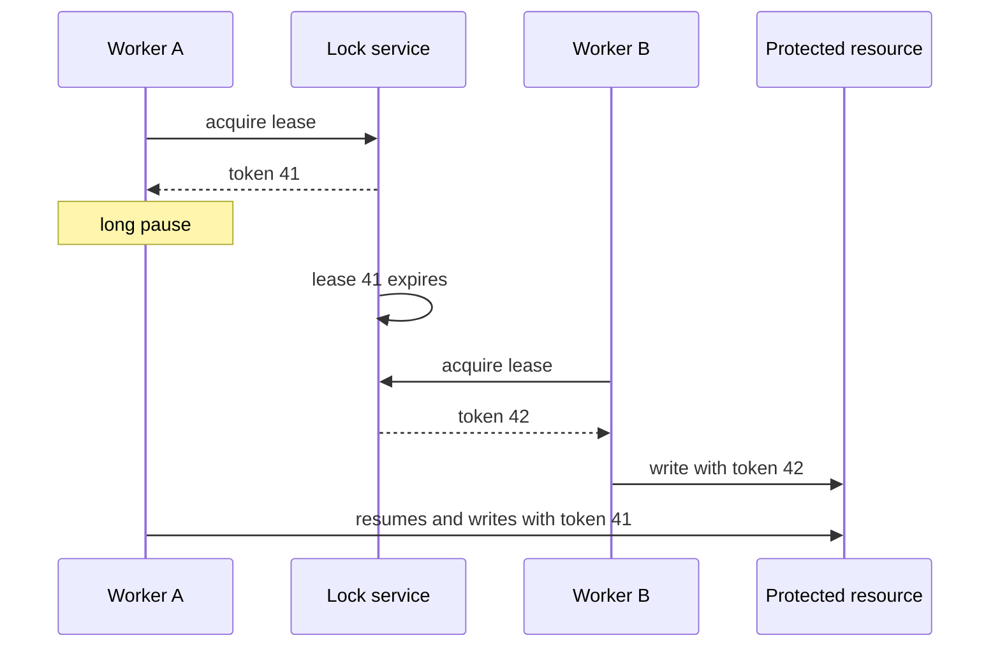

# Distributed Locks And Fencing

A distributed lock coordinates processes on different nodes when one holder
must temporarily own an operation that cannot be protected by a single local
database invariant, partition assignment, or idempotency key.

Back to [Locking And Work Ownership](LOCKING-AND-WORK-OWNERSHIP.md).

## Use Only When Necessary

Valid examples include:

- exclusive interaction with one external device;
- one cross-node migration/coordinator task;
- leader election;
- ownership spanning resources that do not share one transactional database.

Prefer simpler primitives when possible:

| Requirement | Prefer |
|---|---|
| unique business record | database unique constraint |
| decrement only when stock exists | atomic conditional update |
| one database work row | row claim or `SKIP LOCKED` |
| one scheduled method | ShedLock |
| serialize by key | queue/partition ownership |
| tolerate replay | idempotency/Inbox |

## Why `synchronized` Is Insufficient

```java
synchronized void runJob() {
    // ...
}
```

This coordinates threads using one JVM monitor:

```text
Replica A JVM -> monitor A
Replica B JVM -> monitor B
```

The monitors are unrelated. Both replicas can enter.

## Lease-Based Ownership

Distributed locks commonly use a lease:

```text
acquire for 30 seconds
renew while healthy
expire when renewal stops
```

A lease avoids permanent ownership after a crash, but introduces stale-owner
risk:



Without resource-side protection, Worker A can write after losing ownership.

## Fencing Tokens

Every successful acquisition receives a monotonically increasing token:

```text
Worker A -> 41
Worker B -> 42
```

The protected resource rejects old tokens:

```sql
UPDATE protected_resource
SET value = :value,
    fencing_token = :token
WHERE id = :id
  AND fencing_token < :token;
```

```text
token 42 update -> accepted
later token 41 update -> affects 0 rows, rejected
```

The lock service grants leases. The protected resource enforces fencing. A
lease without fencing cannot guarantee that a paused former owner will not
act.

## Redis Lock

Basic single-primary acquisition:

```text
SET lock-key unique-owner-token NX PX 30000
```

Release must atomically verify ownership before deleting. Conceptual Lua:

```lua
if redis.call('get', KEYS[1]) == ARGV[1] then
    return redis.call('del', KEYS[1])
end
return 0
```

Never issue an unconditional `DEL lock-key`; an expired former owner could
delete a newer owner's lock.

Evaluate:

- lease duration and renewal;
- process pauses;
- Redis failover and replication semantics;
- network partitions;
- fencing support at the protected resource;
- lock availability versus business availability.

Redlock attempts quorum acquisition across independent Redis nodes. It remains
a lease algorithm, not a substitute for fencing or idempotency. Choose it only
after documenting failure assumptions and validating them against the protected
resource.

## Database Advisory/Application Locks

Some databases provide named advisory locks. They can be appropriate when all
contenders already depend on the same database and connection-lifetime
semantics are understood.

Advantages:

- no extra coordination system;
- database-controlled ownership;
- useful for coarse administrative tasks.

Risks:

- connection loss can release ownership;
- session- versus transaction-scoped behavior differs;
- coarse locks can bottleneck unrelated work;
- they still should not surround remote network waits.

For database rows, normal conditional updates or `SKIP LOCKED` are generally
clearer than a global advisory lock.

## Coordination Services

ZooKeeper, etcd, and Consul can provide leases, ephemeral nodes, revisions, or
sessions suitable for leader election and ownership. They offer stronger
coordination models than a casual cache lock but add infrastructure and
operational complexity.

Use the service's revision/generation as a fencing value where possible.

## Deadlocks

Database/distributed deadlock pattern:

```text
A owns resource 1 and waits for resource 2
B owns resource 2 and waits for resource 1
```

Controls:

- acquire resources in deterministic order;
- keep ownership scope small;
- avoid nested locks;
- use bounded acquisition timeout;
- release in `finally`/library-managed lifecycle;
- never perform unbounded network I/O while holding a database lock;
- retry only the complete idempotent operation with backoff and jitter.

## Distributed Lock Versus Idempotency

```text
lock:
  prevent two owners from acting concurrently

idempotency:
  repeated action produces one business outcome
```

Responses can be lost and leases can expire, so a distributed lock rarely
eliminates the need for idempotency.

## Production Checklist

- Define the exact protected resource and invariant.
- Document lock scope, lease duration, renewal, and owner identity.
- Use a unique random owner token for release.
- Use monotonic fencing where stale writes matter.
- Bound acquisition and execution time.
- Preserve idempotency and durable audit state.
- Test process pause, crash, partition, failover, and lease expiry.
- Monitor acquisition latency, failures, lease loss, and stale-write rejection.

## Related Guides

- [Spring Distributed Locking Options](SPRING-DISTRIBUTED-LOCKING-OPTIONS.md)
- [Scheduler Locking With ShedLock](SCHEDULER-LOCKING-SHEDLOCK.md)
- [Database Locking And Work Claims](DATABASE-LOCKING-AND-CLAIMS.md)
- [Distributed Transactions](../DISTRIBUTED-TRANSACTIONS-LOCKS.md)
- [High Availability And SPOF](../HIGH-AVAILABILITY-SPOF.md)
