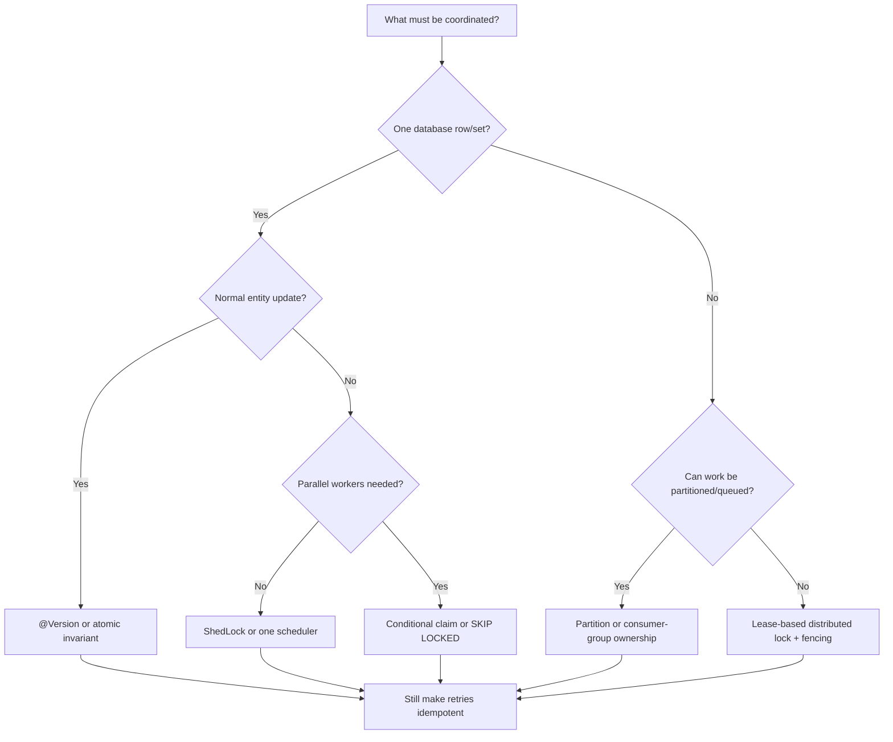

# Locking And Work Ownership

Concurrency controls are not interchangeable. A lock, atomic database
predicate, scheduler lease, queue assignment, and idempotency key protect
different invariants.

Use this page to choose a coordination model, then follow the focused guide.

## Core Questions

Before choosing a mechanism, ask:

1. Is the shared resource in one database?
2. Must only one worker execute, or may several workers process different rows?
3. Is duplicate execution forbidden or merely required to be harmless?
4. Can ownership expire while the old owner is paused?
5. Does work include remote I/O?
6. Must one failed record roll back unrelated records?
7. What durable evidence allows crash recovery?

## Decision Table

| Problem | Preferred starting point | Why |
|---|---|---|
| stale entity update | optimistic `@Version` | detect conflicting writes without blocking readers |
| one database invariant | unique constraint or conditional update | database decides atomically |
| claim one work row | `UPDATE ... WHERE status = PENDING` | simple compare-and-set ownership |
| parallel database pollers | `FOR UPDATE SKIP LOCKED` | workers skip rows already owned by peers |
| one scheduled execution globally | ShedLock/shared scheduler lease | one replica runs the method |
| stable subset per worker | partition/shard ownership | serialize by key without a global lock |
| asynchronous competing work | queue or Kafka consumer group | broker assigns delivery ownership |
| cross-system exclusive lease | distributed lock plus fencing | stale owners must be rejected by the protected resource |
| duplicate delivery | idempotency key or Inbox | locks cannot prevent every replay/crash duplicate |

## Decision Flow



## Focused Guides

| Guide | Scope |
|---|---|
| [Database Locking And Work Claims](DATABASE-LOCKING-AND-CLAIMS.md) | conditional updates, pessimistic locks, `SKIP LOCKED`, MySQL/PostgreSQL batch claims, outbox and expiry decisions |
| [Scheduler Locking With ShedLock](SCHEDULER-LOCKING-SHEDLOCK.md) | one scheduled method execution across replicas, JDBC lock table, leases, crash behavior |
| [Distributed Locks And Fencing](DISTRIBUTED-LOCKS-AND-FENCING.md) | Redis/database/coordinator leases, stale owners, fencing tokens, deadlocks |
| [Partition And Queue Ownership](PARTITION-AND-QUEUE-OWNERSHIP.md) | shard assignment, Kafka consumer groups, competing queues, rebalance and delayed work |

Existing canonical references remain authoritative for framework internals:

- [JPA transactions, optimistic and pessimistic locking](../../spring/jpa/JPA-TRANSACTIONS-LOCKING.md)
- [Apache Kafka](../../integration/APACHE-KAFKA.md)
- [Spring Kafka consumers](../../spring/kafka/SPRING-KAFKA-CONSUMERS.md)
- [Transactional Outbox](../OUTBOX-PATTERN.md)
- [Inbox Pattern](../INBOX-PATTERN.md)

## Shopverse Decisions

| Use case | Current/target decision |
|---|---|
| last-item checkout race | current `@Version` on `InventoryItem` |
| duplicate checkout | current `Idempotency-Key` plus unique constraint |
| Outbox publication | current short per-row pessimistic claim; MySQL `SKIP LOCKED` is a future throughput optimization |
| reservation expiry | target per-row conditional claim and independent transaction |
| one simple expiry scheduler | ShedLock is an alternative, not currently installed |
| Kafka SAGA consumption | current consumer-group assignment plus business idempotency |

## Locking Is Not Idempotency

Locking attempts to prevent concurrent ownership. Idempotency makes replay safe.

```text
lock/claim:
  who may act now?

idempotency:
  has this business action already happened?
```

Distributed systems usually need both because a process can crash after a
side effect but before recording completion.

## Production Rules

- Keep database lock transactions short.
- Never wait for Kafka or another remote system while holding row locks.
- Use indexed claim predicates and bounded batches.
- Persist status, owner, claim time, and retry evidence.
- Recover stale committed claims.
- Use fencing when an expired lease holder can resume.
- Enforce database constraints even when a queue serializes normal traffic.
- Test contention and crash windows using the production database engine.
- Monitor lock waits, deadlocks, skipped claims, stale claims, and work lag.

