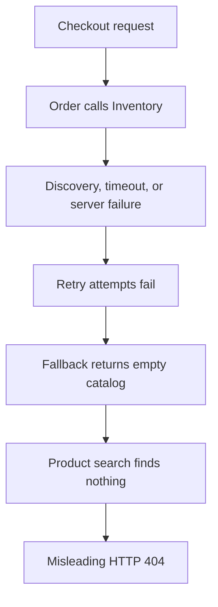
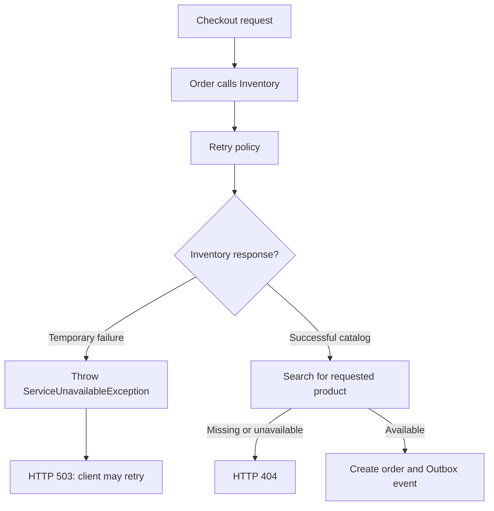

# Dependency And Verification Problems

Inventory outage semantics, bounded verification, Windows health probes, and isolated Config Server tracing noise.

Back to [Shopverse Problems And Solutions](../PROBLEMS-AND-SOLUTIONS.md).

## 4. Inventory Failures Reported As Product Not Found

### Problem Statement

Order Service obtains current product information from Inventory Service before
creating an order:

```java
List<CatalogItemResponse> catalog = catalogService.getCatalog();
```

The catalog call is protected by retry, circuit-breaker, and cache
interceptors:

```java
@Retry(name = "inventory-client")
@CircuitBreaker(
        name = "inventory-client",
        fallbackMethod = "fallbackCatalog"
)
@Cacheable(cacheNames = "catalog")
public List<CatalogItemResponse> getCatalog() {
    return inventoryClient.getCatalog().stream()
            .map(item -> new CatalogItemResponse(
                    item.productId(),
                    item.productName(),
                    item.unitPrice(),
                    item.available()
            ))
            .toList();
}
```

The previous fallback returned an empty catalog whenever Inventory Service
could not be reached:

```java
private List<CatalogItemResponse> fallbackCatalog(Throwable throwable) {
    log.warn("Inventory catalog unavailable; returning an empty catalog", throwable);
    return List.of();
}
```

Checkout then searched that empty list:

```java
CatalogItemResponse product = catalog.stream()
        .filter(candidate -> candidate.productId().equals(item.productId()))
        .filter(CatalogItemResponse::available)
        .findFirst()
        .orElseThrow(() -> new ResourceNotFoundException(
                "Product is unavailable or does not exist: " + item.productId()
        ));
```

This converted several infrastructure failures into a business-level
`ResourceNotFoundException`:

- Inventory had not registered with Eureka yet;
- no Inventory instance was available;
- the Feign request timed out;
- Inventory returned a temporary server error;
- the circuit breaker was open.

`ResourceNotFoundException` maps to `404 Not Found`, so the client was told
that the product did not exist even when the product was present.



### Why Returning An Empty Collection Was Unsafe

An empty collection is a valid successful result. It means Inventory Service
responded and currently has no catalog entries. It must not also mean that the
service could not be contacted.

The method is also annotated with `@Cacheable`. Returning a normal empty list
creates a risk that the fallback value is treated as a successful result and
cached, depending on the active Spring interceptor ordering. Later checkouts
could continue seeing an empty catalog after Inventory recovered.

An exception keeps the failure explicit and is not stored as a successful
cache value by Spring's standard cache interceptor.

### Solution

The fallback now throws a dedicated `ServiceUnavailableException` and
preserves the original cause:

```java
List<CatalogItemResponse> fallbackCatalog(Throwable throwable) {
    log.warn(
            "Inventory catalog unavailable after retry and circuit-breaker policies",
            throwable
    );
    throw new ServiceUnavailableException(
            "Inventory catalog is temporarily unavailable",
            throwable
    );
}
```

The exception is intentionally different from `ResourceNotFoundException`:

```java
public class ServiceUnavailableException extends RuntimeException {

    public ServiceUnavailableException(String message, Throwable cause) {
        super(message, cause);
    }
}
```

The global exception handler converts it to `503 Service Unavailable`:

```java
@ExceptionHandler(ServiceUnavailableException.class)
ProblemDetail handleServiceUnavailable(
        ServiceUnavailableException exception
) {
    return ProblemDetail.forStatusAndDetail(
            HttpStatus.SERVICE_UNAVAILABLE,
            exception.getMessage()
    );
}
```

Example response:

```json
{
  "status": 503,
  "detail": "Inventory catalog is temporarily unavailable"
}
```

### Corrected Flow



The resulting HTTP semantics are:

| Condition | Response | Retry guidance |
|---|---|---|
| Inventory responds and product is missing | `404 Not Found` | Do not retry without changing the request |
| Inventory responds and product is unavailable | `404 Not Found` in the current POC | Retry only after stock changes |
| Inventory has no Eureka instance | `503 Service Unavailable` | Retry with bounded backoff |
| Inventory request times out | `503 Service Unavailable` | Retry with bounded backoff |
| Circuit breaker invokes fallback | `503 Service Unavailable` | Retry after the dependency can recover |

### Verification Behavior

The bounded Docker smoke test retries checkout only when it receives `503`:

```powershell
if ($statusCode -ne 503 -or
    [DateTimeOffset]::UtcNow -ge $checkoutDeadline) {
    throw
}

Start-Sleep -Seconds 1
```

This is deliberate:

- `503` represents a potentially transient dependency failure;
- `404` represents a business result and should not be retried blindly;
- the overall deadline prevents an unavailable dependency from making the
  verification run indefinitely.

Focused regression tests verify both parts of the contract:

```java
assertThatThrownBy(() -> service.fallbackCatalog(cause))
        .isInstanceOf(ServiceUnavailableException.class)
        .hasMessage("Inventory catalog is temporarily unavailable")
        .hasCause(cause);
```

```java
assertThat(problem.getStatus())
        .isEqualTo(HttpStatus.SERVICE_UNAVAILABLE.value());
```

### Result

- infrastructure failures are no longer represented as missing products;
- transient failures return the correct retryable `503` status;
- genuine missing products continue to return `404`;
- failed catalog lookups are not returned as cacheable empty data;
- logs retain the original Feign, discovery, timeout, or circuit-breaker cause;
- startup-time Eureka propagation can recover within the bounded smoke test.


## 6. Unbounded Verification Processes

### Problem Statement

Service tests, image builds, startup checks, and SAGA smoke tests can block due
to a dependency download, unhealthy container, unavailable service, or child
process that does not terminate. Without an overall deadline, verification can
consume CI or developer resources for an indefinite period.

### Solution

The verification runner calculates one deadline for the complete run:

```powershell
$startedAt = [DateTimeOffset]::UtcNow
$deadline = $startedAt.AddMinutes($TimeoutMinutes)
```

Every subprocess receives only the time remaining in that budget:

```powershell
$remainingMilliseconds = [math]::Max(
    1,
    [math]::Floor(
        ($deadline - [DateTimeOffset]::UtcNow).TotalMilliseconds
    )
)
```

When a process exceeds the deadline, its complete Windows process tree is
terminated:

```powershell
if (-not $process.WaitForExit($remainingMilliseconds)) {
    & taskkill.exe /PID $process.Id /T /F 2>$null | Out-Null
    throw "$DisplayName exceeded the remaining verification deadline"
}
```

Gradle also runs with controlled parallelism:

```powershell
gradlew.bat test --no-daemon --max-workers=2
```

### Result

- verification has a predictable upper bound;
- failed child processes do not remain running in the background;
- Gradle workers cannot grow without control;
- CI failure is explicit instead of appearing as an endless running job.

This is a verification-infrastructure fix. It protects delivery pipelines and
developer resources rather than changing runtime request handling.


## 7. Unreliable Windows Health Probes

### Problem Statement

The original PowerShell web request occasionally reported that a connection
closed unexpectedly even when the API Gateway container was healthy. This
created false-negative full-stack verification failures.

### Solution

`Wait-Service.ps1` now invokes `curl.exe` with a request-level timeout and
captures both the response body and HTTP status:

```powershell
$output = @(& curl.exe `
    --silent `
    --show-error `
    --max-time 5 `
    --write-out "`n%{http_code}" `
    $Uri 2>&1)
```

The probe accepts only successful HTTP status codes and, when configured,
checks the expected health payload:

```powershell
if ($statusCode -ge 200 -and $statusCode -lt 300) {
    if ([string]::IsNullOrWhiteSpace($ExpectedPattern) -or
        $content -match $ExpectedPattern) {
        return $result
    }
}
```

An outer deadline and polling interval keep the complete readiness wait
bounded.

### Result

- healthy containers are less likely to be reported as failed;
- each HTTP attempt has its own five-second timeout;
- readiness requires both an acceptable status and expected content;
- failures retain the last connection error for diagnosis.

This is also a verification-infrastructure fix.


## 8. Unnecessary Config Server Tracing In Isolated Tests

### Problem Statement

Config Server tracing defaults to enabled with full sampling:

```yaml
management:
  tracing:
    enabled: true
    sampling:
      probability: 1.0
    export:
      zipkin:
        endpoint: http://localhost:9411/api/v2/spans
```

Inside a container, `localhost` means that same container. During isolated
functional verification, Config Server could therefore attempt to export
spans to a Zipkin endpoint that was not appropriate for that test context,
creating connection warnings and timing noise.

### Solution

The isolated Compose override disables sampling for Config Server:

```yaml
config-server:
  environment:
    MANAGEMENT_TRACING_SAMPLING_PROBABILITY: "0"
```

Spring Boot maps that environment variable to:

```yaml
management:
  tracing:
    sampling:
      probability: 0
```

The normal Docker environment can still enable tracing and use the Docker DNS
endpoint:

```yaml
ZIPKIN_ENDPOINT: http://zipkin:9411/api/v2/spans
```

### Result

- isolated functional tests avoid irrelevant span-export traffic;
- Config Server logs no longer contain false Zipkin connection noise;
- normal observability environments can continue exporting traces;
- test configuration remains separate from production tracing policy.


