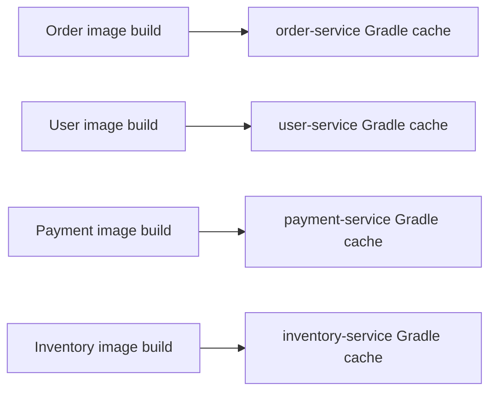
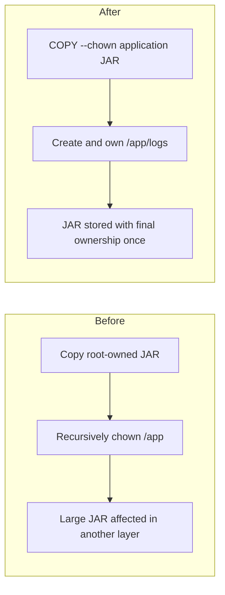

---
title: Docker And Runtime Image Problems
---

# Docker And Runtime Image Problems

Parallel Gradle cache locks, duplicate JAR ownership layers, non-root containers, and multi-stage runtime image composition.

Back to [Shopverse Problems And Solutions](../PROBLEMS-AND-SOLUTIONS.md).

## 1. Parallel Docker Builds And Gradle Cache Locks

### Problem

Docker Compose can build multiple service images concurrently:

```powershell
docker compose build --parallel
```

Previously, every Dockerfile mounted a cache at the same Gradle location
without a service-specific cache identity:

```dockerfile
RUN --mount=type=cache,target=/root/.gradle \
    ./gradlew bootJar --no-daemon --max-workers=2
```

During a parallel build, independent Gradle processes could operate on the
same BuildKit cache:

```text
Order build -----\
User build -------+--> shared /root/.gradle cache
Payment build ----+--> caches/journal-1/journal-1.lock
Inventory build --/
```

Gradle protects cache metadata with files such as
`journal-1/journal-1.lock`. Concurrent processes competing for that metadata
caused lock contention and intermittent image-build failures.

### Fix

Each service now assigns a stable, unique BuildKit cache ID while continuing
to mount it at Gradle's expected path inside the build container.

Order Service:

```dockerfile
RUN --mount=type=cache,id=shopverse-order-service-gradle,target=/root/.gradle \
    ./gradlew bootJar --no-daemon --max-workers=2
```

User Service:

```dockerfile
RUN --mount=type=cache,id=shopverse-user-service-gradle,target=/root/.gradle \
    ./gradlew bootJar --no-daemon --max-workers=2
```

The same pattern is applied to all eight Spring services:

```text
config-server     -> shopverse-config-server-gradle
discovery-server  -> shopverse-discovery-server-gradle
user-service      -> shopverse-user-service-gradle
auth-service      -> shopverse-auth-service-gradle
order-service     -> shopverse-order-service-gradle
payment-service   -> shopverse-payment-service-gradle
inventory-service -> shopverse-inventory-service-gradle
api-gateway       -> shopverse-api-gateway-gradle
```

### How The Mount Works

```dockerfile
--mount=type=cache,id=shopverse-order-service-gradle,target=/root/.gradle
```

| Option | Purpose |
|---|---|
| `type=cache` | Creates a persistent BuildKit cache reused across builds |
| `id=...` | Gives the cache a service-specific identity |
| `target=/root/.gradle` | Mounts it where Gradle expects dependencies and metadata |

The path inside each temporary build container remains `/root/.gradle`, but
the underlying BuildKit storage is isolated by cache ID.



`--no-daemon` avoids leaving a Gradle daemon in a temporary build container.
`--max-workers=2` limits the CPU and memory consumed by each concurrent build.

### Result

- services can build concurrently without cross-service Gradle cache locks;
- each service still reuses downloaded dependencies on later builds;
- repeated builds remain faster than builds with no cache mount.


## 3. Duplicated JAR Ownership Layers

### Problem

The runtime image previously copied the application JAR as `root` and changed
the ownership of the complete application directory in a later instruction:

```dockerfile
COPY --from=build /workspace/build/libs/*.jar app.jar

RUN mkdir -p /app/logs \
    && chown -R shopverse:shopverse /app
```

Docker image layers are immutable. The `COPY` instruction created a layer
containing a root-owned JAR. The recursive `chown` then changed metadata for
that large file in a later copy-on-write layer.

```text
COPY layer   -> app.jar owned by root
chown layer  -> app.jar represented again as owned by shopverse
```

Although the application behaved correctly, the ownership-only change could
increase the final image size and the number of bytes exported, transferred,
and stored.

### Fix

Shopverse now assigns the final owner while copying the JAR:

```dockerfile
COPY --chown=shopverse:shopverse \
    --from=build /workspace/build/libs/*.jar app.jar

RUN mkdir -p /app/logs \
    && chown shopverse:shopverse /app/logs
```

`COPY --chown` creates the JAR with the required user and group in its original
layer. The following `RUN` instruction changes ownership only for the small
logs directory.

```text
COPY layer       -> app.jar owned by shopverse
directory layer  -> create and own /app/logs only
```



### Why Recursive `chown` Was Removed

This command is unnecessarily broad:

```dockerfile
chown -R shopverse:shopverse /app
```

It traverses the JAR and every future file under `/app`. The application JAR
already has the correct owner after `COPY --chown`, so only the writable
directory requires an ownership change:

```dockerfile
chown shopverse:shopverse /app/logs
```

### Non-Root Runtime Is Preserved

The optimization does not weaken container security:

```dockerfile
USER shopverse
```

The JAR and log directory remain accessible to the non-root runtime user. The
change only avoids rewriting ownership metadata in a later image layer.

### Verification

Docker history for the optimized Order Service image shows:

```text
125MB   COPY --chown=shopverse:shopverse ... app.jar
12.3kB  RUN mkdir -p /app/logs && chown shopverse:shopverse /app/logs
```

The large JAR is present in its copy layer, while the following ownership
layer is only a few kilobytes. The same Dockerfile pattern is used across all
Shopverse services.

### Result

- application JARs are stored with final ownership immediately;
- recursive changes over `/app` are avoided;
- runtime images are smaller;
- image export, transfer, and storage require fewer bytes;
- services continue running as the non-root `shopverse` user.


## 9. Container Processes Running As Root

### Problem Statement

A container process runs as `root` unless the image selects another user.
Application compromise under container root gives an attacker broader
permissions inside the container and access to any writable mounted paths
allowed to that user.

### Solution

Each runtime image creates a dedicated system group and user:

```dockerfile
RUN groupadd --system shopverse \
    && useradd --system \
        --gid shopverse \
        --home-dir /app \
        --shell /usr/sbin/nologin \
        shopverse
```

Required files and writable directories receive the correct ownership:

```dockerfile
COPY --chown=shopverse:shopverse \
    --from=build /workspace/build/libs/*.jar app.jar

RUN mkdir -p /app/logs \
    && chown shopverse:shopverse /app/logs
```

The final runtime process executes as that user:

```dockerfile
USER shopverse
```

### Result

- application code does not execute as container root;
- the service can read its JAR and write only to prepared locations;
- the account has no interactive login shell;
- container compromise has a smaller privilege scope.

Non-root execution is one defense layer. Production deployments should still
use read-only filesystems where practical, dropped Linux capabilities,
resource limits, secret stores, and orchestrator security policies.


## 10. Build Tools In Runtime Images

### Problem Statement

Building and running a Spring Boot service in one JDK-based image leaves the
Java compiler, Gradle-related build environment, source files, and other
build-only components in the deployable artifact.

### Solution

Shopverse Dockerfiles use separate build and runtime stages.

The build stage uses a JDK:

```dockerfile
FROM eclipse-temurin:21-jdk-jammy AS build

COPY src ./src
RUN --mount=type=cache,id=shopverse-order-service-gradle,target=/root/.gradle \
    ./gradlew bootJar --no-daemon --max-workers=2
```

The runtime stage uses only a JRE and copies the completed JAR:

```dockerfile
FROM eclipse-temurin:21-jre-jammy AS runtime

COPY --chown=shopverse:shopverse \
    --from=build /workspace/build/libs/*.jar app.jar
```

Package-manager metadata is removed after installing the health-check client:

```dockerfile
RUN apt-get update \
    && apt-get install -y --no-install-recommends curl \
    && rm -rf /var/lib/apt/lists/*
```

### Result

- Gradle, source files, and the JDK compiler are not copied into the runtime
  stage;
- the deployed image contains fewer build-only components;
- package indexes do not remain as unnecessary layer data;
- image transfer, storage, and vulnerability review are simpler.


