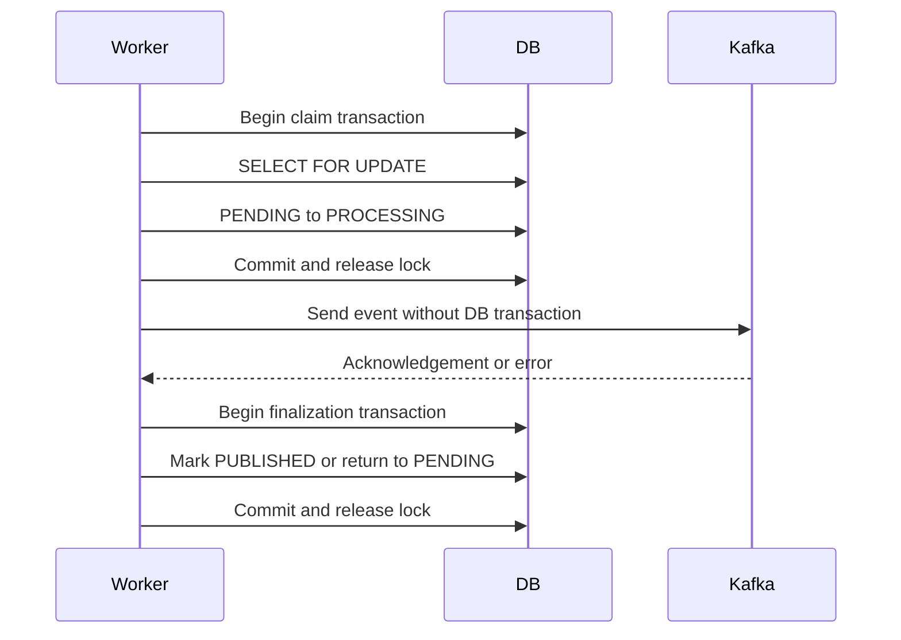

---
title: Outbox Runtime Problems
---

# Outbox Runtime Problems

Outbox database lock scope and stale outbox claim recovery.

Back to [Shopverse Problems And Solutions](../PROBLEMS-AND-SOLUTIONS.md).

## 2. Outbox Database Locks While Waiting For Kafka

### Problem

An Outbox publisher needs to prevent two workers from publishing the same row.
A direct implementation can put the database lock and Kafka call inside one
transaction:

```java
@Transactional
public void publish(Long eventId) throws Exception {
    OutboxEvent event = repository.findByIdForUpdate(eventId).orElseThrow();

    kafkaTemplate.send(
            event.getTopic(),
            event.getMessageKey(),
            event.getPayload()
    ).get(10, TimeUnit.SECONDS);

    event.markPublished();
}
```

`findByIdForUpdate(...)` uses a pessimistic write lock. Because the transaction
does not commit until the method ends, the row lock and database connection
remain occupied while Kafka performs network I/O.

```text
Begin DB transaction
  -> lock Outbox row
  -> wait for Kafka acknowledgement
  -> update row
  -> commit and release lock
```

If Kafka is slow or unavailable, this can cause:

- long-held row locks;
- database connection-pool exhaustion;
- blocked Outbox workers;
- higher deadlock and lock-timeout risk;
- database throughput becoming dependent on Kafka latency.

Increasing the database lock timeout would only hide the design problem. The
network wait should not be part of the database transaction.

### Fix: Claim, Publish, Finalize

Shopverse separates publication into three phases:

```text
1. Short transaction: claim the row
2. No DB transaction: publish to Kafka
3. Short transaction: save success or failure
```

The implementation is used by Order, Inventory, and Payment services.

This is the current Shopverse per-row pessimistic-claim baseline. For the
corrected strategy matrix, MySQL `SKIP LOCKED` batch target, PostgreSQL
`RETURNING` distinction, and crash-window comparison, see
[Database Locking And Work Claims](../locking/DATABASE-LOCKING-AND-CLAIMS.md).

### Phase 1: Claim In A Short Transaction

```java
public OutboxMessage claim(Long eventId) {
    return transactionTemplate.execute(status -> {
        OutboxEvent event = repository.findByIdForUpdate(eventId).orElse(null);
        if (event == null || event.getStatus() != OutboxStatus.PENDING) {
            return null;
        }

        event.claim();
        return OutboxMessage.from(event);
    });
}
```

The row is locked only while its state changes from `PENDING` to `PROCESSING`.
Returning from `TransactionTemplate.execute(...)` commits the transaction and
releases the lock.

`OutboxMessage` is an immutable snapshot containing the data required for
Kafka publication. Kafka does not need the managed JPA entity or an open
transaction.

### Phase 2: Publish Outside The Database Transaction

```java
private void publishRecord(OutboxMessage message) {
    try {
        var result = kafkaTemplate
                .send(message.topic(), message.messageKey(), message.payload())
                .get(sendTimeoutSeconds, TimeUnit.SECONDS);

        markPublished(message.id());
    } catch (Exception exception) {
        markFailed(message.id(), exception);
    }
}
```

The potentially slow Kafka acknowledgement wait happens after the claim
transaction has committed. No Outbox row lock or database connection is held
during this network call.

### Phase 3: Finalize In Another Short Transaction

Success:

```java
public void markPublished(Long eventId) {
    transactionTemplate.executeWithoutResult(status ->
            repository.findByIdForUpdate(eventId)
                    .filter(event -> event.getStatus() == OutboxStatus.PROCESSING)
                    .ifPresent(OutboxEvent::markPublished)
    );
}
```

Failure:

```java
public void markFailed(Long eventId, Exception exception) {
    transactionTemplate.executeWithoutResult(status ->
            repository.findByIdForUpdate(eventId)
                    .filter(event -> event.getStatus() == OutboxStatus.PROCESSING)
                    .ifPresent(event -> event.markFailed(exception))
    );
}
```

The success transaction changes `PROCESSING` to `PUBLISHED`. The failure
transaction records the error and returns the event to `PENDING` for a later
retry.



### Crash Recovery

Claiming introduces one additional failure scenario: a process can terminate
after setting `PROCESSING` but before finalization.

Normal outbox states are:

```text
PENDING -> PROCESSING -> PUBLISHED
```

`PENDING` means the event is waiting to be published. `PROCESSING` means a
publisher has claimed the row and is attempting to send it to Kafka.
`PUBLISHED` means Kafka acknowledged the send and the database finalization
transaction recorded success.

Shopverse stores `claimedAt` and periodically releases stale claims:

```java
worker.releaseStaleClaims(
        Instant.now().minusMillis(claimTimeoutMs)
);
```

An outbox row is stale when it is still `PROCESSING` after the configured
claim timeout:

```text
status = PROCESSING
claimedAt < now - claimTimeout
```

That usually means the publisher process crashed, was killed, or became stuck
after claiming the row. The recovery job changes the row back to `PENDING`:

```text
PROCESSING -> PENDING
```

This is what "stale outbox row becomes retryable" means. The row is no longer
reserved by a dead publisher, so a later scheduler run can pick it again and
attempt Kafka publication.

The claim timeout must be longer than the Kafka send timeout. Otherwise, a
healthy but slow publication could be reclaimed while it is still running.

### Delivery Semantics

This design provides at-least-once publication. A process can crash after
Kafka acknowledges the event but before `PUBLISHED` commits. The stale claim
will later be retried, potentially producing a duplicate event.

Therefore Kafka consumers must remain idempotent, using an event ID or inbox
record to reject already-processed events.


## 5. Outbox Events Stuck After A Worker Crash

### Problem Statement

The short-transaction Outbox design changes an event from `PENDING` to
`PROCESSING` before publishing it to Kafka. A process can terminate after that
claim commits but before it records success or failure:

```text
PENDING
  -> claim commits as PROCESSING
  -> process terminates
  -> no finalization transaction runs
```

Without recovery, normal publisher scans select only `PENDING` rows, so this
event would remain in `PROCESSING` permanently. The event is still present in
the database, but it is no longer eligible for normal publishing. The SAGA can
therefore stop even though the original business transaction committed.

### Solution

Outbox rows now record when the claim was acquired:

```java
public void claim() {
    status = OutboxStatus.PROCESSING;
    claimedAt = Instant.now();
    publishAttempts++;
}
```

Before publishing pending events, the scheduler releases claims older than a
configured timeout:

```java
worker.releaseStaleClaims(
        Instant.now().minusMillis(claimTimeoutMs)
);
```

The recovery transaction returns stale rows to `PENDING`:

```java
public void releaseStaleClaim() {
    if (status == OutboxStatus.PROCESSING) {
        status = OutboxStatus.PENDING;
        claimedAt = null;
    }
}
```

Conceptually, a stale row is:

```text
status = PROCESSING
claimedAt < now - claimTimeout
```

Returning that row to `PENDING` is what "stale outbox row becomes retryable"
means:

```text
PROCESSING -> PENDING
```

The scheduler only selects pending rows. Once the stale claim is released, a
later scheduler run can claim the event again and retry Kafka publication:

```text
PENDING -> PROCESSING -> send to Kafka -> PUBLISHED
```

The claim timeout must be longer than the Kafka send timeout. Otherwise, a
slow but active publisher could be mistaken for a failed worker.

### Duplicate Risk

Stale-claim recovery prevents stuck events; it does not guarantee duplicate
prevention. A crash can happen after Kafka stores the event but before the
database finalization transaction records `PUBLISHED`:

```text
1. Row is marked PROCESSING.
2. Kafka stores the event and returns acknowledgement.
3. Application crashes before PUBLISHED commits.
4. Recovery later returns the row to PENDING.
5. The same business event is sent again.
```

This is why Shopverse treats outbox publication as at least once. Downstream
consumers must handle repeated events safely by checking business keys such as
`orderNumber`, or by using the stronger future inbox pattern with immutable
`eventId`.

### Result

- a terminated publisher does not permanently strand its claimed event;
- events become eligible for later publication;
- `publishAttempts` provides operational evidence of repeated attempts;
- at-least-once delivery remains explicit, so consumers must be idempotent.


