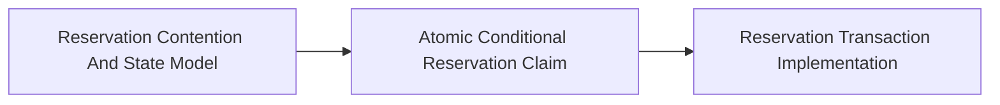

<!-- split-guide-index -->
# Atomic Inventory Reservation

<DocLabels items={[{label: 'Focused guides', tone: 'advanced'}, {label: 'Shopverse', tone: 'shopverse'}, {label: 'Architect route', tone: 'production'}]} />

Design contention-safe reservation ownership, transaction boundaries, and recovery. The original long-form material is preserved without duplication across the focused pages below.

<TopicCards items={[
  {title: 'Reservation Contention And State Model', href: '/reliability/problems/runtime/RESERVATION-CONTENTION-STATE-MODEL', description: 'Part 1 of the focused Atomic Inventory Reservation learning route.', icon: 'route', tags: ['Focused', 'Advanced']},
  {title: 'Atomic Conditional Reservation Claim', href: '/reliability/problems/runtime/ATOMIC-CONDITIONAL-RESERVATION-CLAIM', description: 'Part 2 of the focused Atomic Inventory Reservation learning route.', icon: 'layers', tags: ['Focused', 'Advanced']},
  {title: 'Reservation Transaction Implementation', href: '/reliability/problems/runtime/RESERVATION-TRANSACTION-IMPLEMENTATION', description: 'Part 3 of the focused Atomic Inventory Reservation learning route.', icon: 'security', tags: ['Focused', 'Advanced']},
]} />

<DocCallout type="tip" title="Use the index as the stable entry point">

Each focused page owns one concern. Cross-links point to the canonical explanation instead of repeating the same material.

</DocCallout>

## Recommended Learning Order

1. [Reservation Contention And State Model](./RESERVATION-CONTENTION-STATE-MODEL.md)
2. [Atomic Conditional Reservation Claim](./ATOMIC-CONDITIONAL-RESERVATION-CLAIM.md)
3. [Reservation Transaction Implementation](./RESERVATION-TRANSACTION-IMPLEMENTATION.md)

## Reading Strategy

Use **Atomic Inventory Reservation** as a decision and verification guide inside **Atomic Inventory Reservation**. Start by naming the invariant or operational outcome, then follow the runtime flow and identify the owning component. For every example, record the expected success evidence, the most important failure mode, and the metric or test that proves recovery. This keeps the material useful for implementation reviews, production incidents, and architect interviews instead of treating it as isolated syntax.

Within **Atomic Inventory Reservation**, apply the Shopverse guidance incrementally: verify the current behavior, introduce one bounded change, test the unhappy path, and preserve a rollback or reconciliation route. Follow links to canonical pages when a concept belongs to another track; do not copy that explanation into this page. This ownership rule keeps the focused guides short while retaining technical depth and traceability.

## Official References

- [Resilience4j documentation](https://resilience4j.readme.io/docs)
- [Apache Kafka documentation](https://kafka.apache.org/documentation/)
